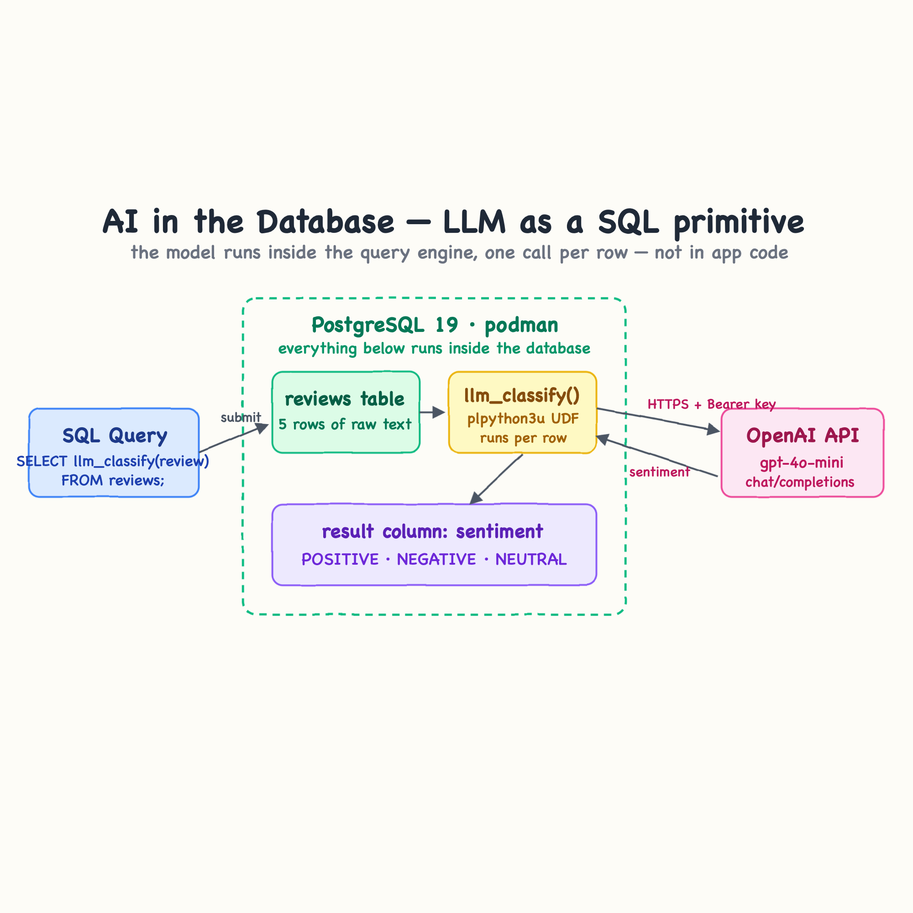

# AI in the Database — LLM as a SQL primitive

This POC runs an LLM **inside the PostgreSQL query engine**, not in application code.
A user-defined function `llm_classify(text)` is registered in the database, so a plain query
like `SELECT llm_classify(review) FROM reviews` calls OpenAI once per row, straight from SQL.

The model becomes a SQL primitive: it composes with `WHERE`, `GROUP BY`, joins, and views like
any other function. There is no app tier — the database itself reaches out to OpenAI.

## Result

```
❯ ./start.sh
STEP 1/2: FROM postgres:19beta1
STEP 2/2: RUN apt-get update && apt-get install -y --no-install-recommends postgresql-plpython3-19 python3 ca-certificates && rm -rf /var/lib/apt/lists/*
--> Using cache 52cfc5dfc9b5b67dd6559dc86ed9691629e689d37c21cdbaf61beacfd5f66916
COMMIT ai-postgresql-db_ai-postgres
--> 52cfc5dfc9b5
Successfully tagged localhost/ai-postgresql-db_ai-postgres:latest
Successfully tagged localhost/ai-postgres-db:local
52cfc5dfc9b5b67dd6559dc86ed9691629e689d37c21cdbaf61beacfd5f66916
9f774efb068f5801dfb8f88453e911c0af654718dbab71ac4c75d5add19a5f59
e1527a07a3bacc309c9e92bbf91259427f3afcfda687fab66b25c57b9975e1ac
ai-postgres-db
Waiting for PostgreSQL to be ready...
PostgreSQL 19 is ready with the llm_classify() SQL function loaded.
❯ ./test.sh
Running the LLM as a SQL primitive: classifying every review row inside the query engine.

 id |                             review                             | sentiment
----+----------------------------------------------------------------+-----------
  1 | The product exceeded my expectations, absolutely love it!      | POSITIVE
  2 | Terrible experience, the item broke after a single day of use. | NEGATIVE
  3 | It works as described, nothing special but it does the job.    | NEUTRAL
  4 | Best purchase I have made all year, I highly recommend it.     | POSITIVE
  5 | Complete waste of money, I would never buy this again.         | NEGATIVE
(5 rows)


Filtering with the LLM in the WHERE-equivalent: only the negative reviews.

 id |                             review
----+----------------------------------------------------------------
  2 | Terrible experience, the item broke after a single day of use.
  5 | Complete waste of money, I would never buy this again.
(2 rows)
```

## Architecture



- **PostgreSQL 19** (`postgres:19beta1`) running on **podman**.
- **`plpython3u`** untrusted procedural language, so the function can open an HTTPS connection.
- **`llm_classify(review text)`** — a PL/Python function that POSTs the row text to
  `https://api.openai.com/v1/chat/completions` (`gpt-4o-mini`) and returns one word:
  `POSITIVE`, `NEGATIVE`, or `NEUTRAL`.
- The OpenAI key is read from the `OPENAI_API_KEY` environment variable of the database process,
  passed into the container by `podman-compose`. It never appears in SQL or in the table data.

## How it works

Trace one query, `SELECT id, review, llm_classify(review) FROM reviews`, end to end:

1. **The key enters the database process.** You `export OPENAI_API_KEY=...`, then `start.sh` runs
   `podman-compose up`. The compose file maps that variable into the container, so the `postgres`
   process boots with the key in its environment. Every query backend it forks inherits it.

2. **The function is loaded once, at init.** On first boot Postgres runs `init.sql`, which enables
   the `plpython3u` language and creates `llm_classify`. The function body is Python that lives in
   the database catalog — nothing is compiled into an app.

3. **The planner treats `llm_classify` like any function.** When the query runs, Postgres scans
   `reviews` and, for each row, calls `llm_classify(review)` — the same way it would call `upper()`
   or `length()`. There is no application code in the loop; the call site *is* the SQL.

4. **The function calls OpenAI from inside the backend.** Per row, the Python body reads
   `OPENAI_API_KEY` from `os.environ`, builds a chat-completions request, and does a synchronous
   `urllib.request.urlopen` to `api.openai.com` over HTTPS. This is only possible because
   `plpython3u` is *untrusted* — a trusted language could not open a socket.

5. **The model's answer becomes the column value.** OpenAI replies with one word; the function
   returns it as `text`. Postgres puts that string in the `sentiment` column of the result row,
   indistinguishable from data that was stored in the table.

6. **It composes like normal SQL.** Because the result is just a column, you can wrap the query in a
   subquery and filter on it (`WHERE sentiment = 'NEGATIVE'`), group by it, join on it, or feed it
   into a view — the LLM is now a SQL primitive.

The cost model follows from step 3: the call is **once per row, serial**. Five rows means five
HTTPS round-trips inside the query. That fits classification/extraction/tagging over a bounded set,
not high-throughput scans.

## Files

| File | Purpose |
|------|---------|
| `Containerfile` | `postgres:19beta1` + `postgresql-plpython3-19` |
| `init.sql` | Creates the `plpython3u` extension, the `llm_classify()` function, the `reviews` table and seed rows |
| `podman-compose.yml` | Postgres service, passes `OPENAI_API_KEY` into the container |
| `start.sh` | Builds and starts the stack, waits until the database is ready |
| `test.sh` | Runs the AI query and a sentiment filter on top of it |
| `stop.sh` | Tears the stack down |

## The function

```sql
CREATE FUNCTION llm_classify(review text) RETURNS text AS $$
import os, json, urllib.request
key = os.environ.get("OPENAI_API_KEY")
if not key:
    return "NO_API_KEY"
payload = json.dumps({
    "model": "gpt-4o-mini",
    "temperature": 0,
    "messages": [
        {"role": "system", "content": "You are a sentiment classifier. Reply with exactly one word: POSITIVE, NEGATIVE or NEUTRAL."},
        {"role": "user", "content": review}
    ]
}).encode("utf-8")
req = urllib.request.Request("https://api.openai.com/v1/chat/completions",
    data=payload, headers={"Authorization": "Bearer " + key, "Content-Type": "application/json"})
data = json.loads(urllib.request.urlopen(req, timeout=30).read().decode("utf-8"))
return data["choices"][0]["message"]["content"].strip()
$$ LANGUAGE plpython3u;
```

## Requirements

- `podman` and `podman-compose`
- An OpenAI API key

## Run it

```bash
export OPENAI_API_KEY=sk-...
./start.sh
./test.sh
./stop.sh
```

`test.sh` runs the model from inside SQL:

```sql
SELECT id, review, llm_classify(review) AS sentiment FROM reviews ORDER BY id;
```

Expected shape of the result:

```
 id |                          review                          | sentiment
----+----------------------------------------------------------+-----------
  1 | The product exceeded my expectations, absolutely love... | POSITIVE
  2 | Terrible experience, the item broke after a single da... | NEGATIVE
  3 | It works as described, nothing special but it does th... | NEUTRAL
  4 | Best purchase I have made all year, I highly recommen... | POSITIVE
  5 | Complete waste of money, I would never buy this again.   | NEGATIVE
```

It then filters on the model output, treating the LLM result like any column:

```sql
SELECT id, review
FROM (SELECT id, review, llm_classify(review) AS sentiment FROM reviews) t
WHERE sentiment = 'NEGATIVE'
ORDER BY id;
```

## Notes

- `plpython3u` is **untrusted** and only a superuser can create it — that is what allows the
  function to make a network call. Keep this pattern to trusted, internal databases.
- The call is synchronous and serial: one HTTPS round-trip per row. It is meant for small,
  set-based AI tasks (classification, extraction, tagging), not high-throughput workloads.
- Set `OPENAI_API_KEY` before `./start.sh`; the container reads it at boot, so the key lives only
  in the database process environment.
