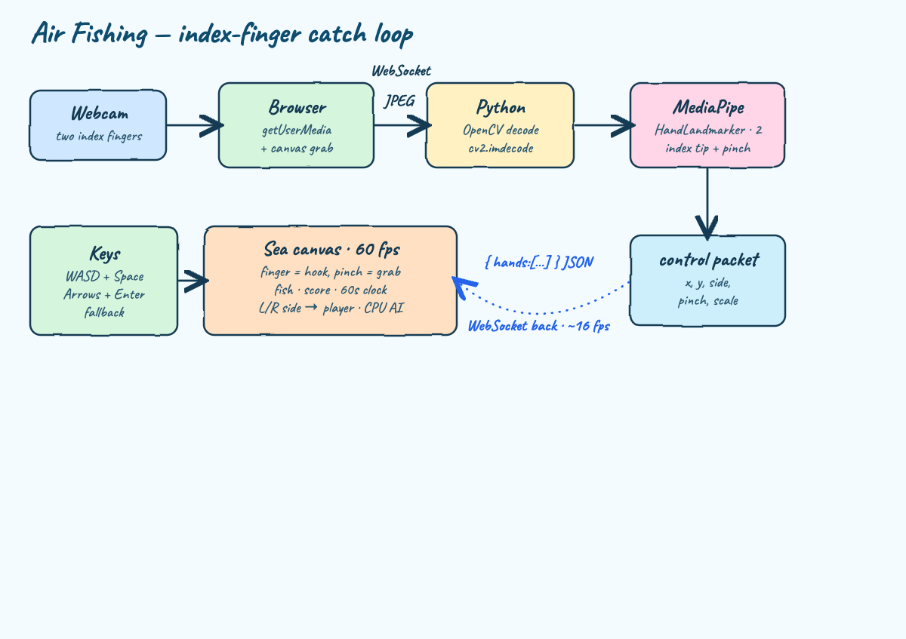
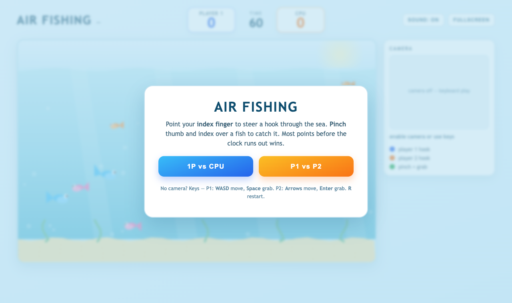
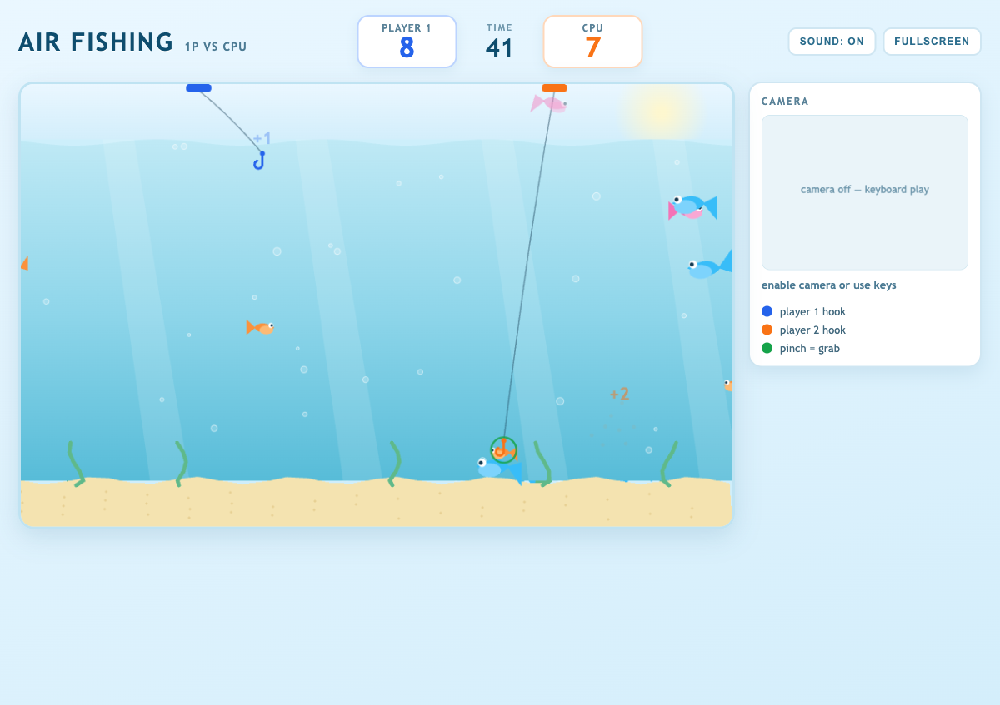
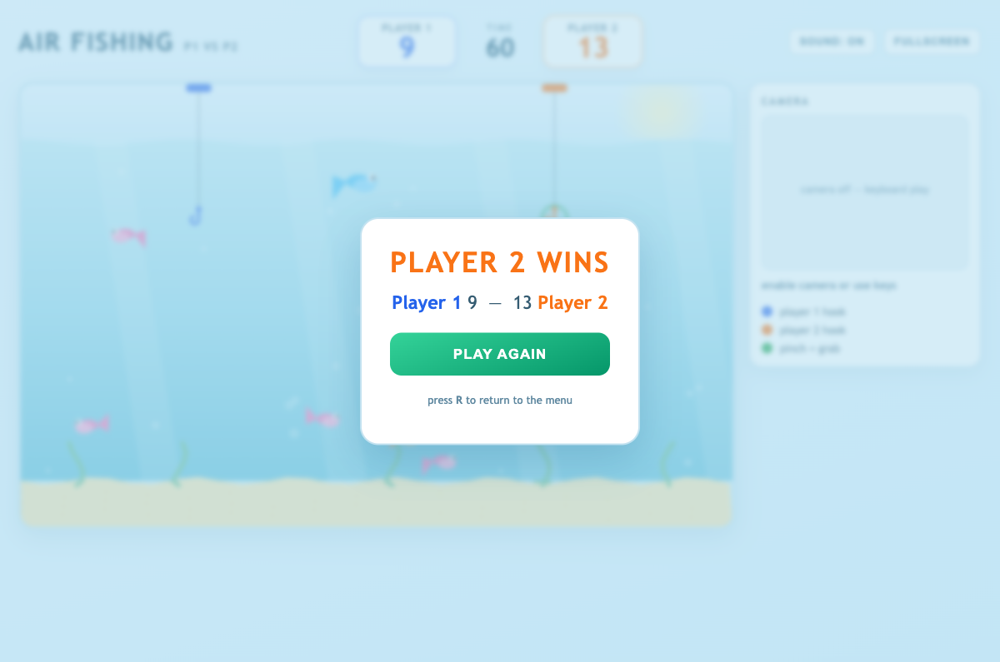

# Air Fishing

A browser **fishing game you play with your bare hands**. Your **index finger is the rod** — point it
to steer a hook through a bright pastel sea, then **pinch** thumb and index together over a fish to
catch it. The camera stays on the whole time so you can see your hands tracked live. Whoever lands the
most points before the **60-second** clock runs out wins.

Two ways to play, picked on the start screen:

- **1P vs CPU** — you steer the blue hook with your hand; the computer works the orange hook, always
  chasing the nearest fish.
- **P1 vs P2** — two people share one camera; the frame is split **left / right**, one hand each, two
  hooks racing for the same fish.

Up to **two hands** are tracked at once, each becomes one player's hook. Bigger and rarer fish are
worth more: a little orange minnow is **1 point**, the golden fish is **5**.

## How it works

The browser owns the webcam; **Python + OpenCV + MediaPipe** is the perception brain. Each frame goes
browser → Python over a WebSocket, comes back as a tiny per-hand control packet, and the canvas turns
that into hooks, catches and score at 60 fps.



| Step | What happens |
| --- | --- |
| 1 | Browser grabs the webcam with `getUserMedia`, draws each frame to a hidden canvas |
| 2 | The frame is JPEG-encoded and pushed to Python over a **WebSocket** |
| 3 | Python decodes it (`cv2.imdecode`) and runs **MediaPipe HandLandmarker** (`num_hands=2`) |
| 4 | Per hand it returns `{ x, y, side, pinch, scale }` — index-fingertip position, which half of the frame the hand is in, and whether thumb and index are pinched |
| 5 | The client smooths the fingertip into a hook, edge-detects the pinch as a grab, and runs the sea, the fish and the scoreboard |

The server stays a thin, stateless perception function; the client owns smoothing, the catch
detection, the fish, the CPU and all the game rules.

## Gameplay

| Gesture | Effect |
| --- | --- |
| **Point your index finger** | the hook follows your fingertip — left/right across the sea, up/down for depth |
| **Pinch** thumb + index over a fish | the hook **grabs** it, you score its points, and it reels up to your rod |
| Open hand / no pinch | the hook just drifts where you point |

A pinch on empty water is a harmless miss with a small splash. After a catch the hook has a short
cooldown so a single pinch lands a single fish. The sea always keeps about a dozen fish swimming, so
there is always something to chase.

| Fish | Points |
| --- | --- |
| Orange minnow | 1 |
| Pink fish | 2 |
| Big blue fish | 3 |
| Golden fish | 5 |

### Keyboard fallback

For machines without a camera (and for the screenshots below), keys drive the same hook and grab:

| | Move hook | Grab |
| --- | --- | --- |
| **Player 1** | `W` `A` `S` `D` | `Space` |
| **Player 2** | Arrow keys | `Enter` |

`R` returns to the menu. In 1P vs CPU only the Player 1 keys are live.

## Screens

**Start screen** — pick a mode. The sea is already alive behind the card, and the camera panel sits on
the right, on display the whole time.



**1P vs CPU** — your blue hook on the left, the CPU's orange hook on the right, each on a line dropped
from its rod. A `+points` pops up wherever a fish is landed; the camera panel shows the live feed with
a coloured tracking dot per hand (green ring = pinch).



**Result** — when the clock hits zero the higher score wins. Here Player 2 edged it 13 to 9. Hit
**Play Again** for a rematch or **R** for the menu.



## Run it

```bash
./start.sh
```

This creates a `.venv`, installs the requirements, downloads the MediaPipe `hand_landmarker.task`
model on first run, starts the server, then prints the URL. Open **http://localhost:8000**, allow the
camera, and pick a mode.

```bash
./stop.sh    # stop the server
./test.sh    # start the server and push one frame through the full pipeline
```

### Test output

```
http page ok
websocket pipeline ok -> {'hands': []}
ALL TESTS PASSED
```

## Privacy

- The webcam never leaves your machine: frames go browser → local Python over `ws://localhost`.
- Because the browser owns the camera, the Python side never opens a camera device — no OS camera
  prompt for the server.
- The screenshots above were captured with the camera disabled, so no real face appears — the panel
  shows its keyboard-play placeholder instead.

## Stack

| Piece | Choice |
| --- | --- |
| Hand tracking | MediaPipe `HandLandmarker` (float16), `num_hands=2` |
| Frame decode | OpenCV (`opencv-python`) |
| Transport | `websockets` |
| Static server | Python stdlib `http.server` (with `no-store` headers) |
| Game | plain HTML canvas + vanilla JS, light theme |
| Sound | Web Audio API, procedural (plop, catch, splash, reel, fanfare) — no audio files |
| Python | 3.9 |

No game engine, no frontend framework, no build step, no audio assets.
