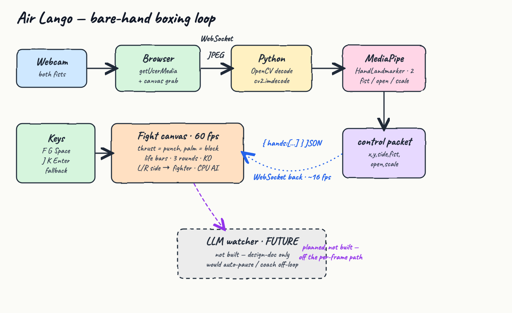
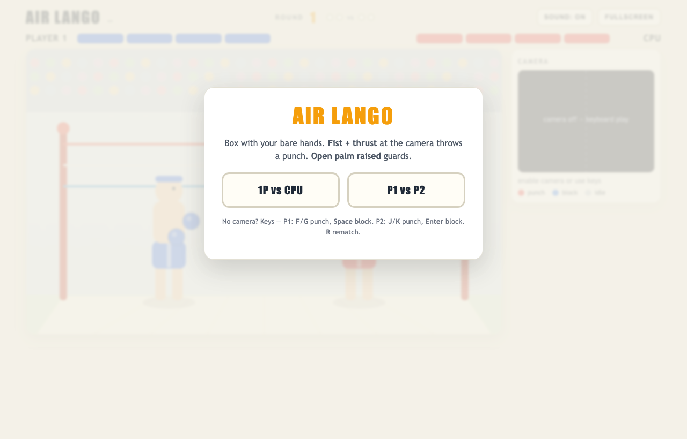
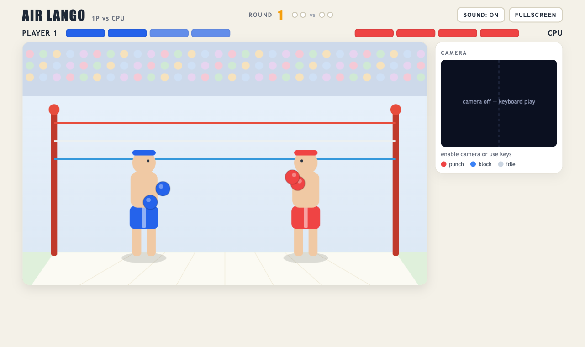
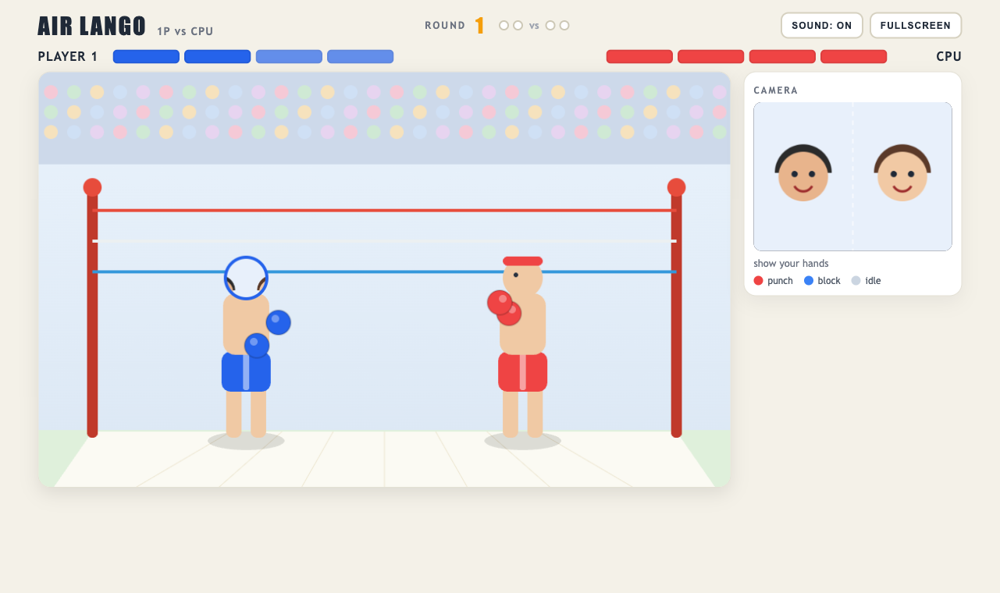
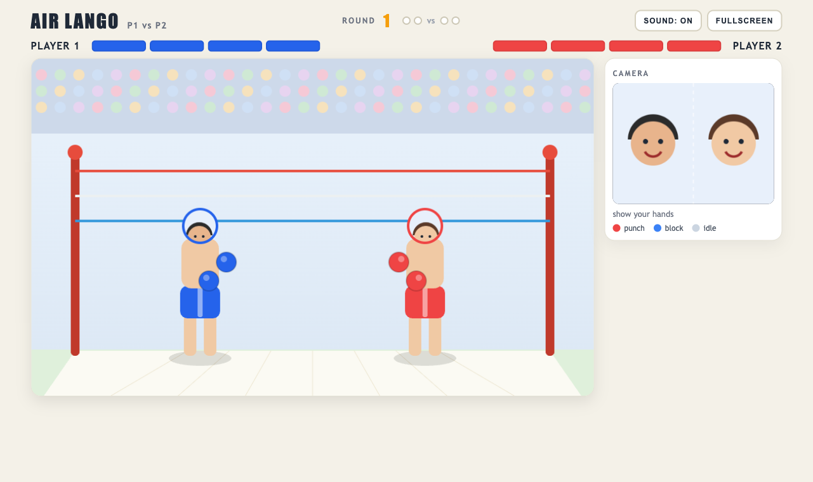
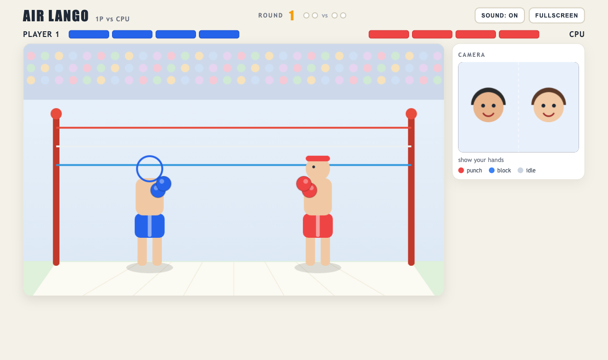

# Air Lango

A browser **2-D boxing game you fight with your bare hands**. There is no keyboard in the intended
experience — your **webcam is the controller**. Throw a **fist toward the camera** to punch, raise an
**open palm** to block. A match is **best of three** rounds; each fighter has a **4-hit life bar** and
the **4th clean punch is a KO**.

Two ways to play, picked on the start screen:

- **1P vs CPU** — you drive one boxer with **both** hands (left hand = left glove, right hand = right
  glove); the computer drives the other and ramps up each round.
- **P1 vs P2** — two people share one camera; the frame is split **left / right**, one hand each.

The whole thing is **pure computer vision** on the per-frame path — no LLM in the fight loop, because a
boxer has to react ~60 times a second.

## How it works

The browser owns the webcam; **Python + OpenCV + MediaPipe** is the perception brain. Each frame goes
browser → Python over a WebSocket, comes back as a tiny per-hand control packet, and the canvas turns
that into punches and blocks at 60 fps.



| Step | What happens |
| --- | --- |
| 1 | Browser grabs the webcam with `getUserMedia`, draws each frame to a hidden canvas |
| 2 | The frame is JPEG-encoded and pushed to Python over a **WebSocket** |
| 3 | Python decodes it (`cv2.imdecode`) and runs **MediaPipe HandLandmarker** (`num_hands=2`) |
| 4 | Per hand it returns `{ x, y, side, fist, open, scale }` — palm position, which half of the frame it is in, hand shape, and a forward-depth proxy |
| 5 | The client smooths the data, detects a forward **thrust** (a punch) and a raised **open palm** (a block), and runs the fight |

The server stays a thin, stateless perception function; the client owns smoothing, the thrust
baseline, edge-triggering, and all the game rules.

## Gameplay

| Gesture | Effect |
| --- | --- |
| **Fist thrust** toward the camera | that glove throws a **punch** (one jab = one punch, then it locks until you pull back) |
| **Open palm raised** | **guard up** — incoming punches are absorbed (clink + gold spark) |
| Hand down / resting | idle, guard down |

A clean punch removes one of four life segments and briefly stuns. A blocked punch costs nothing. The
**4th** clean hit is a **KO** and wins the round; first to **2** rounds wins the match. When a match
ends, a fresh one starts automatically (or press **R** to rematch now).

### Your face on your fighter

When a match begins, a still from the webcam is grabbed and painted on each boxer's head, so you fight
as yourself. In P1 vs P2 the left half of the frame becomes Player 1's face and the right half
Player 2's. With no camera, the boxers keep plain drawn heads.

### Keyboard fallback

For machines without a camera (and for screenshots), keys drive the same primitives, momentarily:

| | Left punch | Right punch | Block |
| --- | --- | --- | --- |
| **Player 1** | `F` | `G` | `Space` |
| **Player 2** | `J` | `K` | `Enter` |

`R` restarts the match. In 1P vs CPU only the Player 1 keys are live.

## Screens

**Start screen** — pick a mode. The camera panel shows a placeholder until you enable the camera.



**The ring** — two boxers face to face in a bright gym, 4-segment life bars up top, best-of-3 pips in
the header. (Camera off here, so the panel shows the keyboard-play placeholder.)



**1P vs CPU** — you drive the blue boxer with both hands; your face rides on its head. The camera
panel shows the live feed (here, privacy-safe avatars) with a tracking dot per hand: **red** = punch,
**blue** = block, **grey** = idle.



**P1 vs P2** — the frame splits down the dashed divider; the left player's face goes on the left
fighter, the right player's on the right.



**Guard up** — an open palm raises both gloves to defend. The short guard-hold keeps your block from
flickering off between camera frames, so defense is reliable.



## Run it

```bash
./start.sh
```

This creates a `.venv`, installs the requirements, downloads the MediaPipe `hand_landmarker.task`
model on first run, starts the server, then prints the URL. Open **http://localhost:8000**, allow the
camera, and pick a mode.

```bash
./stop.sh    # stop the server
./test.sh    # start the server and push one frame through the full pipeline
```

### Test output

```
http page ok
websocket pipeline ok -> {'hands': []}
ALL TESTS PASSED
```

## Privacy

- The webcam never leaves your machine: frames go browser → local Python over `ws://localhost`.
- Because the browser owns the camera, the Python side never opens a camera device — no OS camera
  prompt for the server.
- The face snapshot drawn on each boxer is only ever rendered to the canvas; it is never sent
  anywhere. The screenshots above were captured with the camera disabled (or with stand-in avatars),
  so no real face appears.

## Stack

| Piece | Choice |
| --- | --- |
| Hand tracking | MediaPipe `HandLandmarker` (float16), `num_hands=2` |
| Frame decode | OpenCV (`opencv-python`) |
| Transport | `websockets` |
| Static server | Python stdlib `http.server` (with `no-store` headers) |
| Game | plain HTML canvas + vanilla JS |
| Music & SFX | Web Audio API, procedural (bell, whoosh, thud, clink, crowd) — no audio files |
| Python | 3.9 |

No game engine, no frontend framework, no build step, no audio assets. See
[`design-doc.md`](design-doc.md) for the full design.
