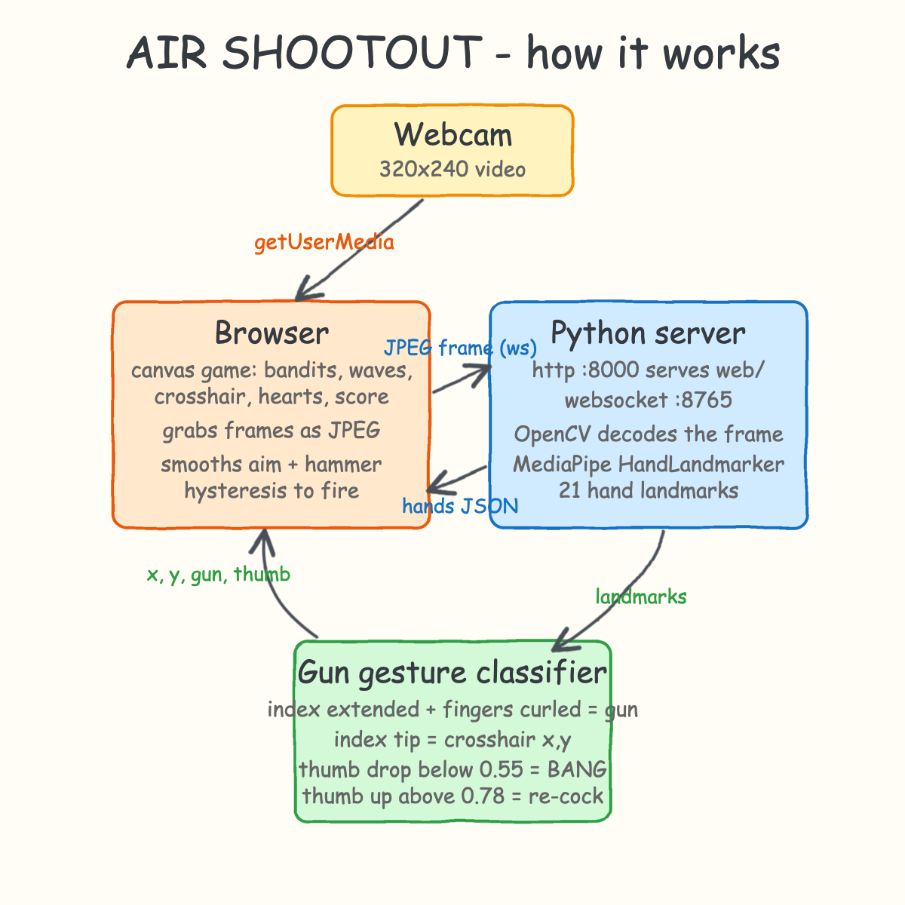
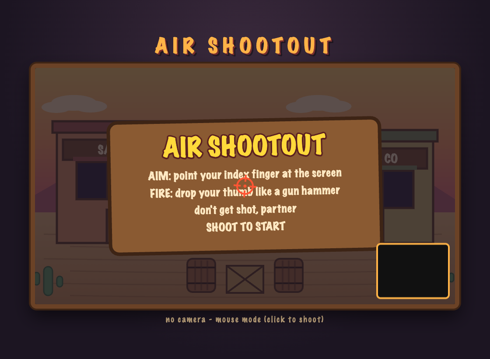
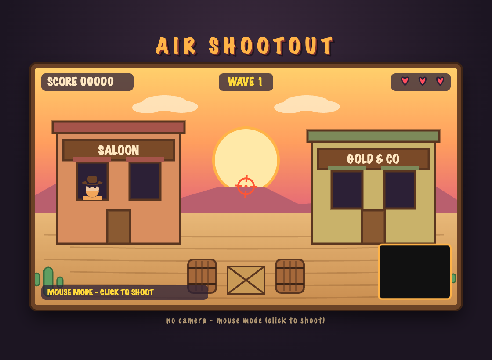
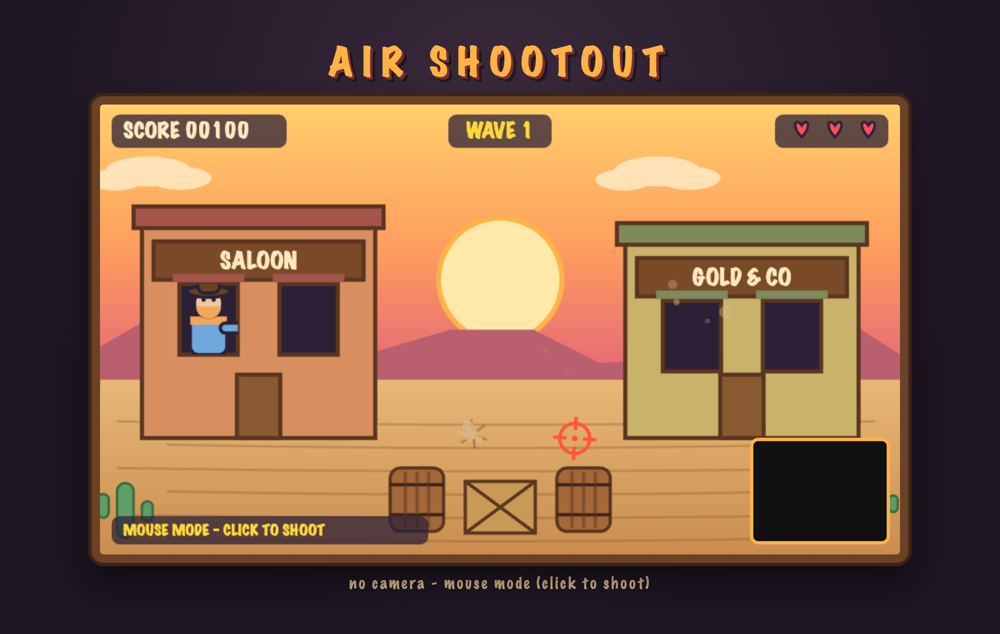
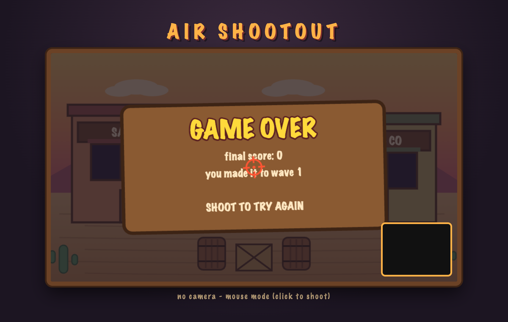

# AIR SHOOTOUT

A wild-west shooting gallery in the spirit of Sunset Riders and Wild Guns, played with your bare hand.
Make a finger gun at your webcam: your index finger aims the crosshair, and dropping your thumb like a
gun hammer fires. Bandits pop up in saloon windows and behind barrels — shoot them before they shoot you.

## How to play

- **Aim**: point your index finger at the screen, the crosshair follows your fingertip
- **Fire**: keep the finger-gun pose (index out, other fingers curled) and drop your thumb; raise the thumb to re-cock
- **Bonus**: shoot the flying money bags for +300
- Bandits flash a `!` right before they fire — hit them first or lose a heart
- 3 hearts, endless waves, each wave spawns more and faster bandits
- No webcam? The game falls back to mouse aim + click to shoot

## Run it

```bash
./start.sh
```

Open http://localhost:8000, allow camera access, and shoot the title board to start.

```bash
./stop.sh
./test.sh
```

## Architecture

The browser runs the whole game on a canvas and streams small JPEG webcam frames over a WebSocket to a
Python server. The server decodes each frame with OpenCV, runs MediaPipe's HandLandmarker to get 21 hand
landmarks, classifies the finger-gun gesture from landmark geometry, and sends back `{x, y, gun, thumb}`.
The browser smooths the aim and applies hysteresis on the thumb value (fire below 0.55, re-cock above 0.78)
so one thumb flick is exactly one shot.



## Screenshots

The title board — shoot it (or click) to start:



Wave 1 starting, a bandit rising in the saloon window:



Mid-fight: a bandit taking aim from the saloon, dust from a missed shot, one heart already gone:



Out of hearts — shoot to try again:



## Stack

- Python: http.server + websockets, OpenCV frame decode, MediaPipe Tasks HandLandmarker
- Browser: vanilla canvas 2D rendering, WebAudio synthesized gunshots, zero dependencies
- Gesture: index extended + middle/ring curled = gun pose; thumb-to-index-knuckle distance,
  normalized by palm width, drives the hammer

## Files

- `server.py` — HTTP :8000 + WebSocket :8765, hand detection and gesture classification
- `web/` — the game (index.html, style.css, game.js)
- `start.sh` / `stop.sh` / `test.sh` — run, stop, verify
- `hand_landmarker.task` — MediaPipe hand model (auto-downloaded if missing)
