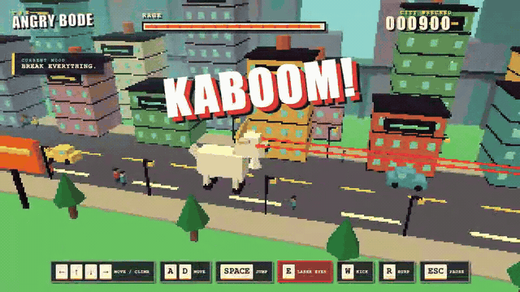
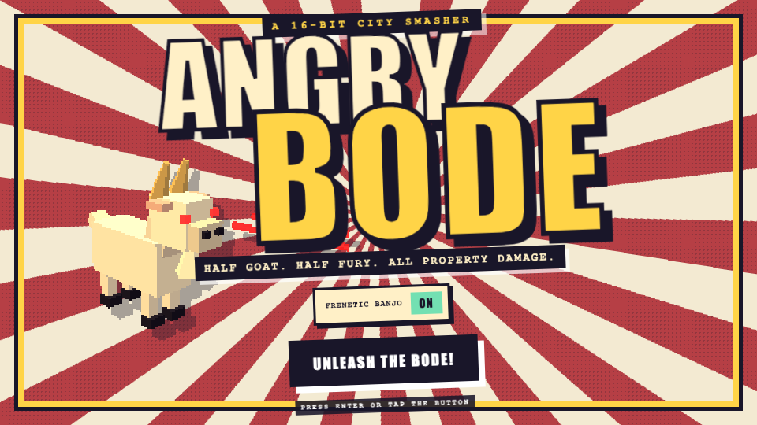
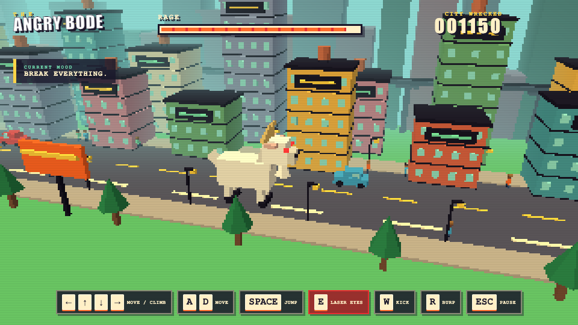

# Angry Bode

Angry Bode is a 16-bit-style 3D city destruction game built with Three.js. Play as a giant white goat that climbs buildings, fires laser eyes, kicks cars, burps shockwaves, crushes citizens, destroys trees, and occasionally poops while walking.



## Run

Install dependencies and start the local server:

```bash
./start.sh
```

Open [http://localhost:5188](http://localhost:5188) in Google Chrome.

Stop the server:

```bash
./stop.sh
```

## Controls

| Input | Action |
| --- | --- |
| Arrow keys | Move freely and climb when touching a building |
| A / D | Move left and right |
| Space | Jump and stomp |
| E | Laser eyes |
| W | Kick |
| R | Burp shockwave |
| Escape | Pause |

## Features

- Destructible buildings with collapsing floors and voxel debris
- Giant animated Bode with laser eyes, kicking, jumping, climbing, walking, and pooping
- Citizens that flee, scream, and launch through the air
- Cars that explode, flip, burn, and become wreckage
- Trees that break when trampled or stomped
- Moving traffic and an elevated train line
- Frenetic physical-model banjo soundtrack with an opening-screen ON/OFF control
- Rage meter, score, combos, announcements, and procedural arcade sound effects
- Pixelated low-resolution rendering with a street-facing 3D camera
- Responsive opening screen with two screenshots and a five-second gameplay GIF

## Media

### Opening screen



### City gameplay



### Five-second gameplay loop


## Verification

Run the JavaScript check:

```bash
npm run check
```

Run the Google Chrome Playwright test:

```bash
npm test
```

## Capture Media

Start the game server, then run:

```bash
npm run capture
```

The capture pipeline uses Playwright with Google Chrome and FFmpeg. It generates:

- `assets/init-screen.png`
- `assets/gameplay-screen.png`
- `assets/angry-bode-play.gif`

FFmpeg trims the gameplay sequence to exactly five seconds and encodes a looping 640×360 GIF at 12 frames per second.

## Project Files

- `src/game.js` contains the Three.js game, destruction systems, procedural audio, input, physics, and rendering.
- `index.html` contains the game interface and opening-screen media rail.
- `styles.css` contains the pixel arcade presentation and responsive layout.
- `scripts/capture-media.mjs` contains the reusable Chrome and FFmpeg media pipeline.
- `tests/game.spec.js` contains the Chrome gameplay interaction test.
