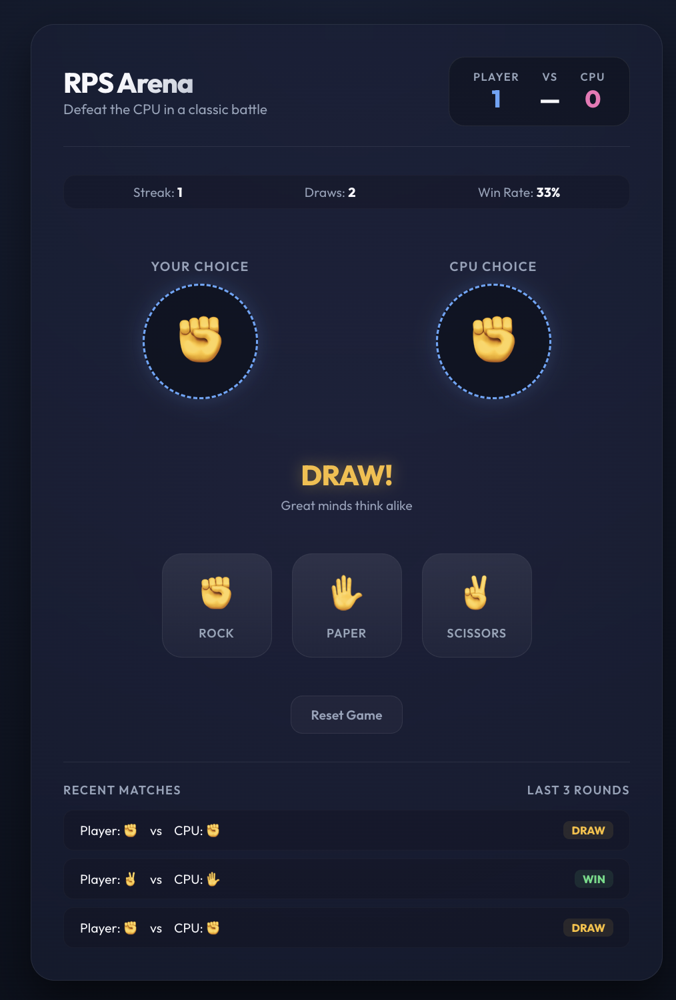

# React + TypeScript + Vite

This template provides a minimal setup to get React working in Vite with HMR and some ESLint rules.

Currently, two official plugins are available:

- [@vitejs/plugin-react](https://github.com/vitejs/vite-plugin-react/blob/main/packages/plugin-react) uses [Oxc](https://oxc.rs)
- [@vitejs/plugin-react-swc](https://github.com/vitejs/vite-plugin-react/blob/main/packages/plugin-react-swc) uses [SWC](https://swc.rs/)

## React Compiler

The React Compiler is not enabled on this template because of its impact on dev & build performances. To add it, see [this documentation](https://react.dev/learn/react-compiler/installation).

## Expanding the ESLint configuration

If you are developing a production application, we recommend updating the configuration to enable type-aware lint rules:

```js
export default defineConfig([
  globalIgnores(['dist']),
  {
    files: ['**/*.{ts,tsx}'],
    extends: [
      // Other configs...

      // Remove tseslint.configs.recommended and replace with this
      tseslint.configs.recommendedTypeChecked,
      // Alternatively, use this for stricter rules
      tseslint.configs.strictTypeChecked,
      // Optionally, add this for stylistic rules
      tseslint.configs.stylisticTypeChecked,

      // Other configs...
    ],
    languageOptions: {
      parserOptions: {
        project: ['./tsconfig.node.json', './tsconfig.app.json'],
        tsconfigRootDir: import.meta.dirname,
      },
      // other options...
    },
  },
])
```

You can also install [eslint-plugin-react-x](https://github.com/Rel1cx/eslint-react/tree/main/packages/plugins/eslint-plugin-react-x) and [eslint-plugin-react-dom](https://github.com/Rel1cx/eslint-react/tree/main/packages/plugins/eslint-plugin-react-dom) for React-specific lint rules:

```js
// eslint.config.js
import reactX from 'eslint-plugin-react-x'
import reactDom from 'eslint-plugin-react-dom'

export default defineConfig([
  globalIgnores(['dist']),
  {
    files: ['**/*.{ts,tsx}'],
    extends: [
      // Other configs...
      // Enable lint rules for React
      reactX.configs['recommended-typescript'],
      // Enable lint rules for React DOM
      reactDom.configs.recommended,
    ],
    languageOptions: {
      parserOptions: {
        project: ['./tsconfig.node.json', './tsconfig.app.json'],
        tsconfigRootDir: import.meta.dirname,
      },
      // other options...
    },
  },
])
```

## Rock-Paper-Scissors Game Setup

This directory contains a complete, premium implementation of a Rock-Paper-Scissors game in React and TypeScript.

### Execution Scripts

Start the dev server:
```bash
./start.sh
```

Stop the dev server:
```bash
./stop.sh
```

### Prompt Details

Built with Gemini 3.5 Flash (High) under the following instructions:
- Request: "I want build a react web application using typescript and nodejs latest, have a start.sh and stop.sh - this should be a rock, paper scizor game. update my readme without loosing content. and build the app. include this prompt using the model gemini flash 3.5 (high)."

## Game Interface Overview

Below is the game interface showing an active round:



### Interface Details

- **Header Scoreboard**: Displays the current scores for the Player and CPU.
- **Session Stats**: Shows the current winning streak, number of draws, and overall win rate.
- **Arena Cards**: Compares the player's active choice against the CPU's choice with a highlighted border.
- **Battle Outcome**: Announces the round result (Victory, Defeat, or Draw) alongside status subtitles.
- **Action Dashboard**: Provides clickable control buttons for Rock, Paper, and Scissors, plus a reset game action.
- **Match History**: Logs details of the last five rounds, showing the choices made and the outcome of each round.
