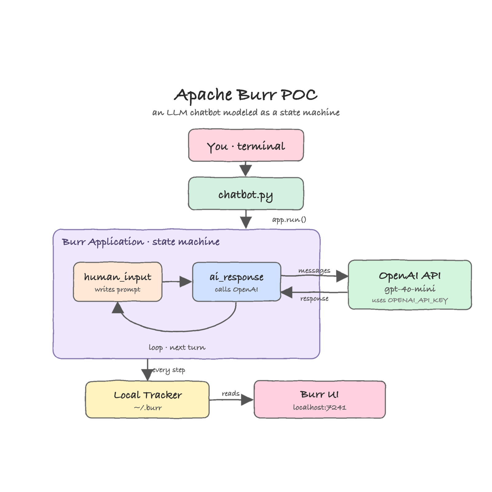
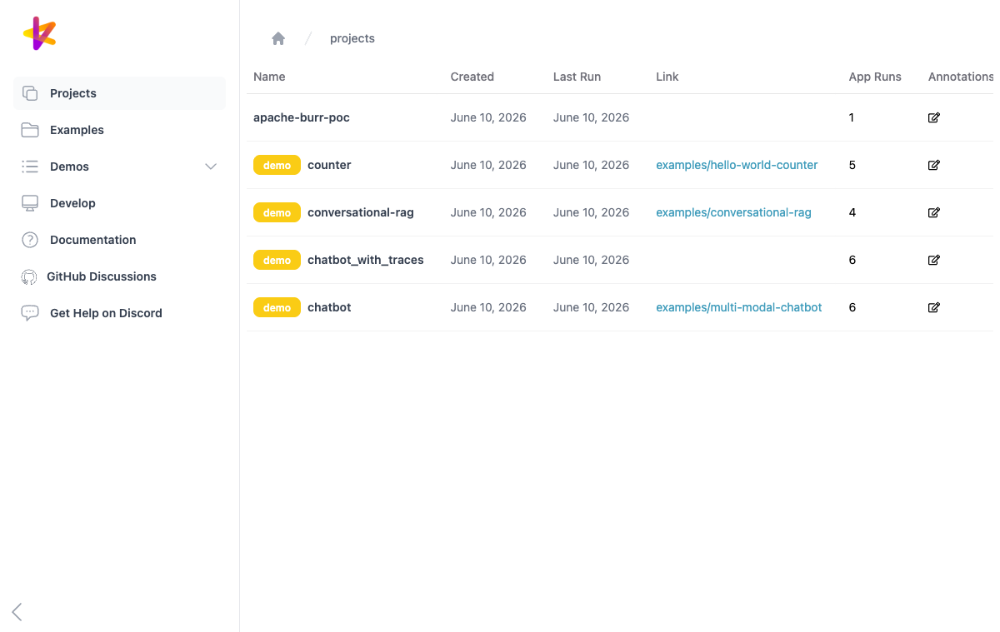
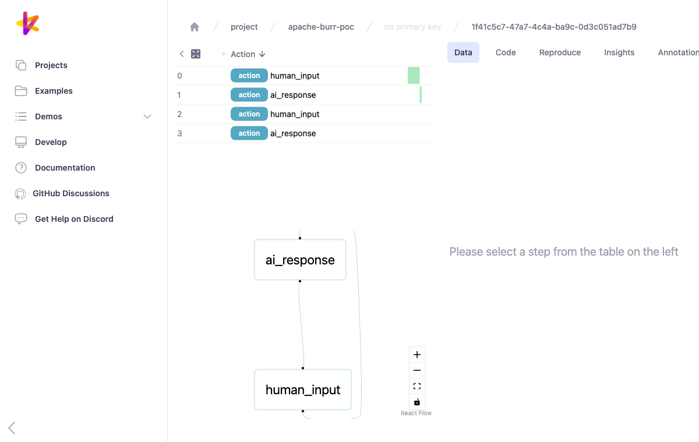

# Apache Burr POC

A small chatbot built with [Apache Burr](https://burr.apache.org/). Burr lets you express an
application as a **state machine**: small `@action` functions read and write a shared `State`,
and `transitions` wire them together. This POC models a chat turn as two actions —
`human_input` and `ai_response` — that loop forever, with every step recorded by Burr's local
tracker so you can replay it in the Burr UI.

The language model is OpenAI (`gpt-4o-mini` by default). The key is read from the
`OPENAI_API_KEY` environment variable.

## Architecture



- **You** type into the terminal; `chatbot.py` calls `app.run(...)` for each turn.
- **`human_input`** writes your prompt into `chat_history`.
- **`ai_response`** sends `chat_history` to the OpenAI API and appends the reply.
- The transition `ai_response -> human_input` loops back, ready for the next message.
- The **local tracker** writes every step to `~/.burr`, which the **Burr UI** reads at
  `http://localhost:7241`.

## Prerequisites

- Python 3.9+
- An OpenAI API key

## Run

Expose your key on the console, then start the POC:

```bash
export OPENAI_API_KEY=sk-...
./start.sh
```

`start.sh` creates a virtualenv, installs the dependencies, launches the Burr UI in the
background on port `7241`, and drops you into the chatbot:

```
you> Who was Aaron Burr?
bot> Aaron Burr was an American politician and lawyer who served as the third Vice President...

you> exit
```

Type `exit` (or press Ctrl-D) to leave the chat. The Burr UI keeps running so you can inspect
the runs. Stop it with:

```bash
./stop.sh
```

Optional: pick a different model with `export OPENAI_MODEL=gpt-4o`.

## How it works

All of the logic lives in `chatbot.py`:

```python
@action(reads=[], writes=["prompt", "chat_history"])
def human_input(state: State, prompt: str) -> State:
    return state.update(prompt=prompt).append(
        chat_history={"role": "user", "content": prompt}
    )

@action(reads=["chat_history"], writes=["response", "chat_history"])
def ai_response(state: State) -> State:
    content = client().chat.completions.create(
        model=MODEL, messages=state["chat_history"]
    ).choices[0].message.content
    return state.update(response=content).append(
        chat_history={"role": "assistant", "content": content}
    )
```

The `ApplicationBuilder` wires the two actions into a looping state machine and attaches the
tracker:

```python
ApplicationBuilder()
    .with_actions(human_input, ai_response)
    .with_transitions(
        ("human_input", "ai_response"),
        ("ai_response", "human_input"),
    )
    .with_state(chat_history=[])
    .with_entrypoint("human_input")
    .with_tracker(project="apache-burr-poc")
    .build()
```

## Burr UI

Open `http://localhost:7241` while the POC is running. The project list shows `apache-burr-poc`
alongside Burr's bundled sample projects:



Opening a run shows the step-by-step timeline (`human_input -> ai_response -> ...`), each step's
state, and the live state-machine graph of the two actions and the loop between them:



## Files

| File | Purpose |
| --- | --- |
| `chatbot.py` | The Burr application: actions, transitions, state, tracker, and the chat loop |
| `requirements.txt` | `burr[start]` (core + UI) and `openai` |
| `start.sh` | Sets up the venv, starts the Burr UI, runs the chatbot |
| `stop.sh` | Stops the Burr UI |
