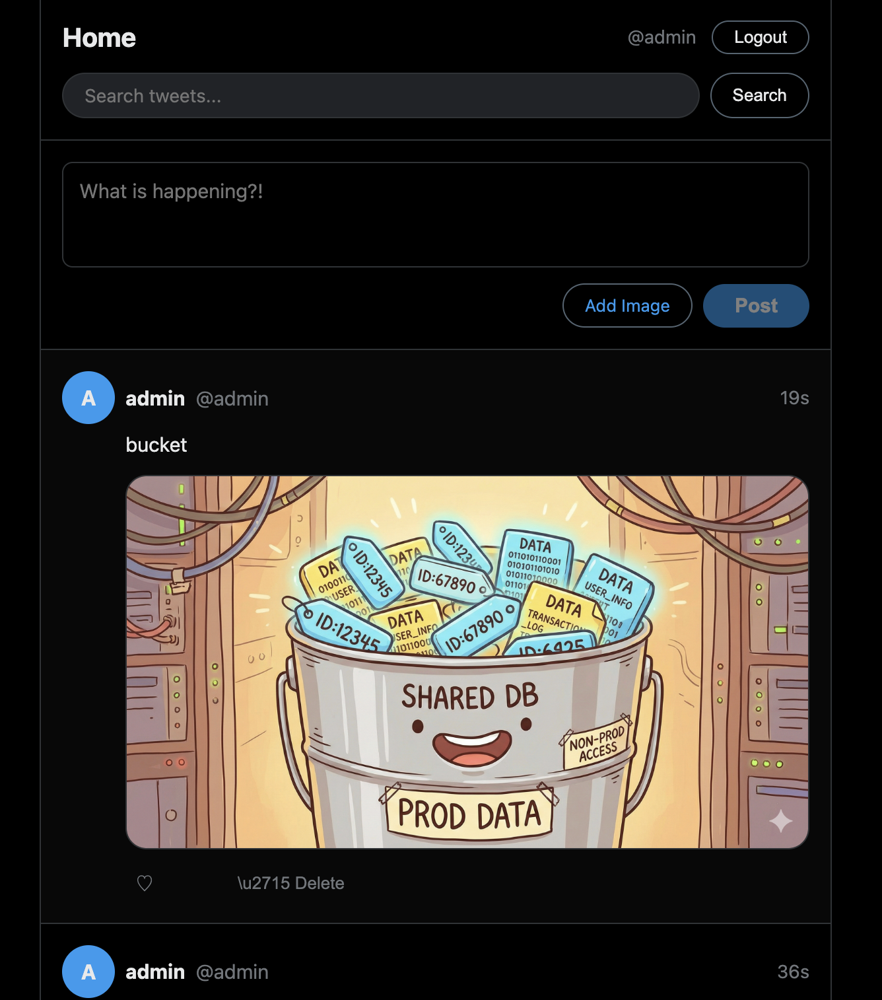

# Beads

https://github.com/steveyegge/beads

## Tasks

Added some tasks in beads by `bd create "Title" -p 0`
```
❯ bd ready

📋 Ready work (4 issues with no blockers):

1. [● P0] [task] beads-fun-1: Create a twitter like app in tanstack and react for the frontend.
2. [● P0] [task] beads-fun-2: Create a twitter like app with rust edition 2024, 1.93+ with tokio and actix for the backend
3. [● P0] [task] beads-fun-3: Create run.sh to run frontend and backend
4. [● P0] [task] beads-fun-4: Create a sqllite database for the tiwtter app use on the rtust code, have a run-dashboard.sh to see the ui with a dasjhbaord to run queries on sql lite
```

Added more tasks:
```
❯ bd list
○ beads-fun-8 [● P0] [task] - Image support
○ beads-fun-7 [● P0] [task] - Search
○ beads-fun-6 [● P0] [task] - Register
○ beads-fun-5 [● P0] [task] - Login
✓ beads-fun-4 [P0] [task] - Create a sqllite database for the tiwtter app use on the rtust code, have a run-dashboard.sh to see the ui with a dasjhbaord to run queries on sql lite
✓ beads-fun-3 [P0] [task] - Create run.sh to run frontend and backend
✓ beads-fun-2 [P0] [task] - Create a twitter like app with rust edition 2024, 1.93+ with tokio and actix for the backend
✓ beads-fun-1 [P0] [task] - Create a twitter like app in tanstack and react for the frontend.
○ beads-fun-9 [● P1] [task] - UI Testing
```

## Result



## Beads Experience Notes

* Fast
* Dependency management is nice
* however did not make the code be better
* Monolith rust backend is bad
* Monolith react frontend is bad

## Beads Commands

```
⏺ Here's the full list grouped by what they do:

  Working With Issues

  ┌─────────────┬────────────────────────────────────────────────┐
  │   Command   │                  What it does                  │
  ├─────────────┼────────────────────────────────────────────────┤
  │ create      │ Create new issue (or bulk from markdown)       │
  ├─────────────┼────────────────────────────────────────────────┤
  │ create-form │ Interactive form to create issue               │
  ├─────────────┼────────────────────────────────────────────────┤
  │ q           │ Quick capture — create issue, output only ID   │
  ├─────────────┼────────────────────────────────────────────────┤
  │ show        │ Show issue details                             │
  ├─────────────┼────────────────────────────────────────────────┤
  │ update      │ Update one or more issues                      │
  ├─────────────┼────────────────────────────────────────────────┤
  │ edit        │ Edit issue field in $EDITOR                    │
  ├─────────────┼────────────────────────────────────────────────┤
  │ close       │ Close one or more issues                       │
  ├─────────────┼────────────────────────────────────────────────┤
  │ reopen      │ Reopen closed issues                           │
  ├─────────────┼────────────────────────────────────────────────┤
  │ delete      │ Delete issues and clean up references          │
  ├─────────────┼────────────────────────────────────────────────┤
  │ list        │ List issues                                    │
  ├─────────────┼────────────────────────────────────────────────┤
  │ search      │ Search issues by text                          │
  ├─────────────┼────────────────────────────────────────────────┤
  │ query       │ Query issues with a query language             │
  ├─────────────┼────────────────────────────────────────────────┤
  │ comments    │ View/manage comments on issues                 │
  ├─────────────┼────────────────────────────────────────────────┤
  │ label       │ Manage issue labels                            │
  ├─────────────┼────────────────────────────────────────────────┤
  │ todo        │ Manage TODO items (task wrapper)               │
  ├─────────────┼────────────────────────────────────────────────┤
  │ promote     │ Promote a wisp to a permanent bead             │
  ├─────────────┼────────────────────────────────────────────────┤
  │ set-state   │ Set operational state (event + label)          │
  ├─────────────┼────────────────────────────────────────────────┤
  │ state       │ Query current state dimension value            │
  ├─────────────┼────────────────────────────────────────────────┤
  │ move        │ Move issue to different rig with dep remapping │
  ├─────────────┼────────────────────────────────────────────────┤
  │ refile      │ Move issue to a different rig                  │
  └─────────────┴────────────────────────────────────────────────┘

  Dependencies & Structure

  ┌─────────────────┬─────────────────────────────────────────┐
  │     Command     │              What it does               │
  ├─────────────────┼─────────────────────────────────────────┤
  │ dep             │ Manage dependencies (add/remove)        │
  ├─────────────────┼─────────────────────────────────────────┤
  │ blocked         │ Show blocked issues                     │
  ├─────────────────┼─────────────────────────────────────────┤
  │ ready           │ Show ready work (open, no blockers)     │
  ├─────────────────┼─────────────────────────────────────────┤
  │ children        │ List child beads of a parent            │
  ├─────────────────┼─────────────────────────────────────────┤
  │ epic            │ Epic management                         │
  ├─────────────────┼─────────────────────────────────────────┤
  │ swarm           │ Structured epic swarm management        │
  ├─────────────────┼─────────────────────────────────────────┤
  │ graph           │ Display dependency graph                │
  ├─────────────────┼─────────────────────────────────────────┤
  │ duplicate       │ Mark issue as duplicate                 │
  ├─────────────────┼─────────────────────────────────────────┤
  │ duplicates      │ Find/merge duplicate issues             │
  ├─────────────────┼─────────────────────────────────────────┤
  │ find-duplicates │ AI-powered semantic duplicate detection │
  ├─────────────────┼─────────────────────────────────────────┤
  │ supersede       │ Mark issue as superseded                │
  ├─────────────────┼─────────────────────────────────────────┤
  │ gate            │ Async coordination gates                │
  ├─────────────────┼─────────────────────────────────────────┤
  │ merge-slot      │ Serialized conflict resolution gates    │
  └─────────────────┴─────────────────────────────────────────┘

  Views & Reports

  ┌────────────────┬──────────────────────────────────────────┐
  │    Command     │               What it does               │
  ├────────────────┼──────────────────────────────────────────┤
  │ status / stats │ Project statistics overview              │
  ├────────────────┼──────────────────────────────────────────┤
  │ count          │ Count issues matching filters            │
  ├────────────────┼──────────────────────────────────────────┤
  │ stale          │ Show stale (not recently updated) issues │
  ├────────────────┼──────────────────────────────────────────┤
  │ lint           │ Check for missing template sections      │
  ├────────────────┼──────────────────────────────────────────┤
  │ types          │ List valid issue types                   │
  ├────────────────┼──────────────────────────────────────────┤
  │ diff           │ Show changes between commits (Dolt)      │
  ├────────────────┼──────────────────────────────────────────┤
  │ history        │ Version history for an issue (Dolt)      │
  ├────────────────┼──────────────────────────────────────────┤
  │ orphans        │ Find orphaned issues still open          │
  ├────────────────┼──────────────────────────────────────────┤
  │ preflight      │ PR readiness checklist                   │
  └────────────────┴──────────────────────────────────────────┘

  Sync & Data

  ┌─────────────┬──────────────────────────────────┐
  │   Command   │           What it does           │
  ├─────────────┼──────────────────────────────────┤
  │ sync        │ Export DB to JSONL (git sync)    │
  ├─────────────┼──────────────────────────────────┤
  │ export      │ Export to JSONL or Obsidian      │
  ├─────────────┼──────────────────────────────────┤
  │ import      │ Import from JSONL                │
  ├─────────────┼──────────────────────────────────┤
  │ merge       │ Git merge driver for JSONL       │
  ├─────────────┼──────────────────────────────────┤
  │ restore     │ Restore compacted issue from git │
  ├─────────────┼──────────────────────────────────┤
  │ federation  │ Peer-to-peer federation          │
  ├─────────────┼──────────────────────────────────┤
  │ branch / vc │ Version control ops (Dolt)       │
  └─────────────┴──────────────────────────────────┘

  Setup & Config

  ┌──────────────┬─────────────────────────────────┐
  │   Command    │          What it does           │
  ├──────────────┼─────────────────────────────────┤
  │ init         │ Initialize beads in current dir │
  ├──────────────┼─────────────────────────────────┤
  │ config       │ Manage config settings          │
  ├──────────────┼─────────────────────────────────┤
  │ hooks        │ Manage git hooks for auto-sync  │
  ├──────────────┼─────────────────────────────────┤
  │ setup        │ Setup AI editor integration     │
  ├──────────────┼─────────────────────────────────┤
  │ onboard      │ Snippet for AGENTS.md           │
  ├──────────────┼─────────────────────────────────┤
  │ prime        │ AI-optimized workflow context   │
  ├──────────────┼─────────────────────────────────┤
  │ info / where │ Show DB info / location         │
  ├──────────────┼─────────────────────────────────┤
  │ doctor       │ Health check and fix            │
  ├──────────────┼─────────────────────────────────┤
  │ backend      │ Manage storage backend          │
  ├──────────────┼─────────────────────────────────┤
  │ sql          │ Run raw SQL against beads DB    │
  └──────────────┴─────────────────────────────────┘

  Integrations

  ┌─────────┬──────────────────────────┐
  │ Command │       What it does       │
  ├─────────┼──────────────────────────┤
  │ jira    │ Jira integration         │
  ├─────────┼──────────────────────────┤
  │ linear  │ Linear integration       │
  ├─────────┼──────────────────────────┤
  │ gitlab  │ GitLab integration       │
  ├─────────┼──────────────────────────┤
  │ repo    │ Multi-repo configuration │
  └─────────┴──────────────────────────┘

  Advanced

  ┌──────────────────────┬─────────────────────────────────────────┐
  │       Command        │              What it does               │
  ├──────────────────────┼─────────────────────────────────────────┤
  │ agent / slot         │ Manage agent bead state/slots           │
  ├──────────────────────┼─────────────────────────────────────────┤
  │ audit                │ Record agent interactions (append-only) │
  ├──────────────────────┼─────────────────────────────────────────┤
  │ formula / cook / mol │ Workflow formulas and templates         │
  ├──────────────────────┼─────────────────────────────────────────┤
  │ ship                 │ Publish capability cross-project        │
  ├──────────────────────┼─────────────────────────────────────────┤
  │ defer / undefer      │ Defer/restore issues for later          │
  ├──────────────────────┼─────────────────────────────────────────┤
  │ rename               │ Rename an issue ID                      │
  ├──────────────────────┼─────────────────────────────────────────┤
  │ rename-prefix        │ Rename prefix for all issues            │
  ├──────────────────────┼─────────────────────────────────────────┤
  │ repair               │ Fix corrupted DB                        │
  ├──────────────────────┼─────────────────────────────────────────┤
  │ migrate / upgrade    │ DB migrations and version upgrades      │
  ├──────────────────────┼─────────────────────────────────────────┤
  │ worktree             │ Git worktrees for parallel dev          │
  └──────────────────────┴─────────────────────────────────────────┘

  That's a lot of capability packed in. The core daily workflow is really just create, ready, update, close, dep, and sync.
```