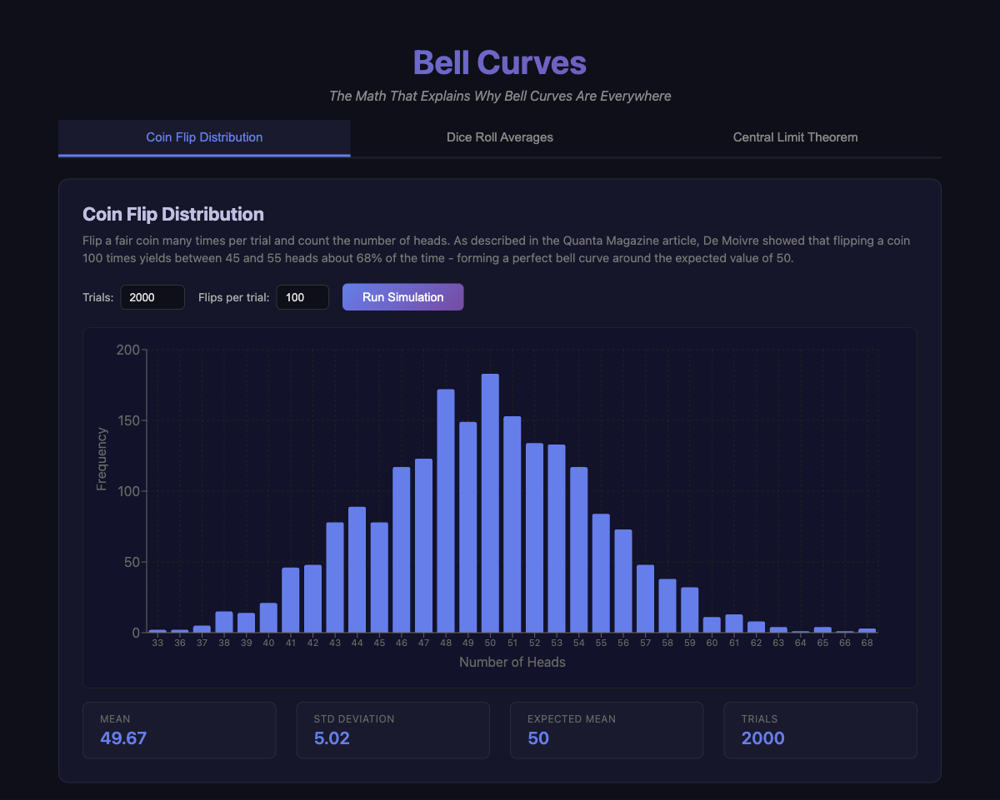
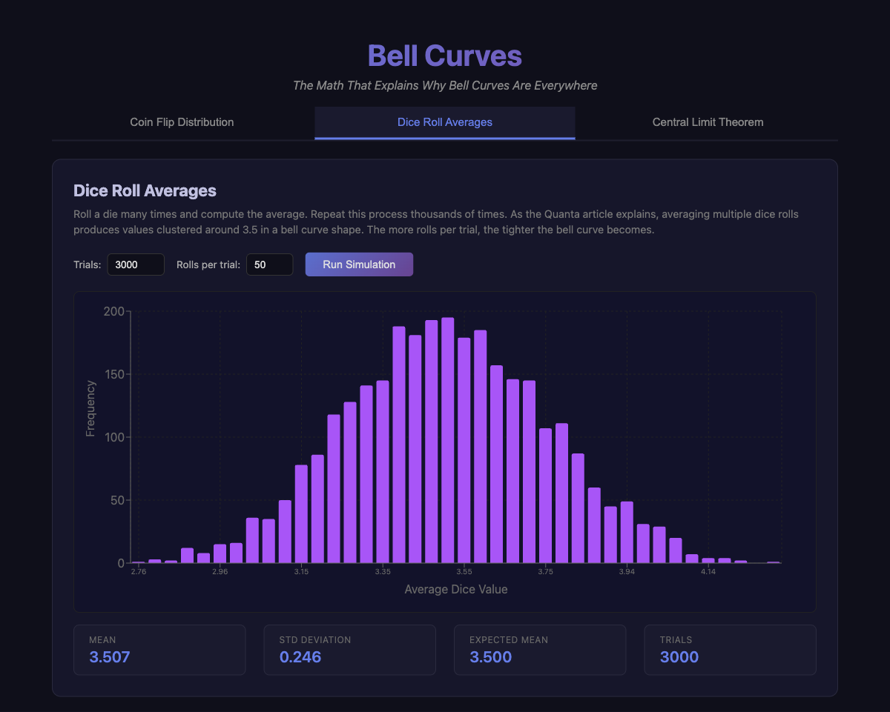
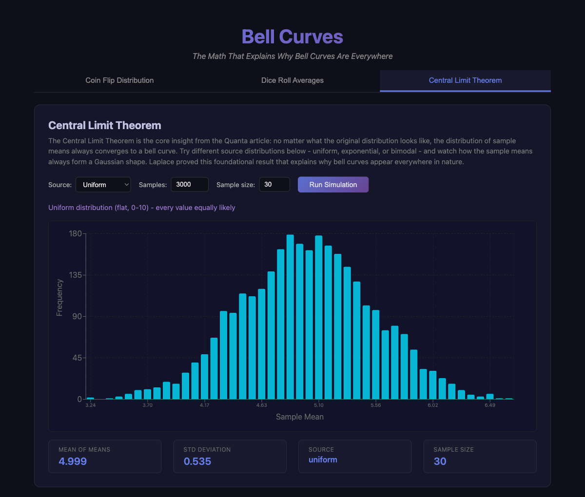

# Bell Curves

A full-stack web application that visually explains why bell curves (normal distributions) appear everywhere in nature, inspired by the Quanta Magazine article ["The Math That Explains Why Bell Curves Are Everywhere"](https://www.quantamagazine.org/the-math-that-explains-why-bell-curves-are-everywhere-20260316/).

## Stack

- **Backend**: Go with Gin-Gonic (REST API on port 8080)
- **Frontend**: React + TypeScript with Bun and Vite (port 5174)
- **Charts**: Recharts

## How to Run

```bash
./run.sh
```

Open http://localhost:5174 in your browser.

## How to Stop

```bash
./stop.sh
```

## Tabs

### Tab 1: Coin Flip Distribution

Simulates flipping a fair coin 100 times per trial across thousands of trials. Counts the number of heads in each trial and plots the frequency distribution. As De Moivre proved, the results cluster around the expected value of 50 in a classic bell curve shape, with approximately 68% of outcomes falling between 45 and 55 heads.



### Tab 2: Dice Roll Averages

Rolls a six-sided die many times per trial and computes the average. When repeated thousands of times, the averages cluster tightly around the theoretical mean of 3.5, forming a bell curve. Increasing the number of rolls per trial makes the curve narrower and taller, illustrating how averaging smooths out randomness.



### Tab 3: Central Limit Theorem

The core mathematical insight: no matter what the original distribution looks like (uniform, exponential, or bimodal), the distribution of sample means always converges to a bell curve. This is Laplace's Central Limit Theorem, the foundational result that explains why bell curves appear everywhere - from heights and weights to SAT scores and rainfall measurements. Each individual effect (genetics, nutrition, environment) combines additively, functioning like averaging many independent random variables.



## API Endpoints

- `GET /api/coin-flip?trials=2000&flips=100` - Coin flip simulation
- `GET /api/dice-roll?trials=3000&rolls=50` - Dice roll averages
- `GET /api/clt?numSamples=3000&sampleSize=30&source=uniform` - Central Limit Theorem (sources: uniform, exponential, bimodal)
- `GET /api/gaussian?mean=0&stddev=1&points=200` - Gaussian curve points
