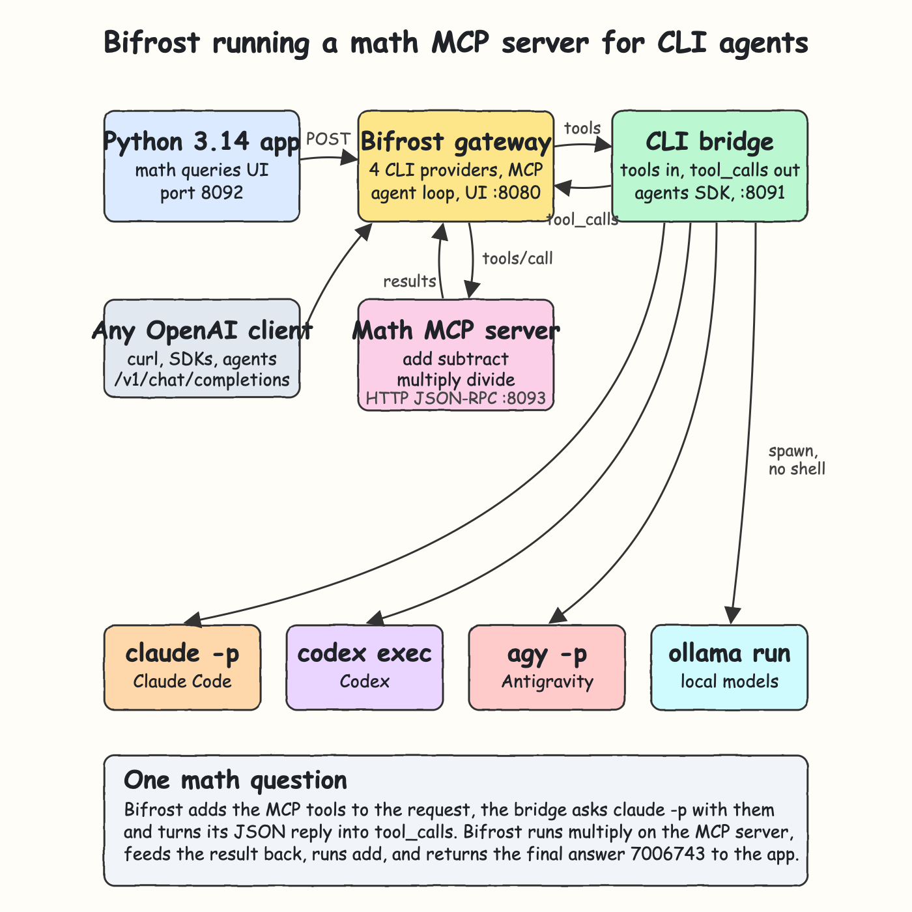
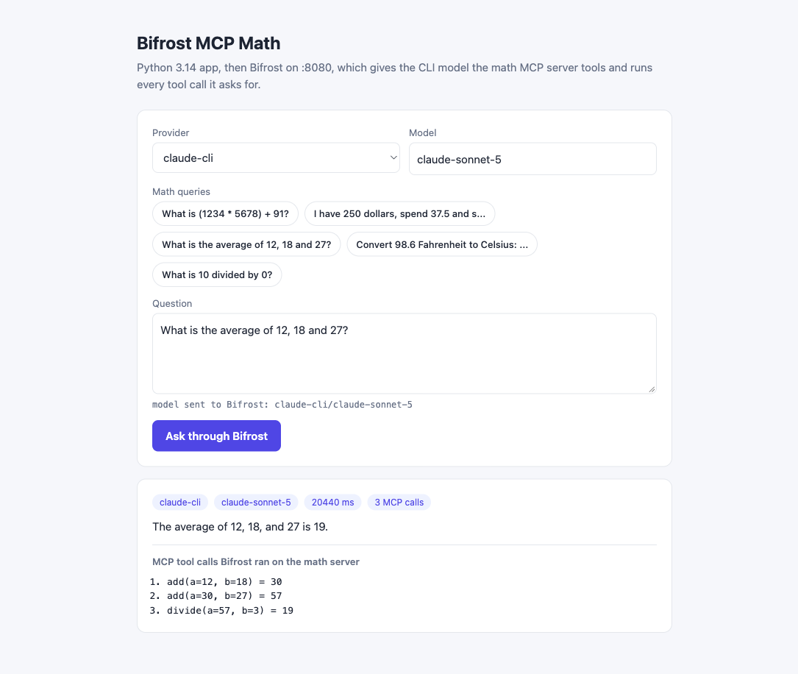
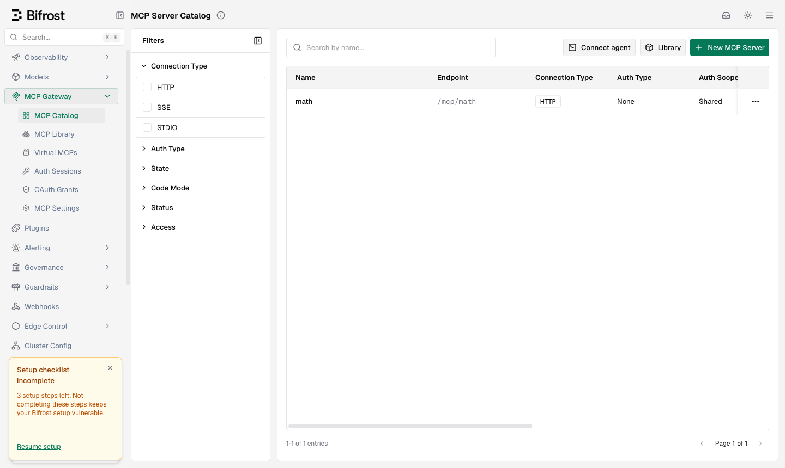

<p align="center"></p>

# Bifrost MCP Math

This POC builds on `pocs/Bifrost-ai-gateway` and adds an MCP server. The [Bifrost](https://github.com/maximhq/bifrost) AI gateway runs locally and routes to Claude Code, Codex, Agy and Ollama through their CLIs. A small Python 3.14.7 MCP server does basic math: `add`, `subtract`, `multiply` and `divide`. Bifrost connects to it as an MCP client in agent mode. When you ask a math question in the UI, Bifrost gives the CLI model the math tools, runs every tool call the model asks for on the MCP server, feeds the results back, and returns the final answer. The UI lists each MCP call that answered the question.

## How It Works?

1. On start, Bifrost connects to the math MCP server at `/mcp`, runs `initialize` and `tools/list`, and registers the 4 tools.
2. The app posts the question to Bifrost with `model: claude-cli/claude-sonnet-5`.
3. Bifrost adds the MCP tools to the request as OpenAI `tools` and forwards it to the bridge.
4. The bridge puts the tool schemas into the CLI prompt, runs `claude -p`, and turns its JSON reply into OpenAI `tool_calls`.
5. The tools are in `tools_to_auto_execute`, so Bifrost runs each `tool_calls` entry with `tools/call` on the MCP server. It then sends the results back to the model as `tool` messages.
6. The loop repeats until the model answers in plain text, up to `max_agent_depth` of 10.
7. The app reads the MCP server's call log and shows the answer with the MCP calls made while it ran.

## Architecture



The diagram source is [architecture.svg](architecture.svg).

## Features

- **Math MCP server**: MCP over streamable HTTP with JSON-RPC 2.0. It supports `initialize`, `ping`, `tools/list` and `tools/call`, uses only the stdlib, and has no SDK.
- **Bifrost agent mode**: Bifrost runs the tool loop itself, so the app sends one question and gets back one final answer.
- **Tool calling for CLI models**: the bridge teaches `claude`, `codex`, `agy` and `ollama` to emit OpenAI `tool_calls`, which they cannot do on their own.
- **Only offered tools run**: the bridge drops any tool name Bifrost did not send, so a model cannot call a tool the gateway does not know.
- **Tool errors are not crashes**: division by zero comes back as an MCP `isError` result, and the model explains it.
- **Visible MCP calls**: the UI lists every `tool(args) = result` that Bifrost ran on the math server for the answer.
- **Math queries in the UI**: one click fills a question that needs one or more tool calls.
- **No dependencies**: the MCP server, bridge, app and tests use only the Python standard library.

## Stack

- **Bifrost `v2.2.1`** (npx wrapper `1.6.3`): the gateway, which acts as MCP client, agent loop, router and logs.
- **Python 3.14.7**: the MCP server, the bridge and the app, stdlib `http.server` and `urllib`.
- **MCP streamable HTTP**: the transport Bifrost uses for an `http` MCP client, served as plain JSON responses.
- **agents SDK (Python)**: copied in to call Claude Code, Codex, Agy and Ollama through their CLIs.
- **unittest**: built-in test runner for unit tests and the live integration suite.
- **Bash scripts**: one command each to set up, start, test and stop the stack.

## Contracts/APIs

Math MCP server on `http://localhost:8093`:

| Method | Path | What it does |
|---|---|---|
| POST | `/mcp` | JSON-RPC 2.0: `initialize`, `ping`, `tools/list`, `tools/call`. Notifications return 202 |
| GET | `/calls?since=<seq>` | `{"last", "calls": [{"seq", "tool", "arguments", "result", "error"}]}` |
| GET | `/health` | Server status and tool names |

MCP tools, each with `{"a": number, "b": number}`:

| Tool | Returns |
|---|---|
| `add` | `a + b` |
| `subtract` | `a - b` |
| `multiply` | `a * b` |
| `divide` | `a / b`, or an `isError` result `division by zero` |

Bifrost on `http://localhost:8080`:

| Method | Path | What it does |
|---|---|---|
| POST | `/v1/chat/completions` | OpenAI chat call. The math tools are injected and run automatically |
| GET | `/v1/models` | Every model from all four CLI providers |
| GET | `/api/mcp/clients` | Connected MCP clients and their tools |
| GET | `/workspace/mcp-registry` | Bifrost Web UI MCP catalog |

Bridge on `http://localhost:8091`, called only by Bifrost. `<cli>` is `claude`, `codex`, `agy` or `ollama`:

| Method | Path | What it does |
|---|---|---|
| POST | `/<cli>/v1/chat/completions` | Runs the CLI. With `tools`, it returns `tool_calls` or the final text |
| GET | `/<cli>/v1/models` | Known model ids for that CLI |
| GET | `/health` | Bridge status and providers |

App on `http://localhost:8092`:

| Method | Path | Body | Response |
|---|---|---|---|
| POST | `/api/ask` | `{"provider": "claude-cli", "model": "claude-sonnet-5", "question": "..."}` | `{"answer", "provider", "model", "latency_ms", "tool_calls"}` |
| GET | `/api/providers` | | `{"providers": [...]}` |

Any OpenAI client gets the MCP tools too:

```bash
curl -s http://localhost:8080/v1/chat/completions \
  -H "Content-Type: application/json" \
  -d '{"model":"claude-cli/claude-sonnet-5","messages":[{"role":"user","content":"What is (1234 * 5678) + 91?"}]}'
```

## Key data structures and design decisions

- **MCP client in `config.json`**: Bifrost refuses to add a loopback MCP URL through its API unless dashboard auth is on. A client declared in `bifrost/config.template.json` is allowed, and `start-all.sh` renders the bridge and MCP ports into it.
- **`tools_to_auto_execute: ["*"]`**: this turns on agent mode for all 4 tools. They are pure math with no side effects, so there is nothing to approve.
- **Tool-call protocol for CLIs**: the bridge adds the tool schemas and one rule to the prompt: reply with only `{"tool_calls": [{"name", "arguments"}]}` or with plain text. It parses the first JSON object in the reply, keeps only calls to offered tools, and returns `finish_reason: tool_calls`.
- **Conversation replay**: in each loop step, Bifrost sends the whole history. The bridge renders earlier `tool_calls` as `called tool X with {...}` and `tool` messages as `tool result: ...`, so the stateless CLI sees what already ran.
- **Plain JSON over streamable HTTP**: the server answers every POST with `application/json` and never opens an SSE stream (GET `/mcp` returns 405). This is valid in the MCP spec and keeps the server stdlib-only.
- **Call log instead of parsing Bifrost responses**: Bifrost returns only the final answer in agent mode. The app reads the MCP server's sequence number before the question and lists the calls made after it. The log is global, so two questions asked at the same time would share their lists.
- **`ollama run --nowordwrap`**: without it, Ollama wraps long lines with terminal escape codes, which broke the tool-call JSON. The copied SDK now always passes it, and a test pins it.
- **Model quality varies**: Claude Code, Codex and Agy break multi-step questions into correct tool calls. `llama3.2` does call the MCP tools, but it often picks the wrong operands on multi-step math.

## How to run the app/tests

Needs Python 3.14, Node (for `npx`) and the `claude`, `codex`, `agy` and `ollama` CLIs, logged in.

```bash
./scripts/setup.sh
./scripts/start-all.sh
./scripts/test-all.sh
./scripts/ui.sh
./scripts/stop-all.sh
```

`test-all.sh` runs 56 tests:

- 14 agents SDK unit tests
- 17 bridge unit tests, 7 of them for tool calling
- 11 math MCP server unit tests
- 7 app unit tests
- 7 live integration tests through the running Bifrost. They check that Bifrost discovers the 4 MCP tools, and that a math question from the app makes Bifrost run `multiply` and `add` on the MCP server for Claude Code, Codex and Agy. They also check that a plain OpenAI call with Ollama reaches the MCP server, and they keep the routing tests from the base POC. If the stack is down, `test-all.sh` starts it and stops it again afterwards.

## Printscreens

### App answering a math query through Bifrost and MCP



The app with `claude-cli` and `claude-sonnet-5`, after a click on the query "What is the average of 12, 18 and 27?". Claude Code did no math itself. Bifrost ran 3 MCP calls on the math server in order: `add(12, 18) = 30`, `add(30, 27) = 57` and `divide(57, 3) = 19`. It fed each result back to the model and returned "The average of 12, 18, and 27 is 19." The chips show the routed provider, the model, the total latency across all loop steps, and the number of MCP calls.

### Bifrost MCP catalog



The Bifrost Web UI under MCP Gateway, then MCP Catalog. The `math` server from `config.json` is connected over HTTP with no auth, and Bifrost exposes it at `/mcp/math`. `GET /api/mcp/clients` shows its 4 tools with `tools_to_auto_execute: ["*"]`.

## Scripts

All scripts live in `scripts/` and run from any directory of the repository.

| Script | What it does |
|---|---|
| `./scripts/setup.sh` | Checks Python 3.14, downloads Bifrost, checks the CLIs |
| `./scripts/start-all.sh` | Starts the MCP server, the bridge, Bifrost and the app, then prints the full link of each one |
| `./scripts/status.sh` | Shows every service port as UP or DOWN, and exits non-zero while any is down |
| `./scripts/test-all.sh` | Runs every test suite, unit and live integration |
| `./scripts/ui.sh` | Opens the app and the Bifrost UI in the browser |
| `./scripts/stop-all.sh` | Stops every service |

Ports are declared in `scripts/ports.env`: `bifrost=8080`, `bridge=8091`, `app=8092`, `mcp=8093`.

```bash
./scripts/setup.sh
./scripts/start-all.sh
./scripts/status.sh
./scripts/ui.sh
./scripts/stop-all.sh
```
