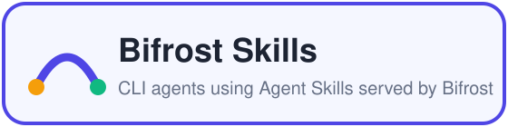
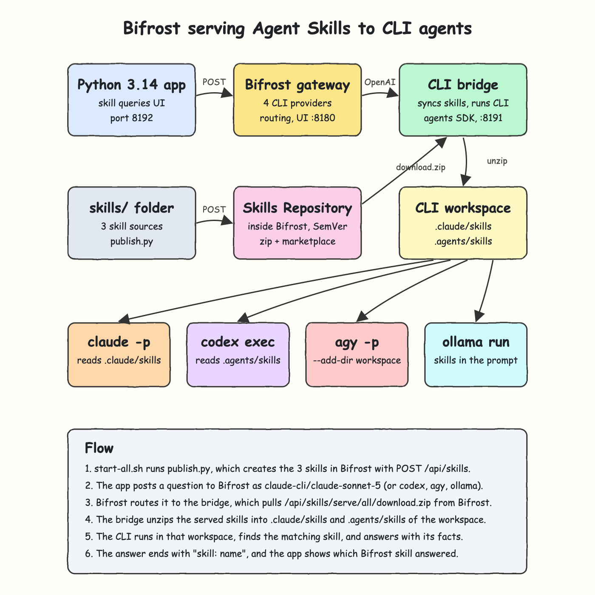
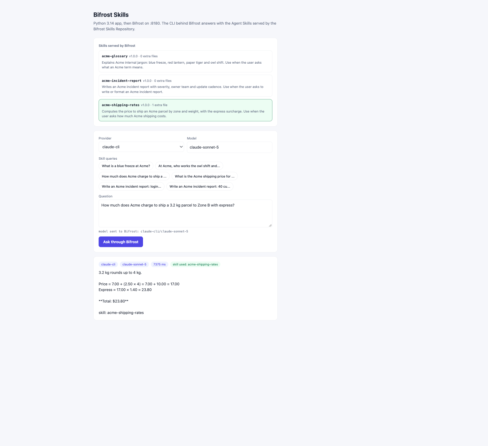
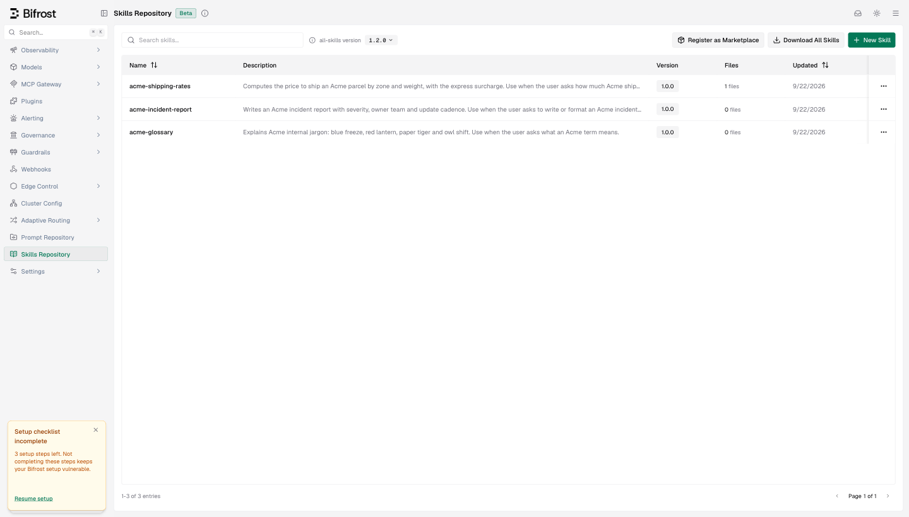

<p align="center"></p>

# Bifrost Skills

This POC builds on `pocs/bifrost-ai-gateway-mcp`. It uses the [Bifrost](https://github.com/maximhq/bifrost) Skills Repository, the Agent Skills registry built into Bifrost v2.2.1. The POC creates 3 skills in Bifrost: `acme-glossary`, `acme-shipping-rates` and `acme-incident-report`. A Python app sends questions through the Bifrost AI gateway to Claude Code, Codex, Agy and Ollama, which run as CLIs. The CLI behind Bifrost answers with the skills Bifrost serves. Each skill holds made-up facts or rules that no model knows, so a correct answer proves the skill was used. The UI shows which Bifrost skill answered.

## How It Works?

1. `start-all.sh` runs `skills/publish.py`, which creates the 3 skills in Bifrost with `POST /api/skills`. The shipping skill carries an attached file, `references/rates.md`.
2. The app posts the question to Bifrost with `model: claude-cli/claude-sonnet-5`, or with `codex-cli`, `agy-cli` or `ollama-cli`.
3. Bifrost routes the request to the bridge, which is the upstream of all 4 custom providers.
4. On every request, the bridge downloads the served skills from Bifrost with `GET /api/skills/serve/all/download.zip`.
5. If the archive changed, the bridge unzips it into `.claude/skills/` and `.agents/skills/` inside its workspace.
6. The CLI runs with that workspace as its working directory. Claude Code, Codex and Agy each find the skills on their own and load the one whose description matches the question.
7. Each skill ends its answer with a line `skill: <name>`. The app reads that line and marks the skill in the UI.

## Architecture



The diagram source is [architecture.svg](architecture.svg).

## Features

- **3 skills created in Bifrost**: a glossary, a price calculator with an attached rate table, and an incident report template. All three are versioned in the Bifrost Skills Repository.
- **Proof of skill use**: each skill holds facts or rules no model knows, such as "a blue freeze is a 36-hour deploy freeze" or "Zone B costs 7.00 plus 2.50 per kg". A right answer can only come from the skill.
- **Native skill discovery**: Claude Code reads `.claude/skills`, and Codex and Agy read `.agents/skills`. The bridge only puts the files there and does not change the question.
- **Ollama gets the skills too**: Ollama has no skill support, so the bridge puts the served skills and their files into its prompt.
- **Always the served version**: the bridge syncs before each request. If a new version is served in Bifrost, the next question uses it without a restart.
- **Idempotent publishing**: `publish.py` creates missing skills, publishes a new version when `skill.json` has a new version, and leaves the rest alone.
- **Marketplace for free**: Bifrost also lists every skill as a Claude Code and Codex plugin (`bifrost-<name>` and `bifrost-all-skills`).
- **Safe unzip**: the bridge rejects any archive entry with an absolute path or `..`, so a served skill cannot write outside the workspace.
- **No dependencies**: the bridge, the app, the publisher and the tests use only the Python standard library.

## Stack

- **Bifrost `v2.2.1`** (npx wrapper `1.6.3`): the gateway, Skills Repository, router and logs.
- **Agent Skills**: the `SKILL.md` format with attached files, served by Bifrost and read by the CLIs.
- **Python 3.14.7**: the bridge, the app and the skill publisher, using stdlib `http.server`, `urllib` and `zipfile`.
- **agents SDK (Python)**: copied in to call Claude Code, Codex, Agy and Ollama through their CLIs. It now runs each CLI in a chosen working directory.
- **unittest**: built-in test runner for the unit tests and the live integration suite.
- **Bash scripts**: one command each to set up, start, test and stop the stack.

## Skills

| Skill | Files | What only the skill knows | Question in the UI |
|---|---|---|---|
| `acme-glossary` | `SKILL.md` | Meanings of blue freeze, red lantern, paper tiger and owl shift | What is a blue freeze at Acme? |
| `acme-shipping-rates` | `SKILL.md`, `references/rates.md` | Zone rate table, rounding up to the next kg, 40% express surcharge | How much does Acme charge to ship a 3.2 kg parcel to Zone B with express? (`$23.80`) |
| `acme-incident-report` | `SKILL.md` | Report template, SEV rules, owner teams, update cadence | Write an Acme incident report: login is failing for about 2500 customers since 10:05. (`SEV-1`, `team-gatekeeper`) |

Each skill's source lives in `skills/<name>/`: `skill.json` holds the description and version, `body.md` holds the `SKILL.md` body, and any other file is attached. Bifrost generates the `SKILL.md` frontmatter from these fields.

## Contracts/APIs

Bifrost on `http://localhost:8180`:

| Method | Path | What it does |
|---|---|---|
| POST | `/v1/chat/completions` | OpenAI chat call routed to a CLI provider |
| GET | `/v1/models` | Every model from all four CLI providers |
| GET | `/api/skills` | Skills in the repository with their served version and file count |
| POST | `/api/skills` | Creates a skill and serves its first version |
| PUT | `/api/skills/{id}` | Creates a new version, with `serve: true` to switch to it |
| GET | `/api/skills/serve/all/download.zip` | Every served skill as `<name>/SKILL.md` plus its attached files |
| GET | `/api/skills/serve/claude-code/.claude-plugin/marketplace.json` | Claude Code marketplace listing every skill as a plugin |
| GET | `/workspace/skills-repo` | Bifrost Web UI Skills Repository |

Bridge on `http://localhost:8191`, called only by Bifrost. `<cli>` is `claude`, `codex`, `agy` or `ollama`:

| Method | Path | What it does |
|---|---|---|
| POST | `/<cli>/v1/chat/completions` | Syncs the Bifrost skills into the workspace and runs the CLI there |
| GET | `/<cli>/v1/models` | Known model ids for that CLI |
| GET | `/health` | Bridge status, providers and the skills in the workspace |

App on `http://localhost:8192`:

| Method | Path | Body | Response |
|---|---|---|---|
| POST | `/api/ask` | `{"provider": "claude-cli", "model": "claude-sonnet-5", "question": "..."}` | `{"answer", "provider", "model", "latency_ms", "skills_used"}` |
| GET | `/api/skills` | | `{"skills": [{"name", "description", "version", "files"}]}` read from Bifrost |
| GET | `/api/providers` | | `{"providers": [...]}` |

Any OpenAI client gets the skills too:

```bash
curl -s http://localhost:8180/v1/chat/completions \
  -H "Content-Type: application/json" \
  -d '{"model":"codex-cli/gpt-5.6-luna","messages":[{"role":"user","content":"What is a blue freeze at Acme?"}]}'
```

## Key data structures and design decisions

- **Bifrost is the source of truth for skills**: the bridge never reads `skills/`. It uses only what Bifrost serves, so a version switched in the Bifrost UI is what the CLIs use.
- **Zip download instead of the marketplace**: `claude plugin install` would change the user's global Claude Code and Codex config. The served zip covers the same skills for all 4 CLIs inside a private workspace, `.run/workspace`.
- **Sync by content hash**: the bridge hashes the downloaded zip and rewrites the workspace only when the hash changes. A lock keeps two requests from unpacking at the same time.
- **Agy needs `--add-dir`**: Antigravity reads `.agents/skills` from its workspace root. When run from inside the workspace without `--add-dir`, Agy did not load the skill and described blue-raspberry drinks for "What is a blue freeze at Acme?". This also shows the model cannot know these facts without the skill.
- **Signature line as proof**: agent mode returns only the final text, so each skill asks the model to end with `skill: <name>`. The integration test also checks the skill-only facts, because a signature alone could be imitated.
- **Listen backlog raised to 64**: `ThreadingHTTPServer` keeps a backlog of 5. On macOS, 9 questions at once got `Connection reset by peer`, so the app and the bridge set `request_queue_size = 64`.
- **Own ports**: 8180/8191/8192, so this POC can run next to the MCP POC on 8080/8091–8093.

## How to run the app/tests

Needs Python 3.14, Node (for `npx`) and the `claude`, `codex`, `agy` and `ollama` CLIs, logged in, with the Ollama server running.

```bash
./scripts/setup.sh
./scripts/start-all.sh
./scripts/test-all.sh
./scripts/ui.sh
./scripts/stop-all.sh
```

`test-all.sh` runs 62 tests:

- 15 agents SDK unit tests, one of which checks that the CLI runs in the given working directory
- 20 bridge unit tests, 10 of them for syncing skills and handing them to each CLI
- 8 skill publisher unit tests
- 11 app unit tests
- 8 live integration tests through the running Bifrost:
  - Bifrost serves the 3 skills at their local versions, with the rate table in the zip and a marketplace plugin for each skill.
  - Claude Code, Codex and Agy each answer all 3 skill questions through app → Bifrost, 9 parallel calls. Each answer holds the skill-only facts (`36`, `23.80`, `SEV-1` + `team-gatekeeper`) and is signed by the right skill.
  - Ollama answers the glossary question through a plain OpenAI call.
  - The routing checks from the base POC still pass.

  If the stack is down, `test-all.sh` starts it and stops it again afterwards.

## Printscreens

### App answering with a Bifrost skill



The app with `claude-cli` and `claude-sonnet-5`, after a click on the shipping query. The top card lists the 3 skills read live from Bifrost, with their served version and attached file count. Claude Code found `acme-shipping-rates` in its workspace and read `references/rates.md`. It rounded 3.2 kg up to 4 kg, applied the Zone B rates `7.00 + 2.50 × 4 = 17.00` and the 40% express surcharge, and returned `$23.80`. The answer ends with `skill: acme-shipping-rates`, so the app shows the green "skill used" chip and highlights that skill.

### Bifrost Skills Repository



The Bifrost Web UI under Skills Repository. The 3 skills that `publish.py` created are served at `1.0.0`, and `acme-shipping-rates` has 1 attached file. The all-skills plugin version is `1.2.0`: Bifrost set it to `1.0.0` for the first skill and raised the minor version for each skill added after it. **Register as Marketplace** gives the Claude Code and Codex install commands for the same skills.

## Scripts

All scripts live in `scripts/` and run from any directory of the repository.

| Script | What it does |
|---|---|
| `./scripts/setup.sh` | Checks Python 3.14, downloads Bifrost, checks the CLIs and the Ollama server |
| `./scripts/start-all.sh` | Starts the bridge and Bifrost, publishes the skills, starts the app, then prints the full link of each one |
| `./scripts/status.sh` | Shows every service port as UP or DOWN, and exits non-zero while any is down |
| `./scripts/test-all.sh` | Runs every test suite, unit and live integration |
| `./scripts/ui.sh` | Opens the app and the Bifrost UI in the browser |
| `./scripts/stop-all.sh` | Stops every service |

Ports are declared in `scripts/ports.env`: `bifrost=8180`, `bridge=8191`, `app=8192`.

```bash
./scripts/setup.sh
./scripts/start-all.sh
./scripts/status.sh
./scripts/ui.sh
./scripts/stop-all.sh
```
