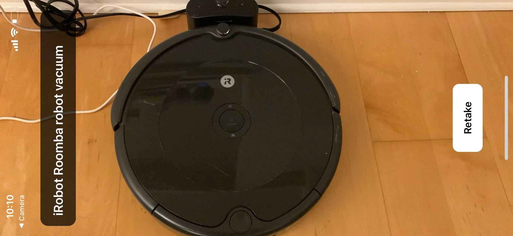

# AR Point & Tell

> Point your phone at a thing. Tap. It tells you what it is.

<p align="center">
  
</p>

The screenshot above is the app running on a real phone. The camera was pointed at a black robot
vacuum sitting on a hardwood floor, the frame was captured, sent to the OpenAI vision API, and the
answer — **"iRobot Roomba robot vacuum"** — is rendered as a label over the captured image. The
**Retake** button drops you back to the live camera to try another object. No typing, no searching:
point, tap, know.

Try it on a sofa and you get *"IKEA fabric sofa"*; on a cap, *"SF Giants baseball cap"*.

---

Built with **Claude Code Auto Mode** — the agent ran the build → run → fix loop unattended, only
stopping for real decisions. Read about it: https://www.anthropic.com/engineering/claude-code-auto-mode

Full design: [design-doc.md](./design-doc.md)

## Experience Notes

* Built with Claude code Opus 4.7 on Auto Mode ON
* No single permission question was asked
* This one done in 10 min
* I had todo a react-native migration to make the app work for all this was done under 10 min and no questions was asked.
* auto-mode is sexy because allow things to run in background or overnight - thats why having to anwser no questions matter.

## Stack

| Piece | Choice |
|-------|--------|
| App | React Native + Expo (SDK 54) |
| Camera | `expo-camera` (live preview + capture) |
| Vision | OpenAI `gpt-4o` (image in → label out) |
| Language | TypeScript, no state/navigation libraries |

## How it works

```
   📷 point        👆 tap         🌐 ask OpenAI       🏷️  show
  live camera  →  capture frame  →  "what is this?"  →  label overlay
                   (base64)         (gpt-4o vision)     + Retake
```

State machine: `ready → analyzing → result / error`.

The whole thing is one screen: [`app/App.tsx`](./app/App.tsx) owns the state,
[`CameraScreen`](./app/src/CameraScreen.tsx) handles the preview and shutter,
[`openai.ts`](./app/src/openai.ts) makes the vision call, and
[`ResultOverlay`](./app/src/ResultOverlay.tsx) draws the label you see in the screenshot.

## Quick start

```
cd app
cp env.example .env          # then put your real key in app/.env
```

`app/.env`:
```
EXPO_PUBLIC_OPENAI_API_KEY=sk-...
```

Then from the POC root:
```
./start.sh
```

This installs dependencies (first run), seeds `.env` if missing, and starts the Expo dev server
**in the foreground** so the QR code shows in your terminal.

### Get it on your phone

1. Install **Expo Go** (App Store / Play Store).
2. Put your phone and this computer on the **same Wi-Fi**.
3. **iOS:** open the Camera app, point at the QR code, tap the banner → opens in Expo Go.
   **Android:** open Expo Go → "Scan QR code".
4. The app loads over the network and reloads live on edits.

Stop with `Ctrl+C` (or `./stop.sh` from another terminal). If the phone can't reach the computer
(different network, VPN, firewall), run `cd app && npx expo start --tunnel`.

> Note: `EXPO_PUBLIC_*` keys are baked into the bundle at build time. If you change `app/.env`
> while Metro is running, restart with `cd app && npx expo start --clear` so the new key is picked up.

## Test

Verifies the OpenAI integration without needing the phone (sends a sample image, asserts a label
comes back, and prints OpenAI's exact error if the key is bad):

```
./test.sh
```

Requires `EXPO_PUBLIC_OPENAI_API_KEY` in `app/.env` or the environment.

## Notes & caveats

- **Key in bundle.** The API key ships inside the app bundle — fine for a local POC, not for
  distribution. The hardening path is a thin backend proxy that holds the key (see *Future Work*
  in the design doc).
- **Cost.** Each capture is a billed OpenAI vision call.
- **Snapshot, not live AR.** It's point → capture → label, not continuous frame-by-frame tracking.
- **Real device recommended.** The camera doesn't work in a plain simulator.
