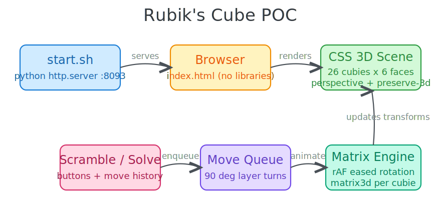
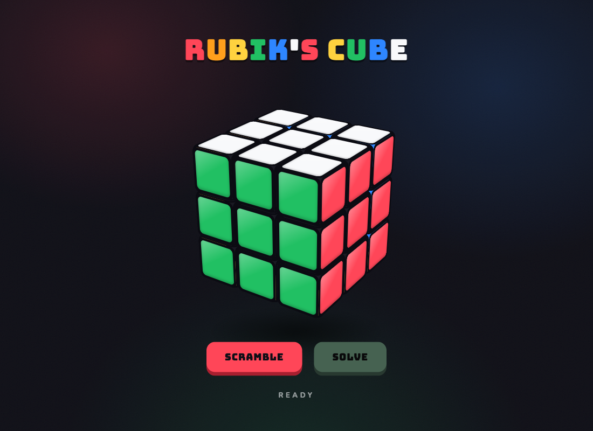
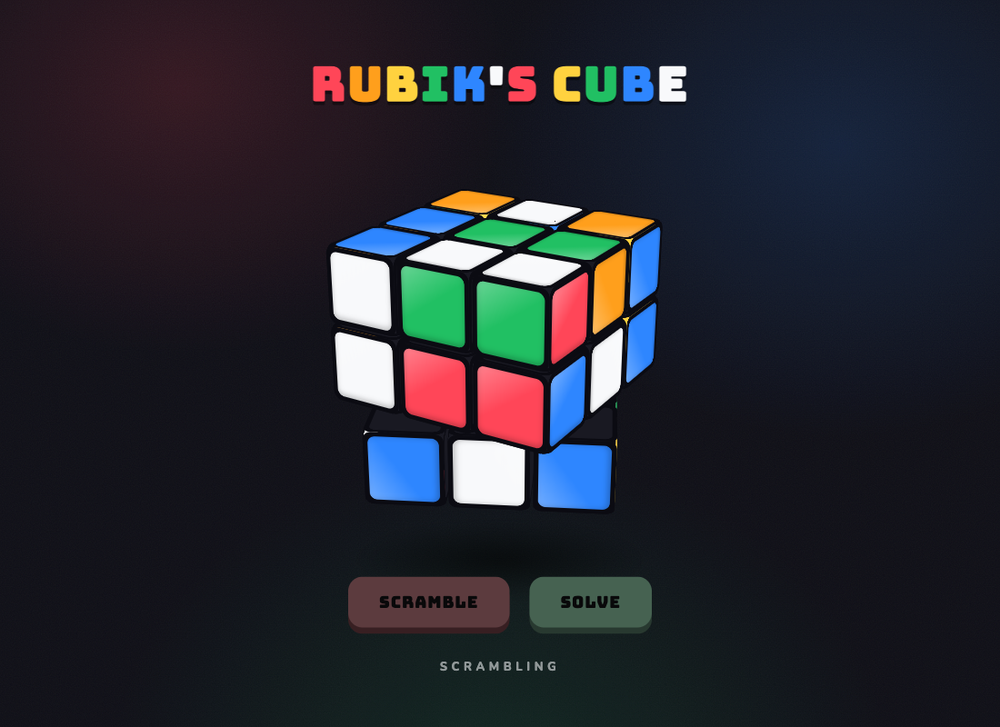
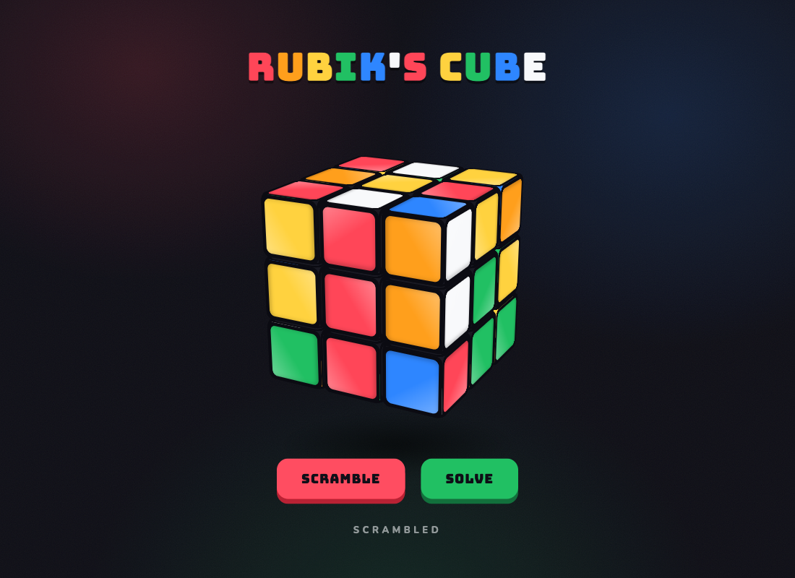
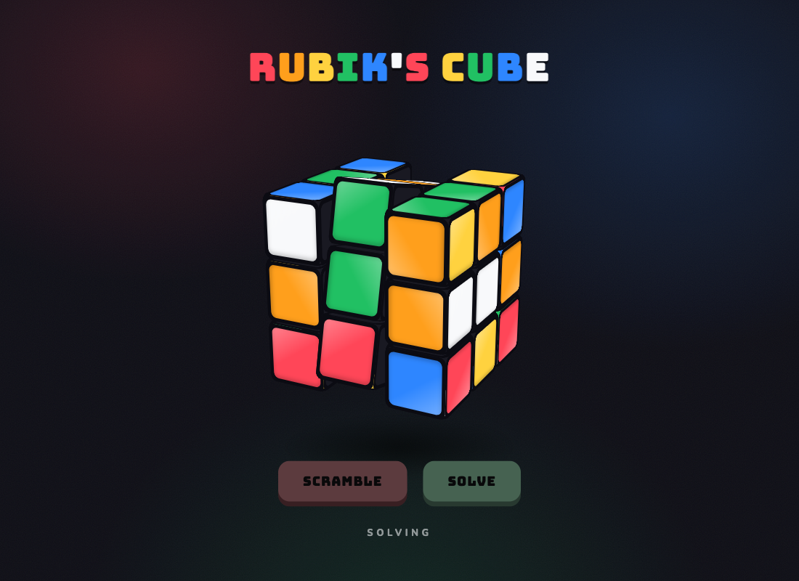
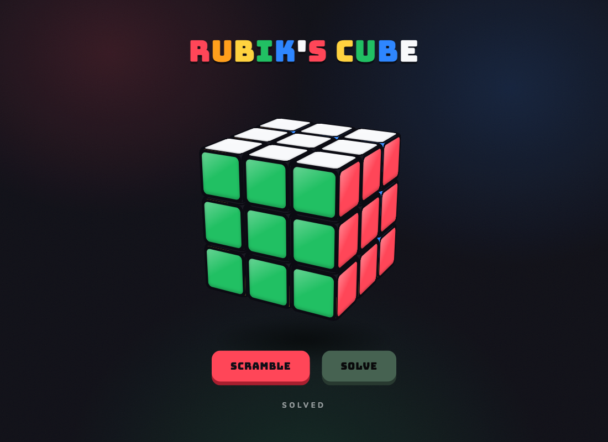

# Rubik's Cube POC

A colorful 3D Rubik's Cube in a single HTML file with zero libraries. The cube is built from 26 cubies rendered with CSS 3D transforms, and every layer turn is animated with an eased 90 degree rotation driven by requestAnimationFrame.

## How it works

- The scene uses `perspective` and `transform-style: preserve-3d`; each cubie is a div with 6 faces placed by `rotate + translateZ`.
- Each cubie carries a 4x4 transform matrix. A layer turn picks the 9 cubies in that slice, animates `matrix3d(R(angle) * M)` per frame, then bakes the final 90 degree rotation into the matrix and updates the cubie grid position.
- Scramble enqueues 18 random layer moves and records them in a history.
- Solve replays the inverse of the history in reverse order, returning the cube to the solved state.
- Buttons are disabled while moves are animating; the status line shows Ready, Scrambling, Scrambled, Solving, Solved.

## Architecture



## Run

```bash
./start.sh
```

Open http://localhost:8093 then:

```bash
./stop.sh
```

## Screenshots

Solved cube on load:



A layer visibly mid-rotation during a scramble, with the bottom slice caught halfway through its 90 degree turn:



Fully scrambled, Solve button enabled:



Solving in progress, both buttons locked:



Back to solved after pressing Solve:


