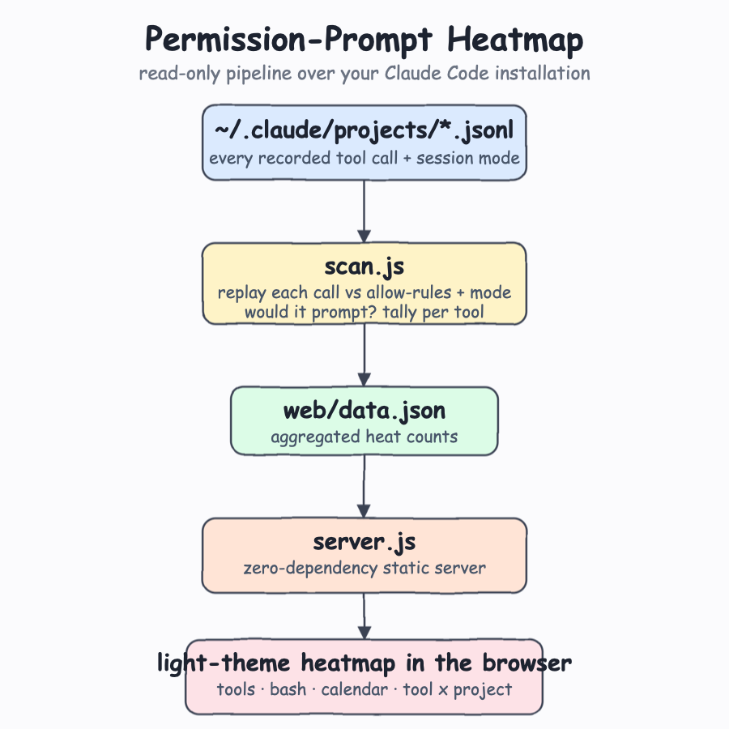
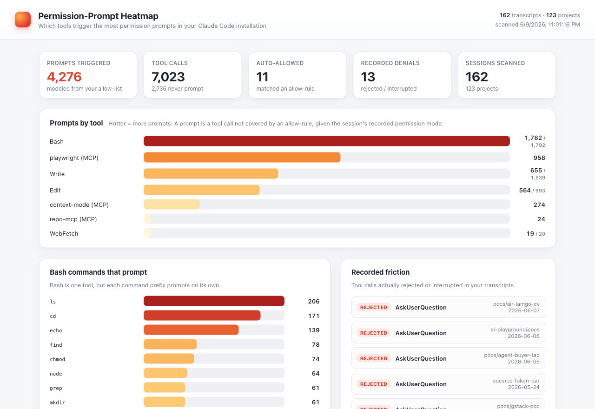
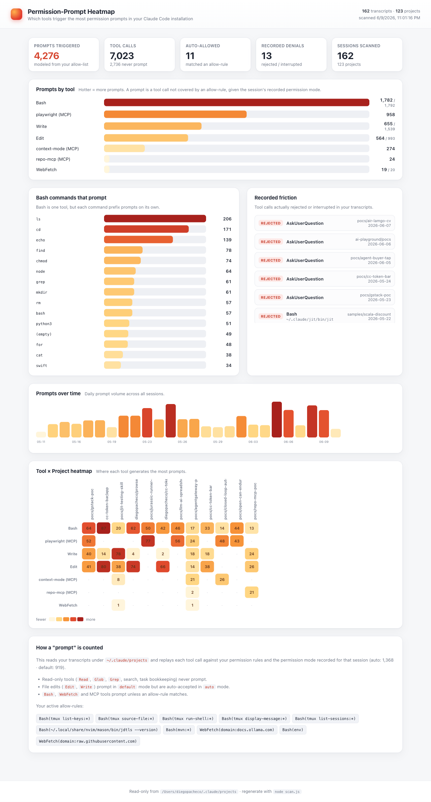

# Permission-Prompt Heatmap

A light-theme web dashboard that answers one question about your local Claude Code installation:

> **Which tools trigger the most permission prompts?**

It reads your transcripts under `~/.claude/projects`, replays every recorded tool call against your permission rules and the permission mode each session ran in, and renders a heatmap of where the friction is.



## What it shows



- **Prompts by tool** — a heat-ranked bar for every tool, hottest first. Bash, MCP servers, and edits float to the top.
- **Bash commands that prompt** — Bash is a single tool, but each command prefix (`ls`, `git status`, `rm`, `node`, …) prompts on its own, so it gets its own breakdown.
- **Recorded friction** — the tool calls that were *actually* rejected or interrupted in your transcripts (ground truth, not modeled).
- **Prompts over time** — daily prompt volume across all sessions.
- **Tool × Project heatmap** — a literal grid showing where each tool generates the most prompts.



## How a "prompt" is counted

Claude Code does not log "a prompt was shown" as an event, so the dashboard reconstructs it. For every `tool_use` in your transcripts it replays the permission decision:

- **Read-only tools** (`Read`, `Glob`, `Grep`, search, task bookkeeping) never prompt → not counted.
- **File edits** (`Edit`, `Write`, `MultiEdit`, `NotebookEdit`) prompt in `default` mode but are auto-accepted in `auto` / `acceptEdits` mode. The transcript records the per-session mode, so this is honored exactly.
- **`Bash`, `WebFetch`, and MCP tools** prompt unless one of your `allow` rules matches. Bash matching is prefix-based (e.g. `Bash(mvn:*)` matches any `mvn …`); WebFetch matches by domain.
- Anything covered by an `allow` rule is counted as **auto-allowed**, not a prompt.

The allow rules used come from `~/.claude/settings.json` and `~/.claude/settings.local.json` and are listed at the bottom of the dashboard for transparency. **Nothing is written to your Claude Code data — the scan is read-only.**

## Run it

```bash
./start.sh     # scans transcripts, generates data, serves the dashboard, opens the browser
./stop.sh      # stops the server
./test.sh      # verifies the scan + server end to end
```

The dashboard is served at `http://127.0.0.1:7820` (override with `PORT=xxxx ./start.sh`).

To refresh the data without restarting, re-run the scanner:

```bash
node scan.js
```

## Files

| File | Role |
|------|------|
| `scan.js` | Reads `~/.claude/projects/**/*.jsonl`, replays each tool call, writes `web/data.json`. |
| `server.js` | Zero-dependency static HTTP server for the `web/` folder. |
| `web/index.html`, `web/styles.css`, `web/app.js` | The light-theme dashboard (vanilla JS, no build step). |
| `web/data.json` | Generated heatmap data. |
| `start.sh` / `stop.sh` / `test.sh` | Lifecycle scripts. |

No dependencies. Just Node.

## Test output

```
$ ./test.sh
Scanned 162 transcripts across 123 projects.
Tool calls: 7023 | Prompts: 4276 | Auto-allowed: 11 | No-prompt: 2736 | Recorded denials: 13
Wrote web/data.json
OK data.json: 4276 prompts, 37 tools
PASS: index (200) and data.json (200) served on http://127.0.0.1:7820
```
