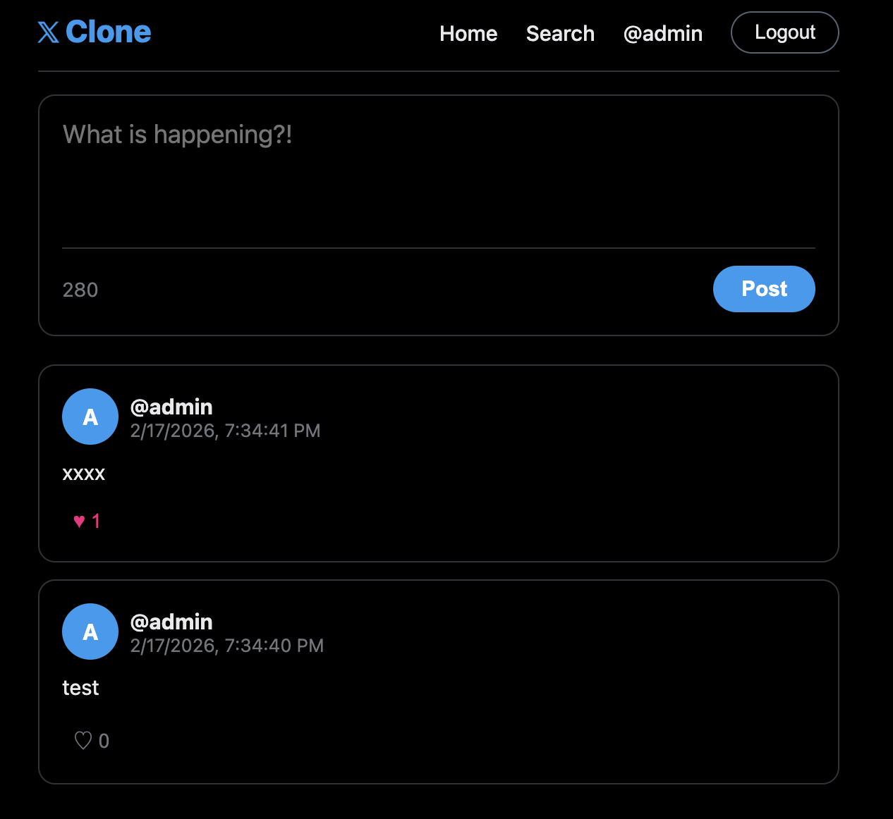
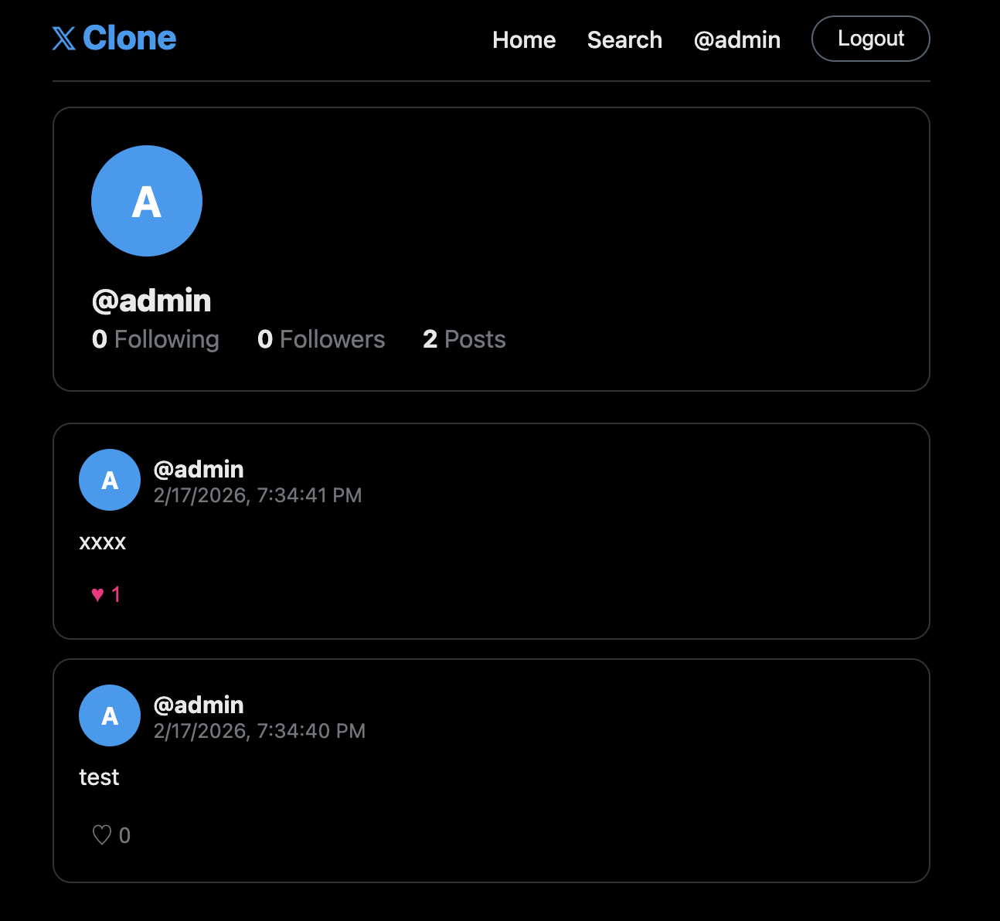
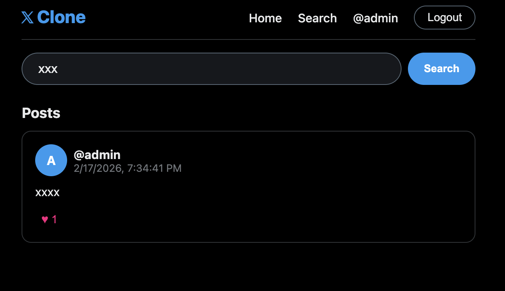

# cc Sonnet 4.6

## Prompt

```
 build a twitter like application with react and rust, make sure you have a run.sh and stop.sh, have the functionality of login, register, timeline, post, follow, like, unlike, search. use sqllite for db.
```

## Experience Notes

* Sonnet 4.6 on shot it pretty well
* Backend code is good.
* Frontend is decent.
* There was a warning on backend code when run run.sh
```
warning: struct `User` is never constructed
 --> src/models.rs:4:12
  |
4 | pub struct User {
  |            ^^^^
  |
  = note: `#[warn(dead_code)]` (part of `#[warn(unused)]`) on by default

warning: struct `Post` is never constructed
  --> src/models.rs:14:12
   |
14 | pub struct Post {
   |            ^^^^

warning: `twitter-clone-backend` (bin "twitter-clone-backend") generated 2 warnings
    Finished `release` profile [optimized] target(s) in 0.14s
```
* I asked for twitter and wrote as X.
* 

## Result

Register <br/>


Timeline <br/>


Profile <br/>


Search <br/>
