<p align="center"></p>
<h1 align="center">The Wizard’s Gambit</h1>
<p align="center">A little magic. A game of minds.</p>

A playable, wizard-inspired 3D chess game for one human against a local CPU. Choose from eight piece colors and seven materials, then challenge the Castle Guardian’s contrasting army in one of three Hogwarts-inspired rooms: the castle library with its glowing fireplace, the Great Hall under floating candles, or Dumbledore’s Office. Built with Three.js, Bun, Vite, and TypeScript.


## Features

- Sculpted 3D pieces, bronze trim, soft shadows, and drifting sparks sit among 540 colored books, vaulted stonework, a library ladder, and a carved fireplace. There are no floating candles in the library.
- The **Background** selector switches between three rooms at any time without touching the match:
  - **The Library** — oak bookshelves, a Gothic window, banners, and a burning fireplace that crackles while sound is on.
  - **The Great Hall** — 48 bobbing floating candles, starry arched windows, the four house banners, the staff table on its dais, and a long house table.
  - **Dumbledore’s Office** — a round, portrait-lined room with bookcases, the Sorting Hat, a claw-footed desk with spinning silver instruments, a phoenix on a golden perch, and a glowing Pensieve.
- Captured pieces rise and spin away as glowing fragments scatter through an expanding golden ring, with a falling magical swish and sparkle.
- On checkmate the defeated king trembles, topples onto its side, and shatters into crimson fragments while a low toll, an impact thud timed to the fall, and a descending chime play.
- Choose **white, green, brown, black, blue, orange, salmon, or gray** for your army at any time. Blue is a deep sapphire, orange a warm amber, and brown a polished rosewood. The CPU uses green against white, and white against the other colors.
- The **Piece style** selector sets both armies’ material: **Classic, Marble, Wood, Steel, Glass, Plastic, or Stone**. Classic is a lacquered finish with a clear coat and soft reflections. Marble veins, wood grain, and stone speckle are procedural canvas textures tinted by the chosen color; steel and glass reflect a generated room environment, and glass uses real light transmission.
- Color, style, and background survive reloads, undo, and new games.
- The **fullscreen button** beside the camera and sound controls expands the board and sidebar together; use it again or press Escape to exit.
- Three CPU levels use a background worker so the board stays responsive during search.
- Checkmate displays a prominent result card over the board, identifies the winner, and offers an immediate **New game** button. It also appears when reopening a finished match and works in fullscreen and on mobile.
- Legal chess includes castling, en passant, promotion choices, checkmate, and automatic draws by repetition, the fifty-move rule, and insufficient material.
- **There is no stalemate.** A side that is not in check but has no legal move skips its turn, and the other side moves again, so a winning player can always go on to checkmate. Skips appear as “skips” in the chronicle and are saved with the match. Only if neither side can move does the game end as a draw.
- Click pieces and destinations, or enter coordinate moves and standard algebraic notation with a keyboard.
- Orbit, zoom, rotate the board, or switch to an overhead camera. Near-side room walls cut away when the camera moves behind them so they do not obscure the board.
- Undo a human/CPU turn, start a fresh match, and restore the current match after a reload.
- The **History** tab beside the chronicle lists every finished match: win, loss, or draw, the Guardian’s level, the move count, how long the game took, and a score from 0% (Novice) to 100% (Grandmaster), plus your win/loss/draw totals and average score. The score weighs the result (win 70, draw 35, loss 0) plus up to 30 for the material edge on the final board, scaled by the Guardian’s level (Apprentice ×0.4, Wizard ×0.7, Grandmaster ×1). The checkmate card shows the same score, and the last 100 matches are saved in the browser.
- The speaker control opens the **Hedwig’s Theme** sequence from Online Sequencer over the board. Press its play button and the panel slides out of view while the music keeps playing, alongside locally synthesized move, capture, and checkmate sounds. In the library, a looping synthesized fire crackle plays too; it stops when you mute or leave the library. Tap the speaker again to mute and unload it. The page address lives in the `music` constant in `src/main.ts`, and music needs an internet connection.
- The full interface fits the browser viewport. Move history and game panels scroll internally on smaller screens, while the outer page stays fixed.
- **Phones:** the game plays in mobile browsers by touch. On phone screens the heading and footer give way so the board fills most of the screen, and the camera zooms in on small canvases so squares stay tappable. Held sideways, the board sits beside a stacked sidebar instead of shrinking to a strip. Taps tolerate a little finger movement, a swipe orbits without selecting a piece, and two fingers pinch to zoom. On touch screens, fields use 16px text so iOS Safari does not zoom the page on focus, camera buttons and swatches grow to thumb size, hover tints are disabled, the hint reads “Pinch to zoom”, and rendering resolution is capped at 1.5× to spare phone GPUs.
- Reduced-motion preferences keep firelight, candles, the phoenix, instruments, and ambient effects still and suppress capture and king-fall animations.
- A playable flat board appears when WebGL cannot initialize.

## How it Works?

1. You control the side that moves first; choose its appearance with the eight piece-color swatches and the piece style selector, and pick a room with the background selector.
2. Select a piece to display its legal destinations, then select a golden ring.
3. Alternatively, enter `e2e4`, `Nf3`, or `O-O` in the Move field.
4. A pawn reaching the final rank opens a queen, rook, bishop, or knight picker.
5. The rules engine validates the move before the scene and chronicle change.
6. Captures trigger the defeated piece’s magical exit, including en passant captures.
7. The Guardian searches the position in a Web Worker and returns its chosen move.
8. The browser saves the complete move history, challenge level, piece color, piece style, and background after each change.
9. Checkmate shows the winner and a New game button over the board. Restart immediately, or undo to revisit the position; draws show the same card with the reason, so a finished match never looks frozen.

## Architecture


The [editable SVG diagram](docs/architecture.svg) embeds the Caveat handwriting font, uses pastel boxes and a wobble filter, and shows the capture path with a solid arrow. The font’s license is in [docs/Caveat-OFL.txt](docs/Caveat-OFL.txt).

This is a static browser application. Vite serves source during development and writes deployable assets to `dist/`. The CPU runs on the user’s device. There is no backend, account, database, external chess API, or paid service.

## Stack

- **Three.js 0.186** — renders the board, procedurally sculpted pieces, shadows, particles, and camera controls.
- **chess.js 1.4** — provides reliable legal move generation and game termination rules.
- **TypeScript 7.0** — checks application, engine, worker, and testing contracts.
- **Bun 1.4** — installs dependencies, executes Vite, and runs the engine tests.
- **Vite 8.3** — supplies fast development updates and the production asset build.
- **Playwright 1.63** — checks real browser interaction, fallback behavior, and responsive screenshots.
- **Native HTML, CSS, Web Audio, and Web Workers** — keep UI, sound, and CPU execution free of extra runtime libraries.

Exact resolved versions are recorded in `bun.lock`. The two runtime dependencies are Three.js and chess.js. Interface fonts load from Google Fonts, with local serif and sans-serif fallbacks; gameplay does not depend on the font request succeeding.

## How to run the app

Install Bun 1.4+ and Node.js 22.12+ with npm available for `npx playwright`. Bash, `curl`, and `lsof` are used by the operational scripts. The scripts support Bash 3.2 on macOS and modern Bash on Linux.

```bash
./scripts/setup.sh
./scripts/start-all.sh
./scripts/status.sh
./scripts/ui.sh
```

Open **http://127.0.0.1:5173**. The port is declared once in `scripts/ports.env`; Vite, Playwright, and operational scripts all read it. Vite uses a strict port and binds to loopback.

For a foreground development session:

```bash
bun run dev
```

Build and serve the production assets:

```bash
bun run build
bun run preview
```

Stop the development server before starting preview, since both use the configured port. The `dist/` directory can be served by a static host at its root. The current bundle is approximately 174 KB gzipped plus a 38 KB CPU worker before compression. Vite reports its normal 500 KB uncompressed chunk advisory because the main bundle includes the Three.js renderer.

## macOS app

`macos/` wraps the game in an Electron app named **Wizards Gambit**. It is a launcher for this project folder: opening it runs `scripts/start-all.sh` and shows each service booting (Bun runtime, dependencies, game server, game), then loads the game. Quitting with ⌘Q, closing the window, or quitting from the Dock runs `scripts/stop-all.sh`. If the port is held by this project’s own Vite server, start-all adopts it; any other process on the port shows its command on the boot screen with Try again and Quit buttons.

```bash
./scripts/install-macos.sh
./scripts/uninstall-macos.sh
```

`install-macos.sh` always uninstalls first, so only one copy exists: it quits a running app (which stops the server), removes every bundle with the id `com.diegopacheco.wizardsgambit`, then installs Electron, renders the rounded icon from `public/logo.svg`, packages the app, and installs it at `/Applications/Wizards Gambit.app`. The install records this folder’s path and your shell `PATH`, so move the project or change your Bun install and you need to reinstall. After any change under `macos/`, run `./scripts/install-macos.sh` again instead of copying files over the app.

- One window, one instance: opening it again focuses the running app.
- Light theme, a draggable title bar, resizable window, and the last position, size, and full screen state restored on the next launch. Double-clicking the title bar fills the screen and restores the previous bounds.
- ⌘K searches the game’s controls, challenge levels, piece colors and styles, and rooms; ↩ goes there. ⌘/ lists every shortcut grouped by area, with a filter, match count, and Esc to clear then close.
- ⌘1–⌘3 switch rooms, ⌘+ ⌘− ⌘0 zoom, ⌘⇧↩ toggles full screen, ⌘P captures a screen area to the Desktop like ⌘⇧4, and ⌘C ⌘X ⌘V work in the move field.

| Boot | Search | Shortcuts |
|---|---|---|
| 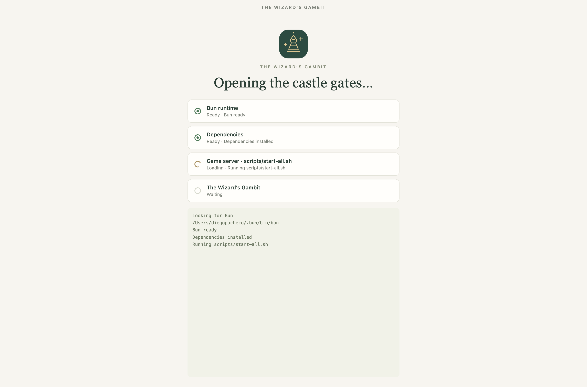 | 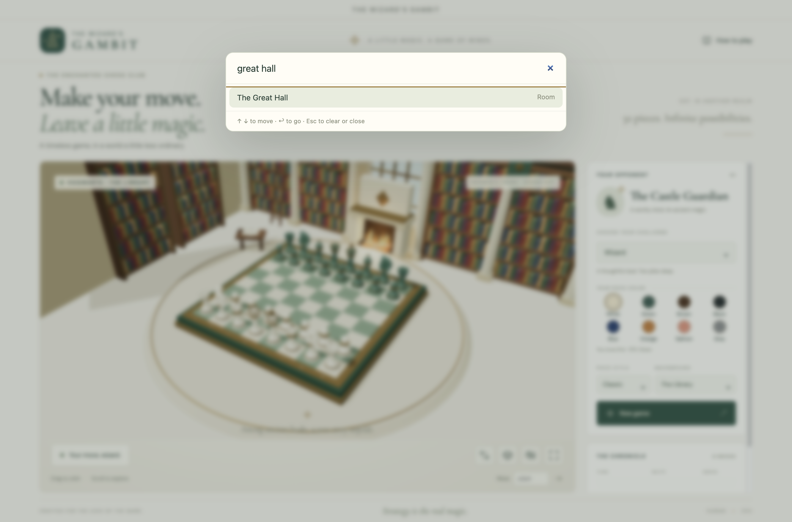 | 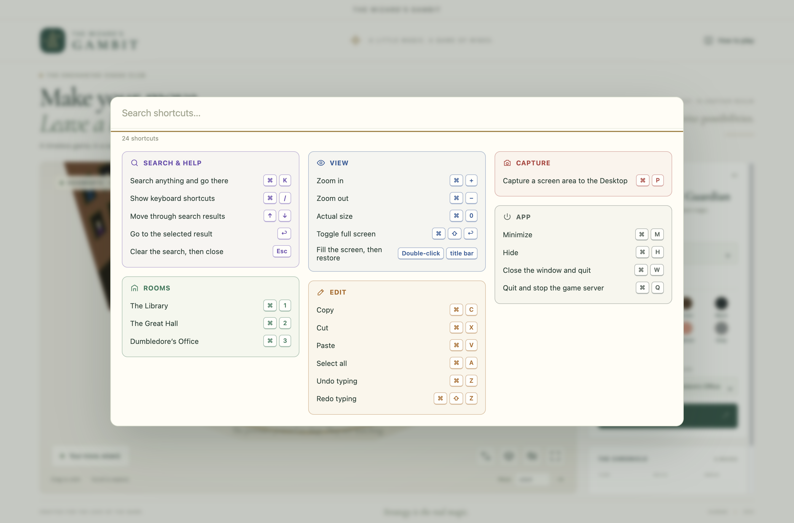 |

App tests launch the installed app with Playwright and a throwaway profile. They cover start-all on launch and stop-all on quit, single instance, search, the shortcut sheet, window memory, title-bar double-click, full screen restore, and cut and paste. They start and stop the same game server, so quit the app before running them:

```bash
cd macos && npm test
```

## Tests

```bash
./scripts/test-all.sh
```

The complete command runs Bun tests, TypeScript validation, the production build, and Chromium browser tests. Playwright starts a temporary Vite server if one is not already running. Browser tests refresh the screenshots in `printscreens/`; failures retain a trace under `test-results/`.

Individual checks:

```bash
bun run test
bun run build
npx playwright test
PLAYWRIGHT_PREVIEW=1 npx playwright test
```

Validation on September 12, 2026:

```text
11 engine and rules tests passed
15 browser tests passed
TypeScript validation passed
Production build passed
```

Engine tests cover legal CPU replies at all levels, mate selection, terminal positions, budget fallback, search state preservation, repetition restoration, castling, en passant, underpromotion, invalid saved moves, and skipped turns: a stuck side passes only when not in check, skips replay from saved history, and the Guardian searches through skips instead of scoring them as draws. Browser tests cover a complete human/CPU turn, 3D board clicks, camera controls, audio toggling, save/restore, invalid input, restart confirmation, capture effects, checkmate, the guide, mobile layout, reduced motion, corrupt storage, WebGL fallback, promotion, interrupted turns, repetition draws, page overflow at eight desktop/mobile/landscape sizes, the sequencer panel’s show, hide-on-play, and unload-on-mute behavior, capture and checkmate sound timing, a stuck Guardian skipping its turn while the match continues and take-back stepping past skips, all eight piece colors, piece styles and backgrounds that persist without disturbing the match, the library fire starting and stopping with sound and room changes, preference persistence during a match, fullscreen play with the restart dialog, live player/CPU checkmates, and restarting from the result card on mobile and in fullscreen. Phone tests emulate an iPhone with real touch events: tapping squares with finger jitter, swiping to orbit without selecting, 16px form fields, thumb-sized controls, reachable settings, and the landscape layout.

## Contracts / APIs

There are no HTTP application APIs. These are the internal contracts:

| Contract | Shape and behavior |
|---|---|
| Move input | SAN such as `Nf3`, or coordinates such as `e2e4`; promotion can include a trailing `q`, `r`, `b`, or `n`. |
| CPU request | `{ history: string[], difficulty: 'apprentice' \| 'wizard' \| 'grandmaster' }` via `worker.postMessage`. |
| CPU response | `{ move: { from, to, promotion? } \| null }`, or `{ error: string }`. The controller validates the returned move again. |
| Saved match | Local storage key `wizards-gambit-v1` stores `{ history: string[], difficulty, pieceColor, pieceStyle, background }`, where `pieceColor` is a key of `pieceColors` in `src/scene.ts`, `pieceStyle` a key of `pieceStyles` in `src/pieceStyles.ts`, and `background` one of `'library' \| 'greatHall' \| 'office'`. Missing or invalid values default to white, classic, and library. |
| Skipped turn | `skipStuckTurn(game)` plays chess.js’s null move `--` when the side to move is not in check and has no legal move, as long as the other side can then move. Saved histories contain `--`. |
| Search | `chooseMove(game, difficulty, budget = 1400)` returns a legal move or `null` when the match is over, preserving the supplied game state. |
| Scene update | `ChessScene.sync(game, move?)` mirrors the legal position and animates the latest move or capture. |

## Key data structures and design decisions

- **One authoritative `Chess` instance:** the scene mirrors the rules engine and never decides whether a move is legal.
- **SAN history:** persisting moves rather than only FEN preserves repetition detection and turn-by-turn undo after reload.
- **Rooms:** `src/rooms.ts` builds each room as a back group and a side group with its own `animate` function and exactly one point light. All rooms are built once; switching only changes visibility, so the light count stays constant and shaders are not recompiled. Only the active room animates.
- **Piece appearance:** dedicated player and CPU `MeshPhysicalMaterial`s keep color and style changes separate from the board and room materials. `applyPieceStyle` resets every physical property before applying a style, so switching styles never leaks transmission or textures from the previous one. Cosmetic colors do not change chess sides or turn order; the fallback board and chronicle use the same palette.
- **Fullscreen:** the native Fullscreen API expands the game grid; the camera resizes with its container and the button follows fullscreen change events. Unsupported browsers keep the control disabled.
- **Square identifiers:** algebraic squares such as `e4` connect chess state, raycast targets, highlights, and 3D coordinates.
- **Dedicated CPU worker:** iterative deepening with negamax, alpha-beta pruning, material values, move ordering, and simple positional evaluation keeps search isolated from rendering.
- **Bounded difficulty:** Apprentice searches one ply, Wizard two, Grandmaster up to three within a 1.4-second soft budget. These names are flavor, not chess ratings. The time budget is checked between search operations and is not a hard real-time deadline.
- **Music and sound effects:** music plays inside an embedded Online Sequencer page; the game detects the first click into that frame through the window blur event, moves the panel off-screen without unloading it, and unloads it when muted. `src/audio.ts` synthesizes move, capture, and checkmate sounds with Web Audio oscillators and filtered noise, timing the checkmate impact to the king’s fall. The fire is a 4-second looping buffer of brown-noise rumble plus random decaying pops, started only while sound is on in the library.
- **Viewport layout:** a `100dvh` application shell allocates remaining height to the game grid. Explicit minimum sizes and internal overflow keep controls reachable on short screens.
- **Short-lived effects:** defeated pieces and particles live independently of the updated board until their animation ends, then their geometry and effect materials are released.
- **Cancellation:** undo, restart, and challenge changes terminate active search; pending CPU timers are also canceled.
- **Simple deployment:** no framework or backend is needed for a single chess table. All pieces are built from geometry, without remote model assets.
- **Resilience:** invalid saved matches reset safely, storage failure is reported, WebGL failure reveals a flat board, and worker failure leaves undo/new game available.

## Printscreens

### Castle library

The opening position shows both sculpted armies, the book-lined castle library and burning fireplace, challenge selection, and an empty chronicle.


### Active match

A human move and the Guardian’s reply appear in the chronicle. The previous move’s squares are highlighted.


### Capture enchantment

The ivory pawn captures on d5. The captured jade pawn dissolves into shards and a gold shockwave while the next turn begins. A still image records one moment of the moving effect.


### Overhead view

The overhead camera and board rotation provide a clear alternative angle for planning moves.


### Promotion

A pawn reaching the last rank opens a picker, including rook, bishop, and knight underpromotion.


### Checkmate

A centered **Checkmate** card names the winner and offers **New game** immediately. The move input is disabled, while undo remains available. Clicking New game resets the board directly and retains your selected color and fullscreen mode.


The player’s victory appears over the board in fullscreen:


The same result fits inside the mobile game panel:


### Spellbook

The guide explains selection, notation, special moves, persistence, and the CPU’s search depth.


### Mobile

The 390 × 844 layout fits the board, opponent controls, chronicle, and status inside one browser viewport. Smaller panels scroll internally; the page does not scroll. Reduced-motion preferences are enabled in this capture.


### Phone browser

Portrait gives the board most of the screen; landscape places it beside the controls. Both are played by touch.

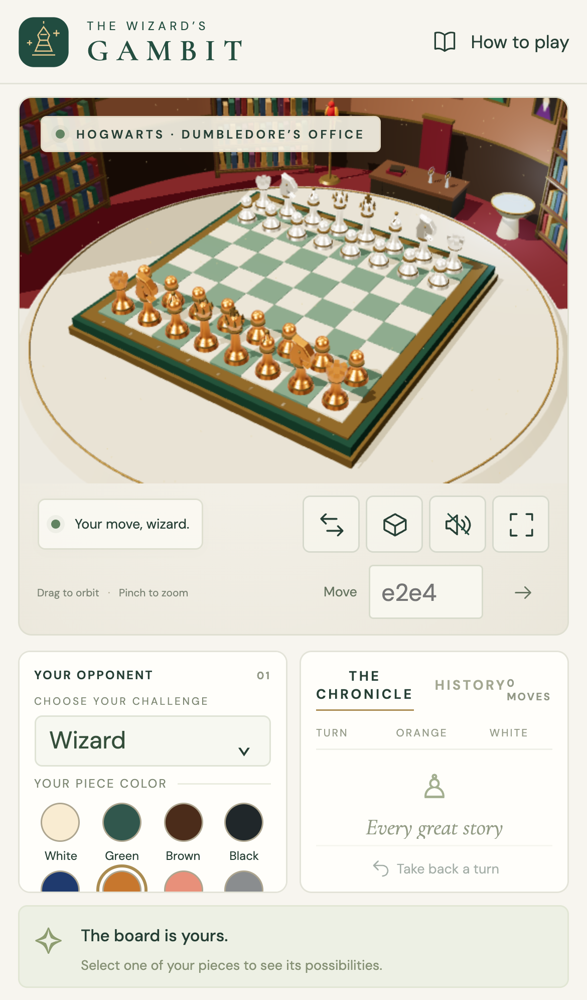

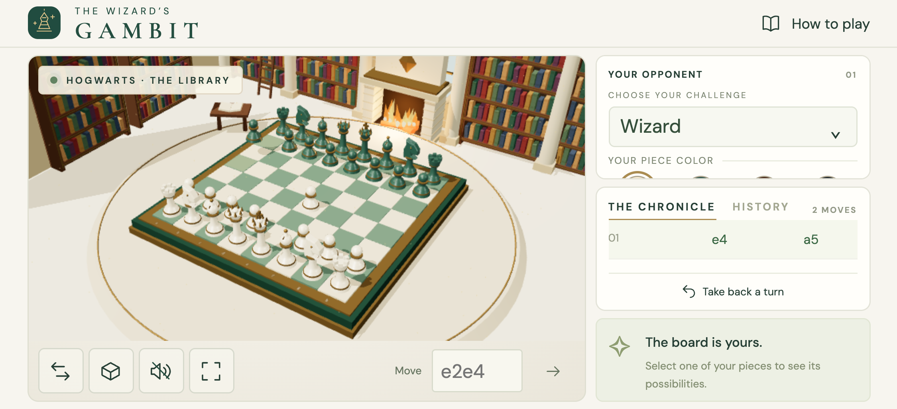

### Laptop viewport

The 1366 × 768 view keeps the board and move input within the window. The sidebar can scroll independently when its content needs more space.


### Piece colors

The eight swatches recolor your army immediately while keeping the opposing pieces distinct. These views show white, green, brown, black, blue, orange, salmon, and gray without changing the starting position.

| White | Green |
|---|---|
|  |  |

| Brown | Black |
|---|---|
|  |  |

| Blue | Orange |
|---|---|
| 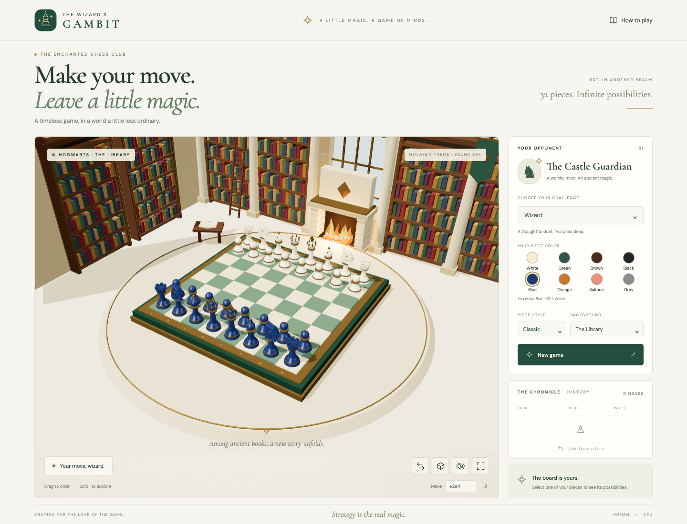 | 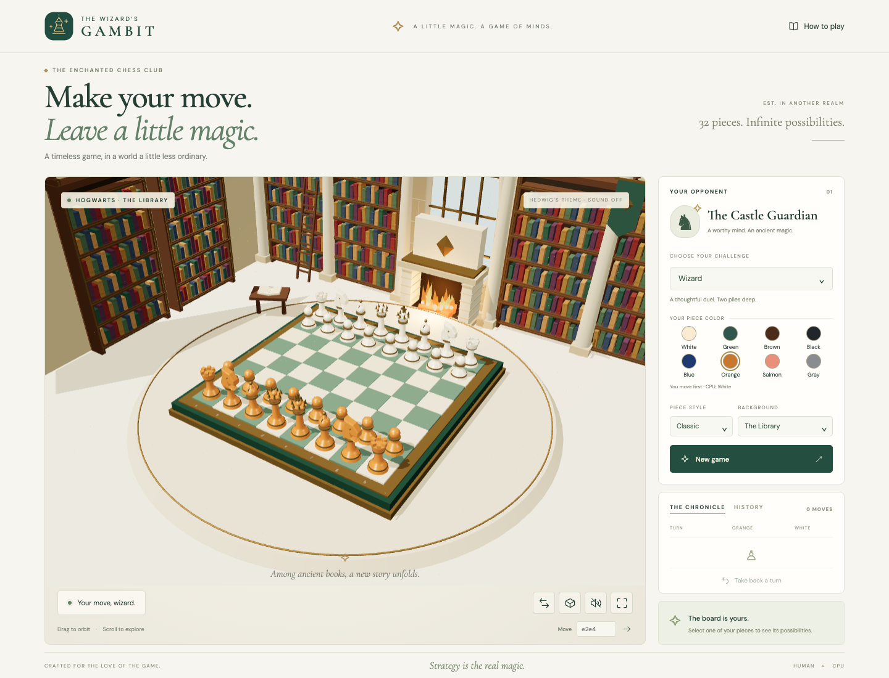 |

| Salmon | Gray |
|---|---|
| 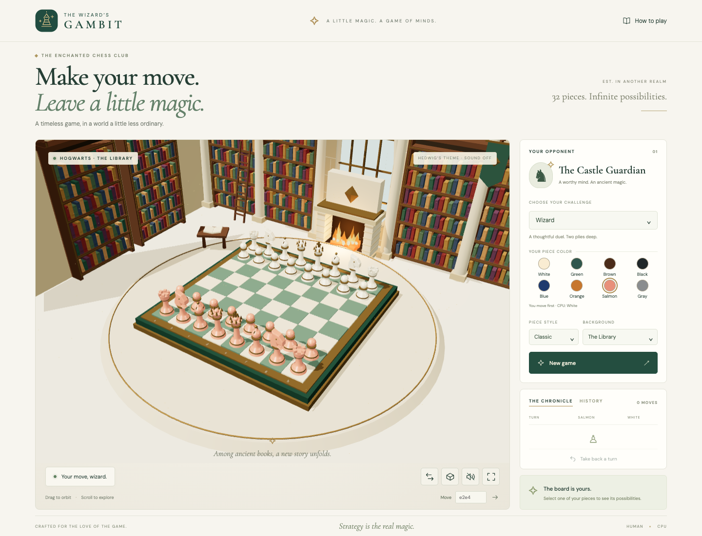 | 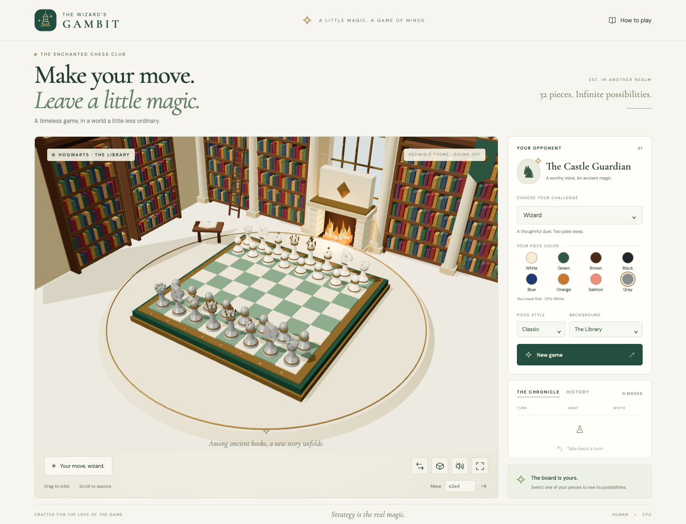 |

### Backgrounds

| The Great Hall | Dumbledore’s Office |
|---|---|
| 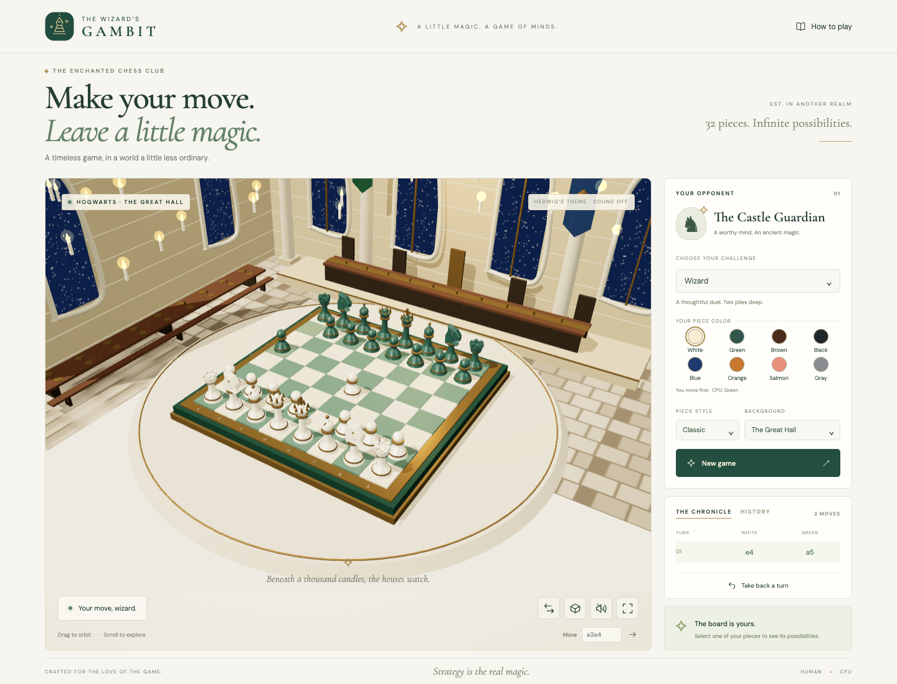 | 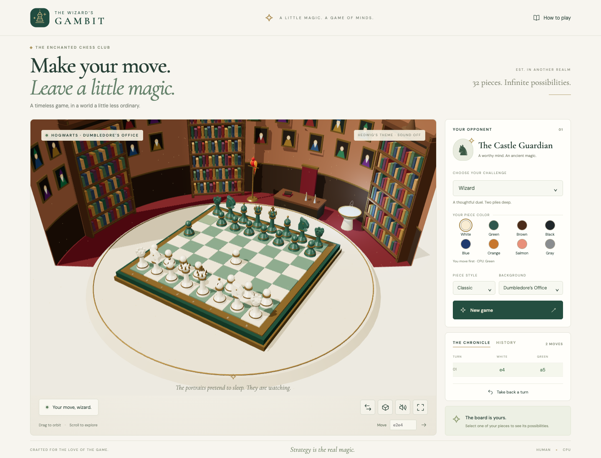 |

### Piece styles

| Marble | Wood | Steel |
|---|---|---|
|  |  |  |

| Glass | Plastic | Stone |
|---|---|---|
| 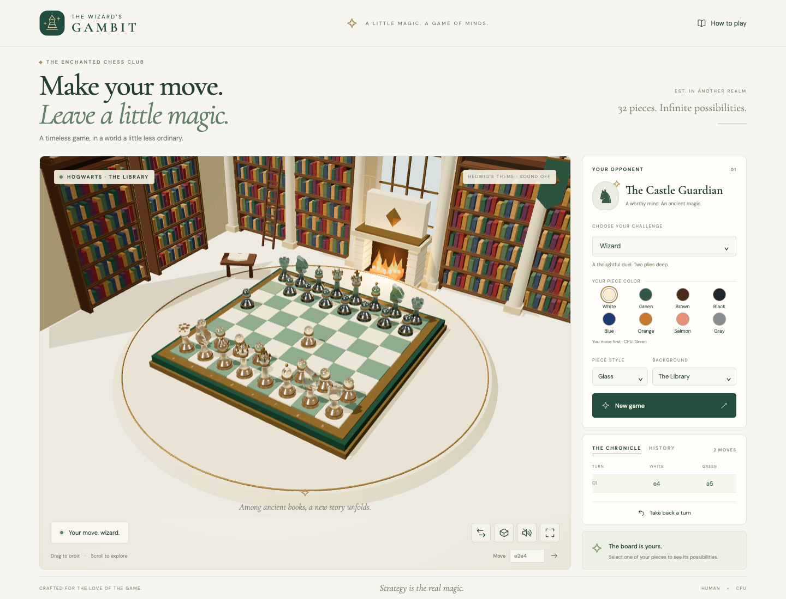 | 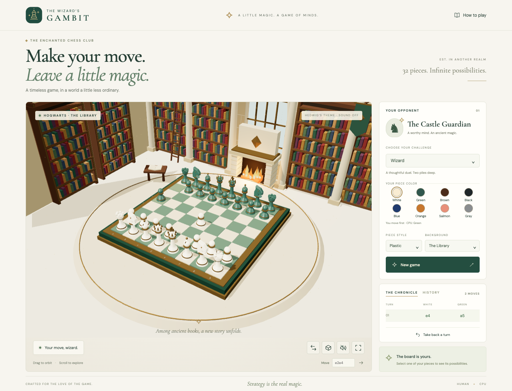 | 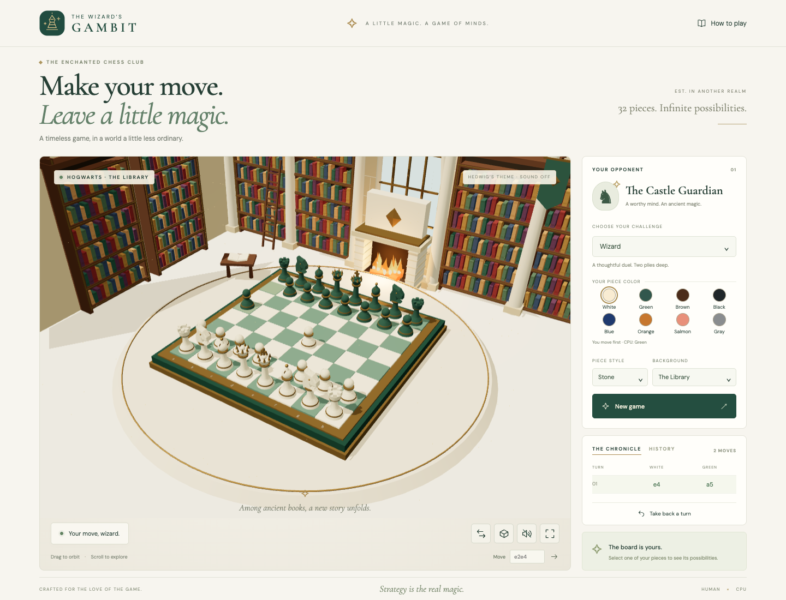 |

### Game fullscreen

The fullscreen button expands the chessboard and all match controls together. Here the green army has played its first move, and the CPU has replied.


## References

The implementation follows the official [Three.js renderer documentation](https://threejs.org/docs/pages/WebGLRenderer.html), [OrbitControls documentation](https://threejs.org/docs/pages/OrbitControls.html), [chess.js API](https://github.com/jhlywa/chess.js), and [Vite guide](https://vite.dev/guide/).

## Scripts

All scripts live in `scripts/` and run from any directory of the repository.

| Script | What it does |
|---|---|
| `./scripts/setup.sh` | Installs locked dependencies and Playwright Chromium. |
| `./scripts/start-all.sh` | Starts Vite in the background and checks HTTP readiness for up to 30 seconds. If this project’s own Vite already holds the port without a PID file, it adopts that process. |
| `./scripts/status.sh` | Shows the frontend’s port, UP/DOWN state, and listening PID; reporting DOWN is a successful status query. |
| `./scripts/test-all.sh` | Runs engine tests, type validation, production build, and browser tests. |
| `./scripts/ui.sh` | Opens the running frontend with the platform browser opener. |
| `./scripts/stop-all.sh` | Stops only the Vite process recorded and owned by this project, waiting up to 30 seconds. The macOS app runs it on quit. |
| `./scripts/install-macos.sh` | Uninstalls any existing copy, then builds and installs `/Applications/Wizards Gambit.app`. |
| `./scripts/uninstall-macos.sh` | Quits the app (stopping the game server) and removes every installed copy and build output. |
| `./scripts/common.sh` | Resolves paths, loads the port, and provides process ownership helpers. |

Ports are declared in `scripts/ports.env`. PID files and logs are stored in `.run/`; the frontend log is `.run/logs/frontend.log`. Start and stop are safe to repeat. An occupied port belonging to another process produces an error and is never forcibly cleared. There is no SQL console because this app has no database.

```bash
./scripts/setup.sh
./scripts/start-all.sh
./scripts/status.sh
./scripts/ui.sh
./scripts/test-all.sh
./scripts/stop-all.sh
```
