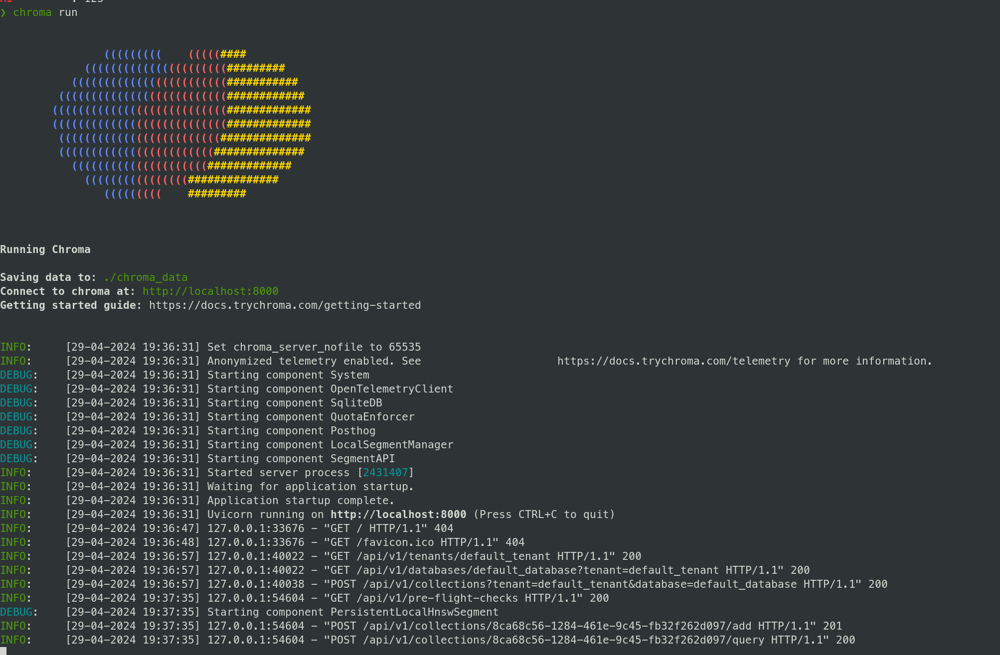

### Result
* Uses Chroma embeddings to compare two documents

```
/bin/pip install chromadb
chroma run
```


Result
```
 ./run.sh
/home/diego/.cache/chroma/onnx_models/all-MiniLM-L6-v2/onnx.tar.gz: 100%|█████████████████████████████████████████████████████████████████| 79.3M/79.3M [00:36<00:00, 2.31MiB/s]
Results: {'ids': [['doc1', 'doc2']], 'distances': [[0.9026352763806998, 1.0358158255050436]], 'embeddings': None, 'metadatas': [[{'source': 'notion'}, {'source': 'google-docs'}]], 'documents': [['This is document1', 'This is document2']], 'uris': None, 'data': None}
```