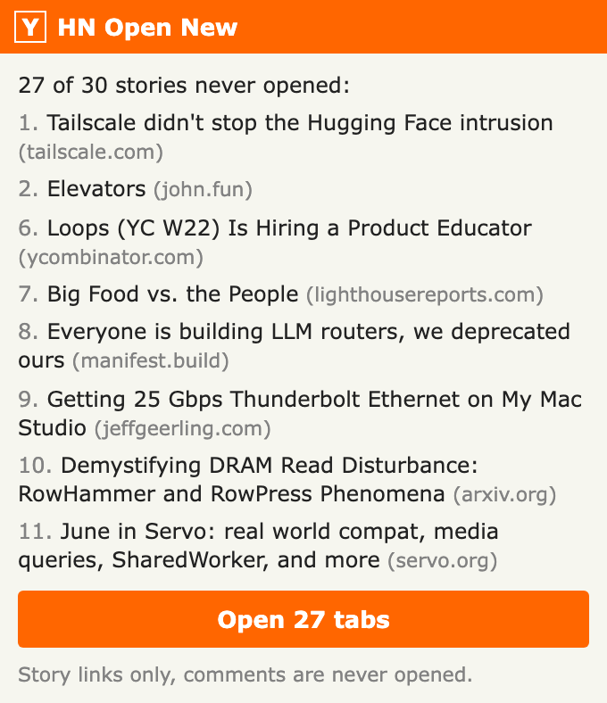
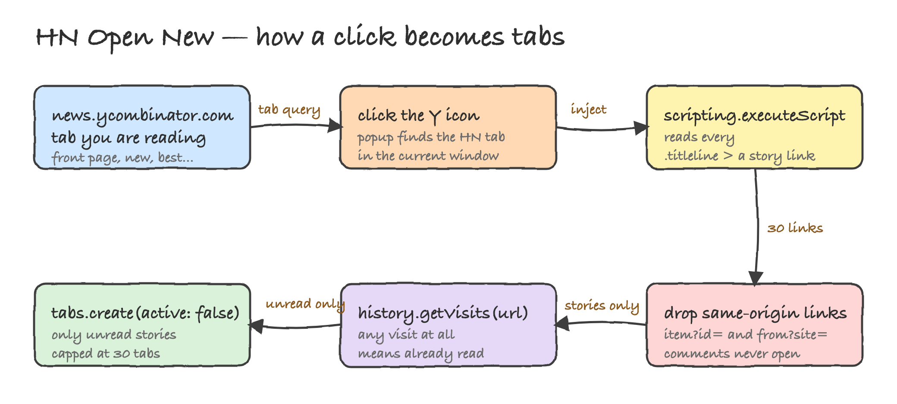

# HN Open New

Chrome extension that opens every Hacker News story you have **not read yet** in background tabs.

One click on the toolbar icon reads the Hacker News page you have open, keeps only the story links you never
visited, and opens them as background tabs. Comment pages are never opened.



## How it works



1. The popup looks for a `news.ycombinator.com` tab in the current window.
2. It injects a small reader into that tab and collects every `.titleline > a` story link (30 on a front page).
3. Links pointing back to `news.ycombinator.com` (`item?id=`, `from?site=`) are dropped, so comment pages and
   site filters never open.
4. Each remaining URL is checked against `chrome.history.getVisits`. Zero visits means never opened.
5. The unread ones open with `chrome.tabs.create({ active: false })`, capped at 30 tabs, so your current tab
   stays where it is.

"Already read" is the browser's own history, the same source that paints visited HN titles grey. If you opened
a story yesterday from anywhere, it will not open again.

## Install

1. Open `chrome://extensions`.
2. Turn on **Developer mode**.
3. Click **Load unpacked** and pick this folder.
4. Pin the orange **Y↗** icon to the toolbar.

## Use

1. Go to `news.ycombinator.com` (front page, `newest`, `best`, any list page).
2. Click the icon. The popup lists the unread stories with their HN rank.
3. Click **Open N tabs**.

If everything on the page was already opened, the popup says so and the button stays disabled.

## Permissions

| Permission | Why |
| --- | --- |
| `history` | Read-only check of whether a story URL was ever visited |
| `tabs` | Find the Hacker News tab and create background tabs |
| `scripting` | Read the story links from the Hacker News page |
| `host_permissions: https://news.ycombinator.com/*` | The only site the extension touches |

Nothing is sent anywhere, no storage, no network calls of its own.

## Files

```
manifest.json      MV3 manifest
popup.html         popup markup
popup.css          Hacker News styling
popup.js           scrape, filter by history, open tabs
icons/             icon.svg source and 16/32/48/128 PNGs
printscreens/      screenshots and the architecture diagram
```

## Limits

- Max 30 tabs per click.
- Text-only posts (Ask HN, most Show HN discussions) point at the comments page, so they are skipped by design.
- Chrome keeps history for 90 days, so a story read before that counts as unread again.

## Verification

Driven through the Chrome DevTools Protocol against the live front page: the extension is loaded, three story
URLs are pushed into history to simulate "already read", then the popup is reloaded and its output checked.

```
extension loaded: emoapamelbphdgemicnoefddjcbcmljj
front page rows: 30, external story links: 30
seeded visits: [1,1,1]
marked read: #3 qm | #4 Golang proposal: container/: generic collection types | #5 Severance
popup status: 27 of 30 stories never opened:
popup button: Open 27 tabs
PASS unread count = stories - read (got 27, expected 27)
PASS already read hidden (got 0, expected 0)
PASS no comment links listed (got 0, expected 0)
PASS button enabled (got false, expected false)
PASS button label (got "Open 27 tabs", expected "Open 27 tabs")
PASS tabs opened (got 27, expected 27)
PASS hn tab kept, not reopened (got 1, expected 1)
opened hosts sample: jwlabs.vercel.app, blog.marcua.net, xn--gckvb8fzb.com, cgjennings.ca, arxiv.org, jovidecroock.com
ALL CHECKS PASSED
```
