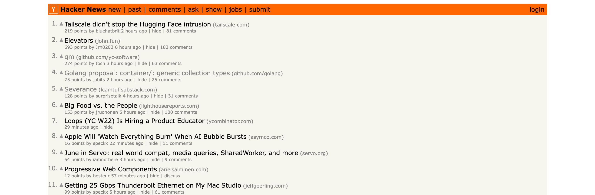

# HN Open New

Chrome extension that opens every Hacker News story you have **not read yet** in background tabs.

One click on the toolbar icon fetches Hacker News, keeps only the story links you never visited, and opens them
as background tabs. Comment pages are never opened. Hacker News does not have to be open: every click pulls the
page fresh, so new stories always show up.


## Visited stories go grey

On every Hacker News page, story titles you already visited are repainted in the HN grey `#828282`, exactly as
if you had clicked them. Rows 3, 4 and 5 below were visited before, the rest are still unread:



This runs on page load, and the popup also re-applies it to a Hacker News tab that was already open, so tabs
opened by the extension turn grey the next time you click the icon without a reload.

## How it works


1. The popup fetches the front page on every click, with `cache: "no-store"` so the list is never stale. If the
   active tab is already a Hacker News list page (`newest`, `best`), that URL is fetched instead.
2. The HTML is parsed with `DOMParser` and every `.titleline > a` story link is collected (30 on a front page).
3. Links pointing back to `news.ycombinator.com` (`item?id=`, `from?site=`) are dropped, so comment pages and
   site filters never open.
4. Each remaining URL is checked against `chrome.history.getVisits`. Zero visits means never opened.
5. The unread ones open with `chrome.tabs.create({ active: false })`, capped at 30 tabs, so your current tab
   stays where it is.

"Already read" is the browser's own history, the same source that paints visited HN titles grey. If you opened
a story yesterday from anywhere, it will not open again.

The grey repaint uses that same history. A content script on `news.ycombinator.com` collects the story links
and asks the service worker for their visit counts, since `chrome.history` is not reachable from a content
script, then tags the visited ones with a class that `content.css` paints grey.

## Install

1. Open `chrome://extensions`.
2. Turn on **Developer mode**.
3. Click **Load unpacked** and pick this folder.
4. Pin the orange **Y↗** icon to the toolbar.

## Use

1. Click the icon from anywhere. The popup lists the unread front page stories with their HN rank.
2. Click **Open N tabs**.

If the active tab is a Hacker News list page (`newest`, `best`), that page is read instead of the front page.

If everything was already opened, the popup says so and the button stays disabled.

## Permissions

| Permission | Why |
| --- | --- |
| `history` | Read-only check of whether a story URL was ever visited |
| `tabs` | Read the active Hacker News list page URL and create background tabs |
| `scripting` | Re-grey visited links on open Hacker News tabs |
| `host_permissions: https://news.ycombinator.com/*` | The only site the extension touches |

The only request it makes is fetching the Hacker News page itself. Nothing is sent anywhere, no storage.

## Files

```
manifest.json      MV3 manifest
popup.html         popup markup
popup.css          Hacker News styling
popup.js           fetch and parse HN, filter by history, open tabs
background.js      service worker answering history lookups
content.js         tags visited story links on the page
content.css        grey paint for visited story links
icons/             icon.svg source and 16/32/48/128 PNGs
printscreens/      screenshots and the architecture diagram
```

## Limits

- Max 30 tabs per click.
- Text-only posts (Ask HN, most Show HN discussions) point at the comments page, so they are skipped by design.
- Chrome keeps history for 90 days, so a story read before that counts as unread again.

## Verification

Driven through the Chrome DevTools Protocol against the live front page: the extension is loaded, three story
URLs are pushed into history to simulate "already read", the page is reloaded and the greying is checked
against the computed colour, then the popup is opened and its output checked.

```
extension loaded: emoapamelbphdgemicnoefddjcbcmljj
external story links: 30
PASS nothing grey before any visit (got 0, expected 0)
seeded visits: [1,1,1]
PASS grey link count (got 3, expected 3)
PASS grey links are the visited ones (got ["https://github.com/golang/go/issues/80590","https://github.com/yc-software/qm","https://lcamtuf.substack.com/p/severance"], expected [same])
PASS computed colour is HN grey (got ["rgb(130, 130, 130)"], expected ["rgb(130, 130, 130)"])
PASS unvisited titles stay black (got false, expected false)
PASS no HN-internal links greyed (got 0, expected 0)
popup status: 27 of 30 stories never opened:
PASS popup still filters read stories (got "27 of 30 stories never opened:", expected "27 of 30 stories never opened:")
PASS re-injection into an already-open tab re-greys (got 3, expected 3)
ALL CHECKS PASSED
```

`--load-extension` is ignored by Chrome stable since 137, so the harness runs against the Chrome for Testing
build (151) that ships with Playwright.

The fetch-on-click behaviour is checked the same way, with no Hacker News tab open anywhere in the browser:

```
extension id: emoapamelbphdgemicnoefddjcbcmljj
front page story links: 30
popup state (no HN tab open): {"status":"30 of 30 stories never opened:","count":30,"button":"Open 30 tabs","disabled":false}
PASS popup lists stories with NO hacker news tab open (30 stories, status: "30 of 30 stories never opened:")
PASS open button enabled (Open 30 tabs)
seeded history with: 3 story urls
popup state (after seeding history): {"status":"27 of 30 stories never opened:","count":27}
PASS visited stories are filtered out of the list (30 -> 27 after visiting 3)
PASS newest page still loads story rows (30 rows, 1 greyed)

4/4 checks passed
```
