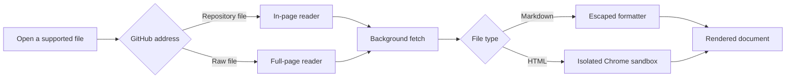

<p align="center">
  
</p>

<p align="center">
  <strong>HTML and Markdown reading for GitHub</strong><br>
  By <a href="https://diegopacheco.github.io">Diego Pacheco</a>
</p>

# GitHub Render

GitHub Render turns HTML and Markdown files into calm, readable documents as you browse GitHub. It works on GitHub file pages and raw file URLs, and a toolbar switch lets you enable or disable the behavior at any time.

## What it does

- Renders `.html` and `.htm` files in an isolated frame
- Resolves relative images and preserves page CSS and JavaScript
- Renders `.md`, `.markdown`, `.mdown`, and `.mkd` files as formatted documents
- Supports headings, links, images, lists, tasks, tables, quotes, code fences, and inline formatting
- Follows GitHub navigation without requiring a page refresh
- Routes raw HTML and Markdown URLs through a full-page reader
- Keeps the enabled state in Chrome sync storage
- Provides one-click access to the original source and raw file
- Uses no third-party runtime libraries and sends no analytics

## How it works



### GitHub repository files

The content script runs on GitHub `blob` addresses. It detects supported file extensions, requests the raw source through the extension background worker, and places the reader over GitHub's source view. **View source** closes the reader for the current address without changing the global setting.

### Raw GitHub files

GitHub serves raw HTML as plain text, so Chrome does not treat it as a normal web document. The background worker watches top-level navigation to `raw.githubusercontent.com`. For a supported file, it routes the tab to the extension's full-page reader and passes the original source address with it.

### Markdown rendering

Markdown is escaped before formatting. The dependency-free renderer handles headings, paragraphs, links, images, lists, tasks, quotes, tables, code fences, inline code, emphasis, and separators. The result is placed inside the extension's paper-style reading surface.

### HTML rendering

HTML is parsed before display. The reader adds a base address matching the source file's directory so relative images and other assets resolve correctly. The document then runs in a Manifest V3 sandbox with its own isolated origin. Page CSS and JavaScript work, while the document cannot access extension APIs, GitHub's page, or a trusted origin.

### Enable and disable

The popup stores the switch in Chrome sync storage. Content scripts and raw navigation both read the same value, so disabling the extension immediately restores standard GitHub behavior across tabs and browser sessions.

### Data flow

The background worker accepts source requests only for `github.com` raw routes and `raw.githubusercontent.com`. It returns file text to the appropriate reader. No content, browsing history, or settings are sent to another service.

## Install

Run:

```bash
./install.sh
```

Chrome will open its extensions page and the built extension folder. Enable **Developer mode**, select **Load unpacked**, and choose the `dist` folder shown by the script.

Chrome requires this final confirmation for locally built extensions. After loading it once, rebuilding the extension only requires selecting the reload button on its Chrome extensions card and refreshing the GitHub tab.

## Use

Open an HTML or Markdown file in a GitHub repository. GitHub Render replaces the source view with the rendered document.

Use **View source** in the document toolbar to return to GitHub for the current file. Use the extension button in the Chrome toolbar to turn automatic rendering on or off across all GitHub tabs.

## Build

Run:

```bash
./build.sh
```

The build creates:

- `dist/` for Chrome's **Load unpacked** flow
- `github-render.zip` as a portable release archive

The project uses plain HTML, CSS, and JavaScript. No dependency installation is required.

## Test

Run:

```bash
npm test
```

The test suite checks Markdown formatting, unsafe markup handling, the Manifest V3 configuration, and required package files.

## Uninstall

Run:

```bash
./uninstall.sh
```

The script removes local build artifacts and opens Chrome's extensions page. Select **GitHub Render**, then choose **Remove** to clear Chrome's locally loaded entry.

## Security

Markdown input is escaped before formatting. HTML runs in a Chrome sandbox with scripts enabled but without access to the extension, GitHub, a trusted origin, forms, popups, or top navigation. Embedded frames and browser redirects are removed before display.

Source content is requested only from GitHub and `raw.githubusercontent.com`.

## Files

```text
assets/
  github-render-logo.svg
manifest.json
src/
  background.js
  content.css
  content.js
  html-viewer.html
  html-viewer.js
  popup.css
  popup.html
  popup.js
  renderer.js
  viewer.css
  viewer.html
  viewer.js
scripts/
  generate-icons.js
test/
  package.test.js
  renderer.test.js
build.sh
install.sh
uninstall.sh
```

## Author

GitHub Render is built by [Diego Pacheco](https://diegopacheco.github.io).
