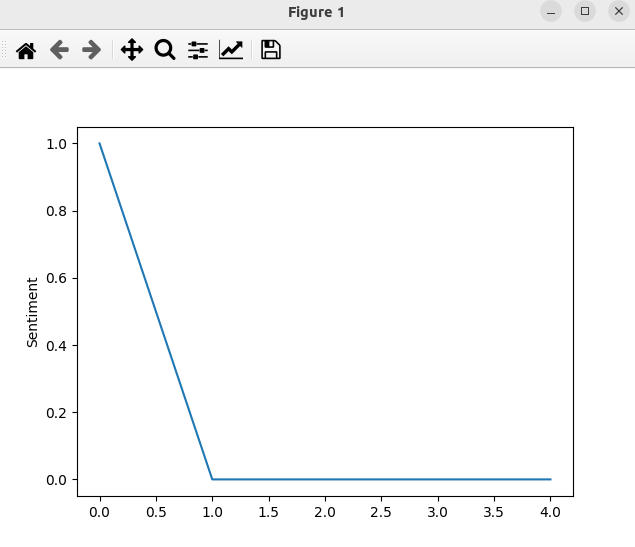

### Result
* Classification
* Sentiment Analysis
* Hidden Markov Models in Python, with scikit-learn like API
* Gaussian HMM
* Gaussian HMM works by assuming that the observations are generated from a mixture of several Gaussian distributions with unknown parameters.

Results:
```
Predicted sentiment: ['happy', 'sad', 'sad', 'sad', 'sad']
```

