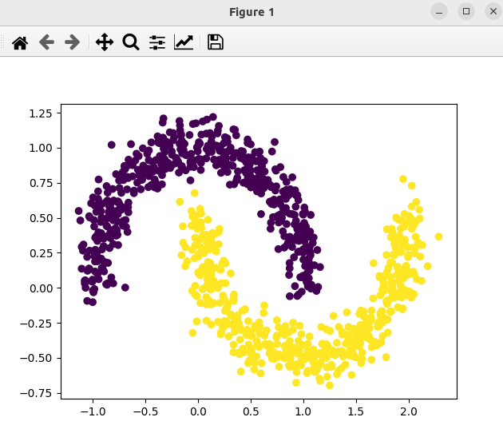

### Result
* sklearn.datasets.make_moons function to generate a synthetic two-class classification problem. These types of datasets are often used for testing machine learning algorithms.
* KAN model https://github.com/KindXiaoming/pykan/tree/master

Output:
```
train loss: 1.58e-01 | test loss: 1.54e-01 | reg: 3.19e+00 : 100%|██| 20/20 [00:08<00:00,  2.33it/s]
fixing (0,0,0) with sin, r2=0.9730899910041069
fixing (0,1,0) with tan, r2=0.9787837167093693
-0.39*sin(3.1*x_1 - 7.84) - 0.78*tan(0.95*x_2 + 9.2) + 0.52
train acc of the formula: tensor(0.9990)
test acc of the formula: tensor(1.)

```

Result:



