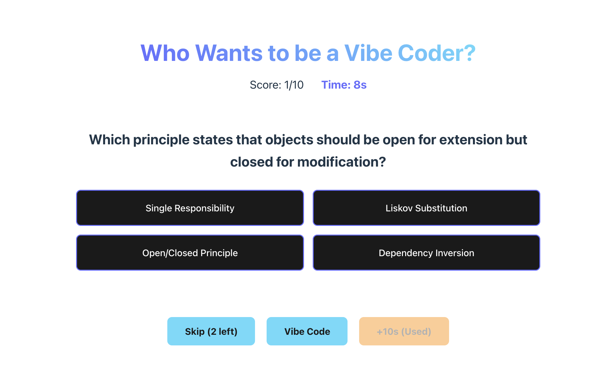

## The Prompt

```
build a game called "Who want's to be a Vibe Coder?" as a satire of "who wants to be a milionare". Dont use comments never ever, build this with react, dont use backend or redux, 
save it all on the browser local store. Make sure every question has 4 options, 3 wrong 1 
right, every time the question is right - render a congratulations annimations with confetti, 
ask 10 questions give 21s for each question for the user to anwser, to help the user there is 
3 options(buttones). The user can: A: skip (the user can skip 2 times and get new questions - 
but he needs anwseer 10 questions no matter what). B: Vibe code them a ramdon rolete
happens and user might win or losse (3) win 10 more seconds just 1 time. The questions must 
be about Distributed Systems, Design Patterns, OOP, FP, Data Srtructures, Algorithims, Cloud 
Computing on AWS, DevOps, Data Engineering, Frontend Engineering and about weired langs like 
Haskell, Rust, Zig, Nim, Clojure, Emojicode and TypeScript. Create a run.sh to run the app.
```

## Model / Tool

```
Tool: claude-code
Model: claude-sonnet-4.5
```

## Run 

```
./run.sh
```

## Result




# React + Vite

This template provides a minimal setup to get React working in Vite with HMR and some ESLint rules.

Currently, two official plugins are available:

- [@vitejs/plugin-react](https://github.com/vitejs/vite-plugin-react/blob/main/packages/plugin-react) uses [Babel](https://babeljs.io/) (or [oxc](https://oxc.rs) when used in [rolldown-vite](https://vite.dev/guide/rolldown)) for Fast Refresh
- [@vitejs/plugin-react-swc](https://github.com/vitejs/vite-plugin-react/blob/main/packages/plugin-react-swc) uses [SWC](https://swc.rs/) for Fast Refresh

## React Compiler

The React Compiler is not enabled on this template because of its impact on dev & build performances. To add it, see [this documentation](https://react.dev/learn/react-compiler/installation).

## Expanding the ESLint configuration

If you are developing a production application, we recommend using TypeScript with type-aware lint rules enabled. Check out the [TS template](https://github.com/vitejs/vite/tree/main/packages/create-vite/template-react-ts) for information on how to integrate TypeScript and [`typescript-eslint`](https://typescript-eslint.io) in your project.
