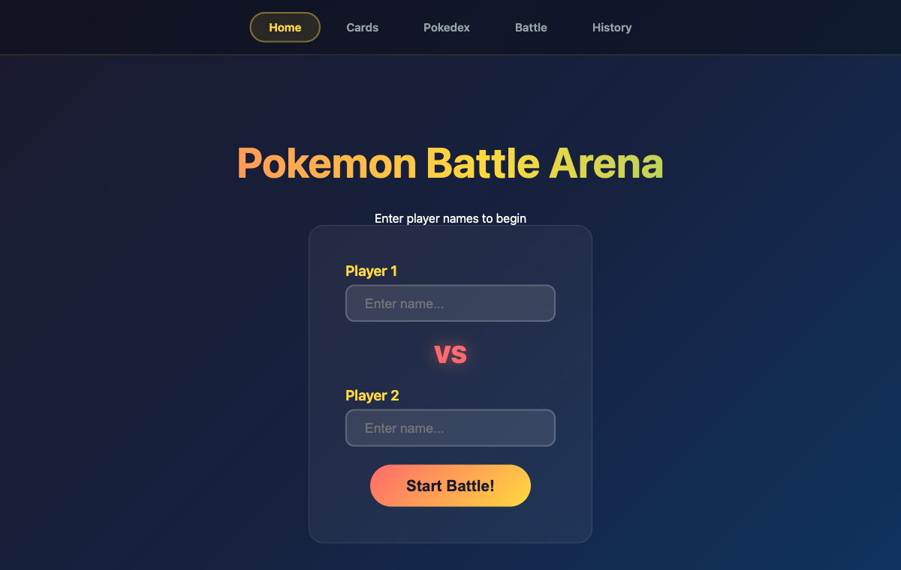
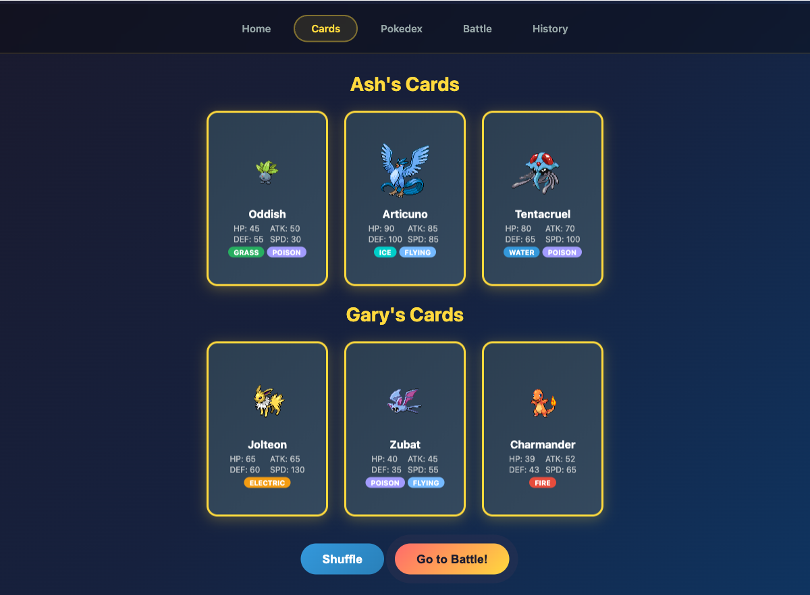
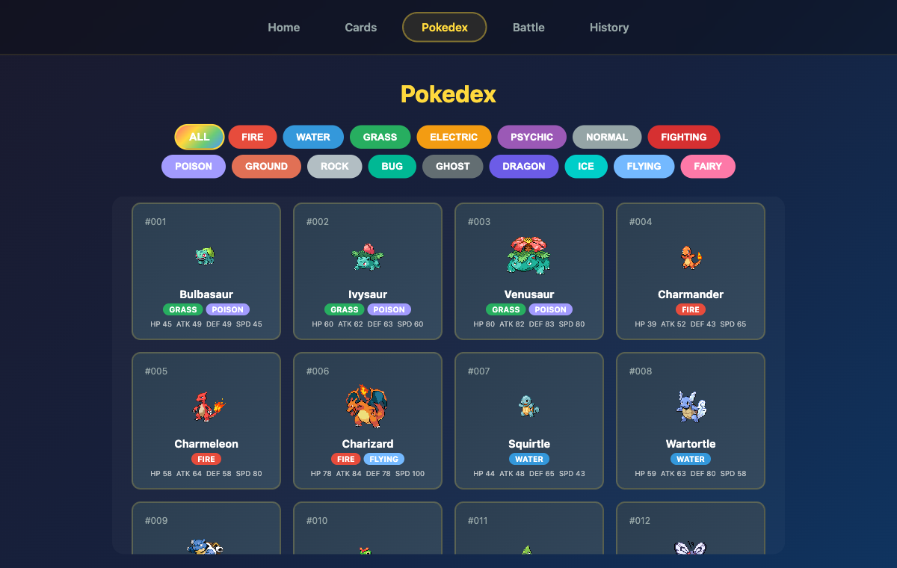
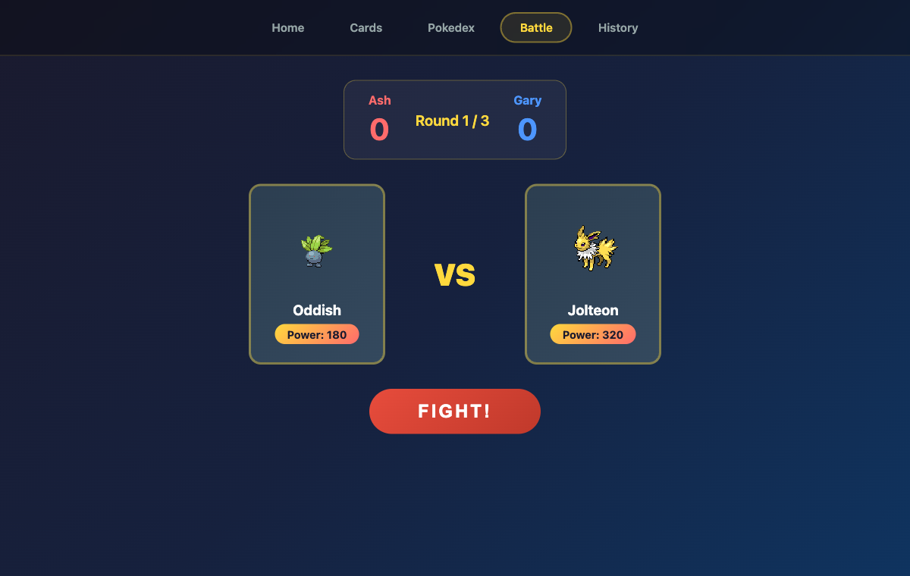
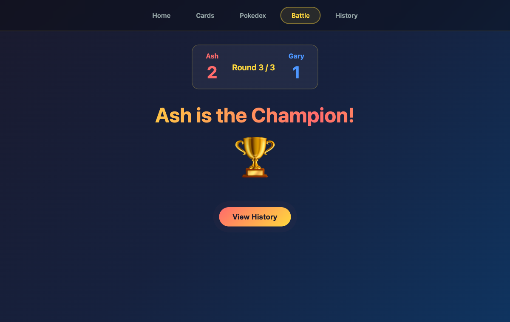
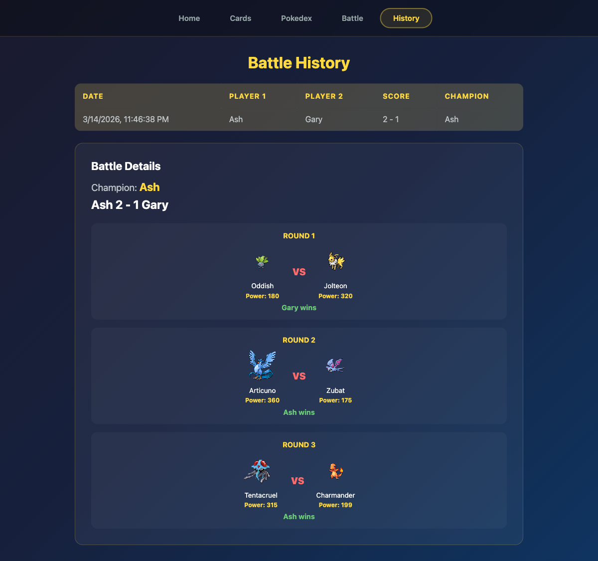

# Claude Code Voice POC

Pokemon Battle Arena built entirely using Claude Code Voice mode.

## Tech Stack

* React 19
* Bun
* TanStack Router (routing/tabs)
* TanStack Query (PokeAPI data fetching)
* TanStack Table (battle history display)
* TanStack Form (player name input)
* TanStack Virtual (Pokedex scrolling)
* CSS animations (card flip, battle clash, champion entrance)

## How to Run

```bash
./run.sh
```

## How to Test

```bash
./test.sh
```

## Screenshots

### Home - Player Setup


### Cards - Flip and Reveal Pokemon


### Pokedex - Browse All Pokemon by Type


### Battle - Fight!


### Champion Screen


### History - Battle Details


## Tabs

| Tab | Description |
|-----|-------------|
| Home | Enter player names (TanStack Form) |
| Cards | Shuffle, deal, and flip 6 Pokemon cards (3 per player) |
| Pokedex | Browse all 151 Gen 1 Pokemon filtered by type (TanStack Virtual) |
| Battle | 3-round battle with clash animations, declares champion |
| History | Table of past battles, click to see round-by-round details (TanStack Table) |

## Experience Notes

* I need to hold space for a long time, wish it was shorter.
* It doesn't auto-send after recording, I still need to press enter. Didn't like that at all.
* Voice transcription is buggy - it transcribed "Bun" as "ban" and "TanStack" as "10 stack". Speech-to-text accuracy needs improvement.

## Tests

```
❯ ./test.sh
=== Unit Tests ===
bun test v1.3.2 (b131639c)

src/store.test.js:
✓ store > should set player names [0.05ms]
✓ store > should set player cards [0.08ms]
✓ store > should set player 2 cards [0.03ms]
✓ store > should start battle [0.02ms]
✓ store > should record a round with player 1 winning [0.03ms]
✓ store > should record a round with player 2 winning [0.09ms]
✓ store > should finish after 3 rounds and save to history [9.80ms]
✓ store > should reset game [0.06ms]
✓ store > should notify subscribers [0.07ms]

9 pass
0 fail
17 expect() calls
Ran 9 tests across 1 file. [19.00ms]

=== E2E Tests (Playwright) ===

Running 7 tests using 1 worker

✓  1 e2e/app.spec.js:8:3 › Pokemon Battle Arena › should show home page with title (168ms)
✓  2 e2e/app.spec.js:12:3 › Pokemon Battle Arena › should have navigation tabs (129ms)
✓  3 e2e/app.spec.js:17:3 › Pokemon Battle Arena › should show player name form (126ms)
✓  4 e2e/app.spec.js:22:3 › Pokemon Battle Arena › should navigate to cards after entering names (188ms)
✓  5 e2e/app.spec.js:29:3 › Pokemon Battle Arena › should show pokedex page (527ms)
✓  6 e2e/app.spec.js:35:3 › Pokemon Battle Arena › should show battle history page (176ms)
✓  7 e2e/app.spec.js:41:3 › Pokemon Battle Arena › should filter pokemon by type in pokedex (498ms)

7 passed (4.5s)
```