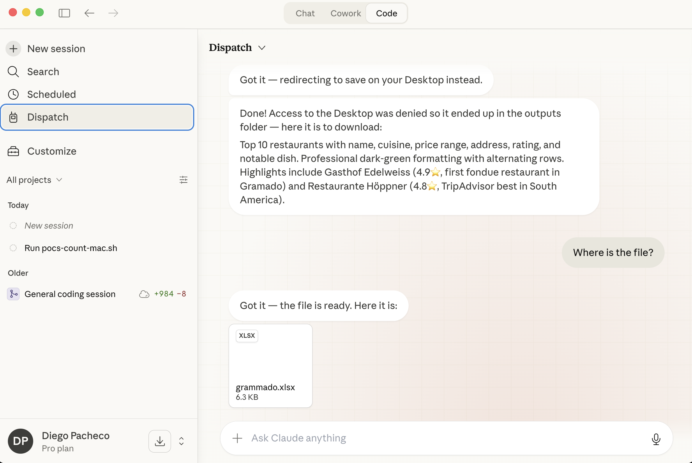
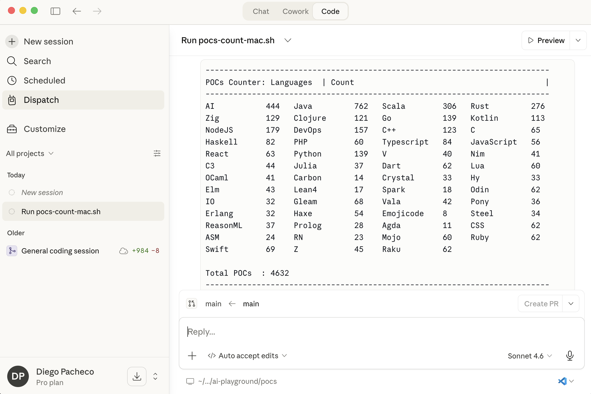

# Claude Dispatch

Claude Dispatch is an Anthropic feature that lets users trigger Claude Cowork agents remotely, including from a phone or desktop. It provides a continuous conversation thread with Claude that survives device changes, allowing the agent to use the computer autonomously while users step away. It is a key building block toward Anthropic's always-on agent vision.

## Claude Dispatch vs Claw-* Solutions

| Feature | Claude Dispatch | OpenClaw | NanoClaw | ZeroClaw | NemoClaw |
|---|---|---|---|---|---|
| Purpose | Remote agent trigger for Claude Cowork | General-purpose life assistant across messaging apps | Lightweight OpenClaw alternative in containers | Minimal single-binary agent (Rust) | NVIDIA-backed OpenClaw with OpenShell security |
| Focus | Coding and development tasks | Messaging integration (WhatsApp, Telegram, Slack, Discord, Gmail) | Same as OpenClaw but minimal and containerized | Minimal footprint, single binary | Enterprise security with NVIDIA Agent Toolkit |
| Security | Anthropic-managed, sandboxed | CVE-2026-25253 (RCE, CVSS 8.8), 341 malicious skills found on ClawHub | Container isolation, small codebase (~5 files) | Single binary, small attack surface | NVIDIA OpenShell runtime, managed inference |
| Codebase | Closed source (Anthropic) | ~430,000 lines | ~4,000 lines of Python | Single Rust binary, 99% smaller than OpenClaw | Open source reference stack |
| Integration | Claude Code, Claude Cowork | Multiple messaging platforms | Multiple messaging platforms | CLI focused | NVIDIA infrastructure |
| Pricing | Included in Claude subscription | Was free with Claude login, now paywalled (April 2026) | Free / self-hosted | Free / self-hosted | Free / self-hosted |
| Stars (GitHub) | N/A | Large community | 26,800+ | Growing community | NVIDIA backed |

### Key Takeaways

- **Claude Dispatch** is purpose-built for development workflows, tightly integrated with Claude Code and Cowork, and runs securely under Anthropic's infrastructure.
- **OpenClaw** is the most feature-rich but has significant security concerns and a massive codebase that is hard to audit.
- **NanoClaw** is the pragmatic middle ground: same core features as OpenClaw but in a codebase small enough to read and understand, with container isolation.
- **ZeroClaw** is for minimalists who want a single Rust binary with near-zero footprint.
- **NemoClaw** is the enterprise play backed by NVIDIA, adding security layers via OpenShell for running autonomous agents safely.

### When to Use What

- Use **Claude Dispatch** if your workflow is coding-centric and you want Anthropic's native, secure agent experience.
- Use **NanoClaw** or **ZeroClaw** if you need a self-hosted, general-purpose assistant across messaging platforms with security in mind.
- Use **NemoClaw** if you are running on NVIDIA infrastructure and need enterprise-grade security for autonomous agents.
- Avoid **OpenClaw** unless you have audited the skills you install and understand the security risks.

## Sources

- [OpenClaw vs Claude Code (DataCamp)](https://www.datacamp.com/blog/openclaw-vs-claude-code)
- [NanoClaw - GitHub](https://github.com/qwibitai/nanoclaw)
- [NemoClaw - GitHub](https://github.com/NVIDIA/NemoClaw)
- [NanoClaw minimalist AI agents (The New Stack)](https://thenewstack.io/nanoclaw-minimalist-ai-agents/)
- [State of the Claw World (Medium)](https://medium.com/@SyedAbbasT/the-state-of-the-claw-world-openclaw-nemoclaw-and-the-explosion-nobody-predicted-86852b5e3652)
- [A Quick Look at Claw-Family (DEV)](https://dev.to/0xkoji/a-quick-look-at-claw-family-28e3)
- [Claude Code Agent Teams](https://code.claude.com/docs/en/agent-teams)
- [Anthropic Managed Agents](https://www.anthropic.com/engineering/managed-agents)
- [Claude Code Channels (VentureBeat)](https://venturebeat.com/orchestration/anthropic-just-shipped-an-openclaw-killer-called-claude-code-channels)

## Screenshots

### Claude Dispatch - Excel Generation

Claude Dispatch was asked to search for restaurants and put the results in a spreadsheet. It generated a .xlsx file with top 10 restaurants including name, cuisine, price range, address, rating, and notable dish. It used professional dark-green formatting with alternating rows. The file was created and delivered directly in the Dispatch chat.

### Claude Dispatch - Running a Script

Claude Dispatch was asked to navigate to a folder and run a bash script (pocs-count-mac.sh). It executed the script and displayed the output showing a POCs counter by programming language. The output shows 4632 total POCs across 50+ languages including AI (444), Java (762), Scala (386), Rust (276), Zig (129), Go (139), and many others. This demonstrates Dispatch's ability to run arbitrary commands on your machine remotely.

## Experience Notes

* It was easy to pair my desktop with my claude app in my phone.
* I did not share my documents access with claude (too creepy)
* When you use the mobile from the mobile app you can accept permissions on the computer.
* You can also allow permission on computer. 
* It's a bit slow, pretty sure is not the best model(claude-sonnet-4-6), it was slow, did not felt like opus 4.6
* This is lileraly the claw-* like OpenClaw, NanoClow,ZeroClaw, IronClaw, NemoClaw but from Anthorpic.
* I guess technically it's a crab not a lobster :-) 
* It can do all things in your machine, use chrome, open files, read files, all the things.
* I asked to goto a folder an run some bash script I had and was able to do it. After dealing with apple security :-) 
* It was smart enought to figureout my rust version but not smart enought to figureoput my java version - so I told him to go and check with sdkman after I tip it - them it found the right java (which was 25).
* The cool thing is you have the same chat history in the computer and the phone.
* I also asked to do some google search and lookup some restaurants for me and put in a sheet, it did a good job.