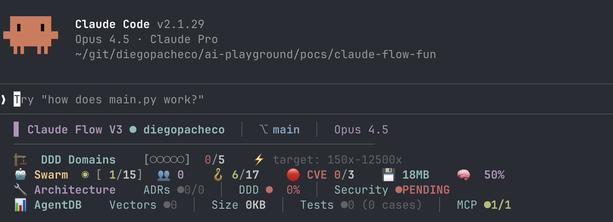
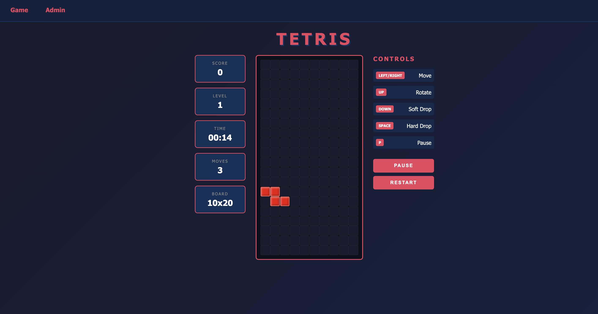

# Claude Flow Experience

## Result

1 - Claude Flow Status line in Claude Code <br/>
 <br/>


2- The game - 15min later <br/>
 <br/>

Prompt:
```
build a react tetris game, with the backend in rust 2024 with tokio. have a run.sh to run the app. there must be levels, and admin interface where admin can choose backlground themes, time config and more. the game must have time and count moves scores, once player make 100 points move next, each good move is 10 points. every 30s the board gets bigger and randon time to time player free for 10s.
```

# Notes

0. Tested Claude Flow V3 with Claude 2.1.29 / Opus 4.5
1. Installed claude flow: https://github.com/ruvnet/claude-flow
2. start as: `npx claude-flow@alpha init --wizard`
3. Tested with claude v2.1.29
4. Lots of things on the status line.
5. when type: `/Swarm Orchestration` got `Unknown skill: Swarm`
6. Lots of comamnds not working or borken.
7. I could see claude flow sub agents kick in claude code (backend-dev)
8. Claude Flow told me this:
```
⏺ I've launched 3 agents working in parallel on your Tetris game:

  - 🦀 Backend Dev: Building Rust/Tokio backend with Axum (API endpoints, WebSocket, game config, scores)
  - ⚛️ Frontend Coder: Building React Tetris game (board, pieces, controls, scoring, levels, admin panel)
  - 📜 Script Coder: Creating run.sh and stop.sh scripts

  Game Features being implemented:
  - 10 points per line cleared, 100 points → next level
  - Board grows every 30 seconds
  - Random 10-second freeze bonus
  - Admin interface for themes, time config, board settings
  - Time and move scoring
```
9. in 15min I had a workable game. 
10. Admin configs are not being applyed on the fly. 
11. I asked to fix the admin bug and add unit tests for frontend and backend.
12. 