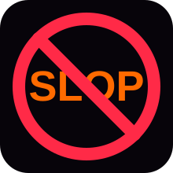
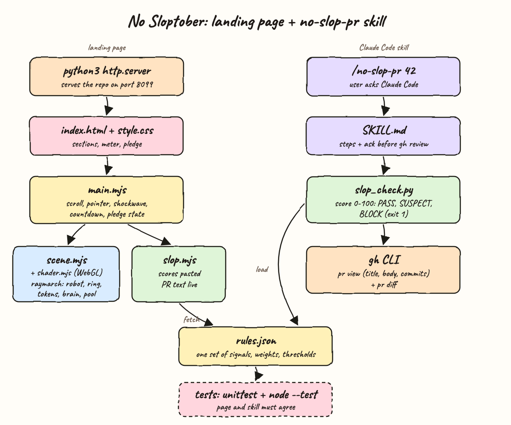
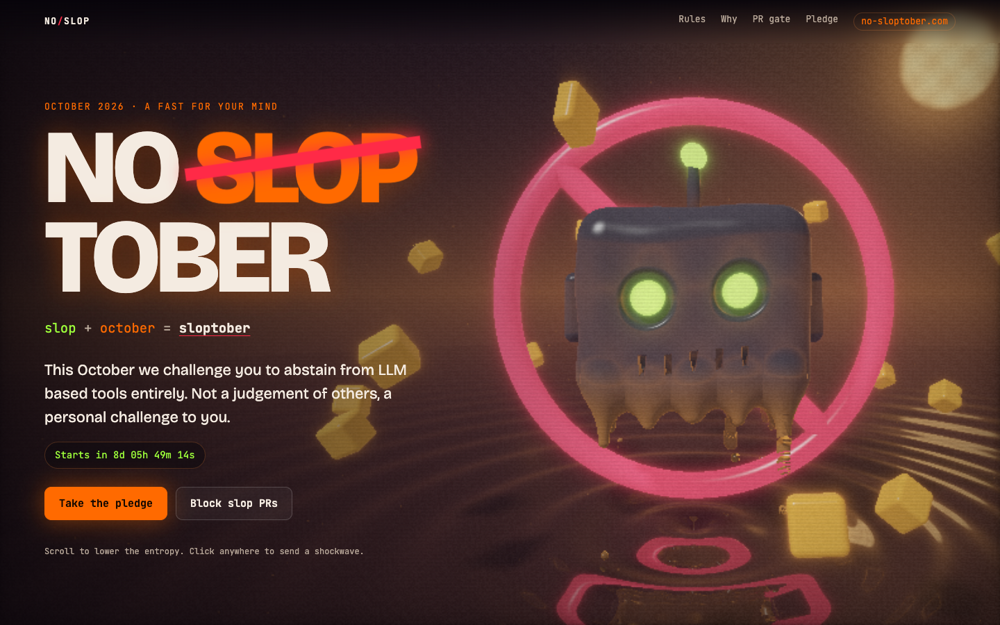
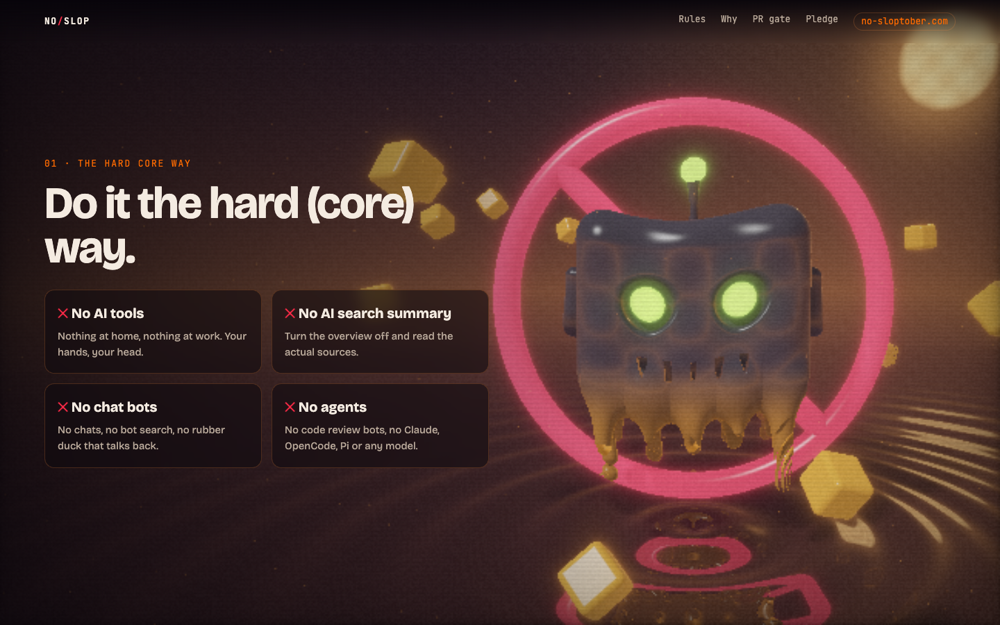
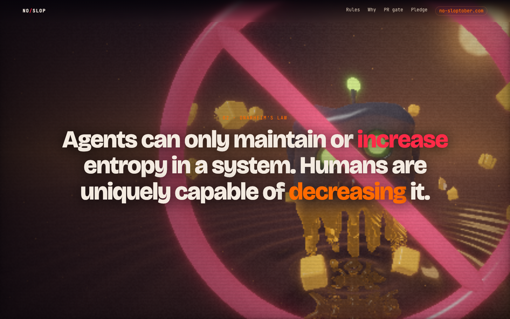
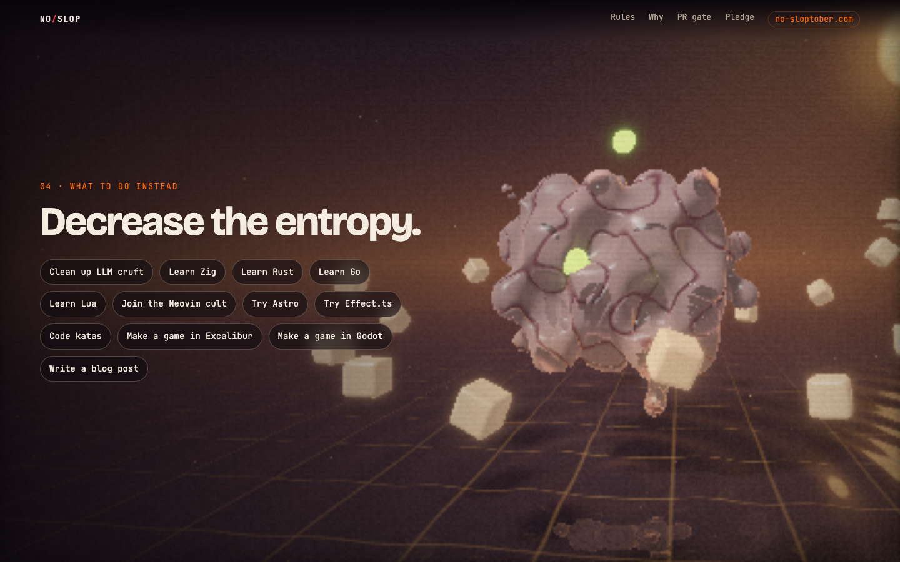
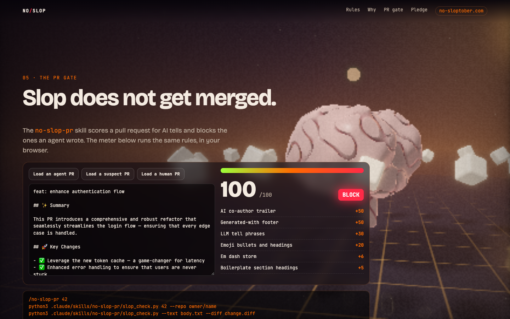
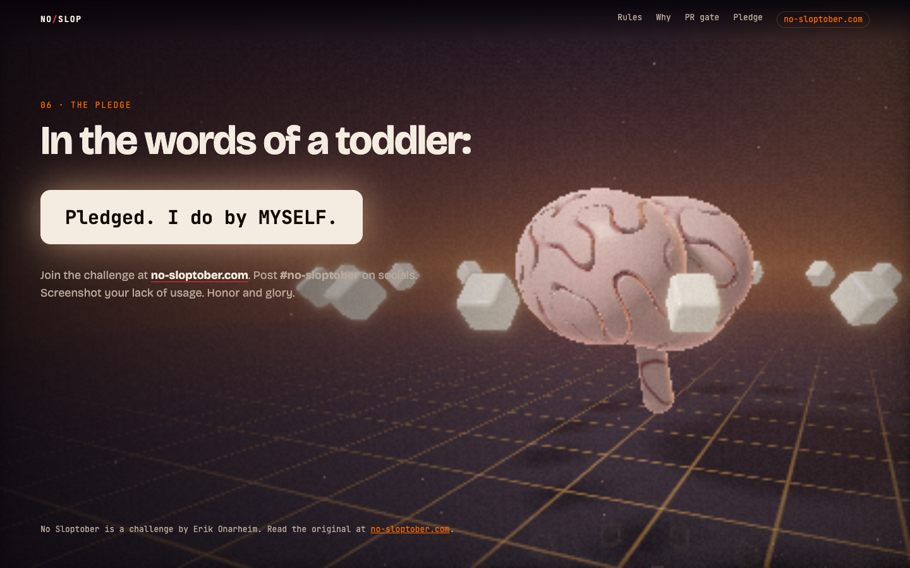

<p align="center"></p>

# No Sloptober

**slop + october = [sloptober](https://no-sloptober.com/).** No Sloptober is a challenge by Erik Onarheim: spend October without LLM tools. This project is a 3D landing page for the challenge plus a Claude Code skill, `no-slop-pr`, that scores pull requests for AI slop and blocks the ones an agent wrote.

The page is one full screen WebGL fragment shader behind the content. A chrome robot head sits inside a red NO sign and melts into orange slop. When you reach Onarheim's Law the NO ring flies through the camera. Then the robot turns into a human brain, the slop pool turns into a clean grid, and the token cubes line up in a ring. The story follows the law: agents add entropy, humans take it away.

## How it Works

1. `python3 -m http.server` serves the repo. There is no build step and no npm dependency.
2. `web/shader.mjs` is a raymarcher written with signed distance functions: robot head, drips and drops, NO ring and bar, 16 orbiting token cubes, a gyroid folded brain, a rippling pool, a harvest moon and embers.
3. `web/scene.mjs` draws one full screen triangle each frame and passes time, mouse, scroll, shockwave and pledge values to the shader. It lowers or raises the render resolution to keep the frame rate.
4. Scroll drives the story: the robot melts (0 to 35%), the ring flies away (24 to 50%), the robot turns into a brain (52 to 86%), and the camera orbits.
5. Clicking sends a shockwave ring with a VHS glitch. The pledge button morphs to the brain right away and stores the pledge in `localStorage`.
6. The PR gate section loads `rules.json` from the skill folder and scores pasted PR text in the browser with `web/slop.mjs`.
7. The skill runs `slop_check.py`, which reads a PR with `gh` (title, body, commits, diff), scores it with the same `rules.json`, and exits `1` on `BLOCK`.

## Architecture



## Features

* **Raymarched 3D scene with no libraries**: one WebGL1 fragment shader, so the page has no three.js and nothing to download.
* **Scroll story**: melt, ring fly-through, robot to brain morph and camera orbit, all tied to page scroll.
* **Robot follows your cursor**: the head and camera follow the pointer, so the scene feels alive.
* **Click shockwave and glitch**: a light wave from the head and scanline tearing while slop mode is on.
* **Pledge morph**: "I do by MYSELF" turns the robot into a brain and saves the pledge for the next visit.
* **Countdown**: counts down to October 1st, then shows the day of the challenge.
* **Adaptive resolution**: the canvas scale follows the frame time, so slow GPUs stay smooth.
* **Live slop meter**: paste a PR and see the score, the verdict and each signal that matched.
* **`no-slop-pr` skill**: Claude Code finds it in `.claude/skills` and can gate PRs by number, repo or local files.
* **One rules file**: page and skill read the same `rules.json`, so their scores stay the same.
* **WebGL fallback**: if WebGL is missing, the page shows a gradient background and the content still works.

## Stack

* **WebGL 1 + GLSL ES 1.0**: runs in every browser and on every GPU.
* **Vanilla ES modules**: no bundler, no framework, no install step.
* **Python 3 standard library**: the skill script and the static server need no pip packages.
* **gh CLI**: reads PR data and diffs the same way a human reviewer does.
* **unittest + node --test**: built-in test runners, no test dependencies.
* **Bash ops scripts**: the same setup, start, status, test and stop commands as the other POCs.

## Contracts

There is no REST API. The contracts are the CLI and the rules file.

`slop_check.py`

| Call | What it does |
|---|---|
| `slop_check.py 42` | Reads PR 42 of the current repo with `gh` |
| `slop_check.py 42 --repo owner/name` | Reads a PR from another repo |
| `slop_check.py --text body.txt --diff change.diff` | Scores local files |
| `--json` | Prints `{"score", "verdict", "hits": [{id, label, count, points}]}` |
| exit code | `1` on `BLOCK`, `0` on `SUSPECT` or `PASS` |

`rules.json`

| Signal | Weight | Cap |
|---|---|---|
| AI co-author trailer (Claude, Copilot, Cursor, Codex, ...) | 50 | 50 |
| Generated-with footer | 50 | 50 |
| LLM tell phrases (delve, robust, seamless, this PR introduces, ...) | 6 | 30 |
| Emoji bullets and headings | 5 | 20 |
| Em dash storm | 3 | 15 |
| Boilerplate section headings (Summary, Key Changes, Test Plan) | 5 | 15 |
| Comment cruft: 30% or more of added lines are comments | 20 | 20 |

`BLOCK` starts at 50 and `SUSPECT` at 25. The total is capped at 100.

## Design decisions

* **Caps on every signal**: one repeated word gives at most `SUSPECT`. Only a trailer or footer that admits an agent wrote the PR, or several different signals together, gives `BLOCK`.
* **The skill asks before touching GitHub**: it only runs `gh pr review --request-changes` after the user says yes, and it never closes, merges or pushes.
* **Parity tests**: `tests/slop.test.mjs` runs the Python script on the same fixtures and checks that the browser gives the same result.
* **Shared scene state**: `main.mjs` owns one `state` object (`scroll`, `shockAt`, `pledge`), and the render loop smooths it every frame.
* **Globals in the shader**: morph, melt and ring values are computed once per pixel in `main()`, and every SDF call reads them.

## Run

```bash
./scripts/setup.sh
./scripts/start-all.sh
./scripts/ui.sh
./scripts/test-all.sh
./scripts/stop-all.sh
```

To use the skill, open Claude Code in this folder and run `/no-slop-pr 42`, or ask it to check a PR for AI slop.

## Printscreens

**Hero.** The robot is inside the NO sign with eyes glowing green, and slop drips into the pool under a harvest moon. The title glitches and "SLOP" gets crossed out. The "slop + october = sloptober" line links to no-sloptober.com.



**The hard core way.** The robot melts further as you scroll and the drips get longer. The four rules sit on glass cards.



**Onarheim's Law.** The NO ring grows and flies toward the camera while the robot turns into a puddle.



**Decrease the entropy.** The robot is halfway through turning into a brain. The slop pool is becoming a clean grid and the cubes stop tumbling.



**The PR gate.** The agent PR fixture is loaded: co-author trailer, footer, tell phrases, emoji, em dashes and boilerplate headings add up to 100, so the verdict is `BLOCK`.



**The pledge.** After "I do by MYSELF" the brain is finished, the cubes form a ring and the footer links to the original site.



## Scripts

All scripts live in `scripts/` and run from any directory of the repository.

| Script | What it does |
|---|---|
| `./scripts/setup.sh` | Installs dependencies and prepares the app |
| `./scripts/start-all.sh` | Starts every service and prints the full link of each one |
| `./scripts/status.sh` | Shows every service port as UP or DOWN |
| `./scripts/test-all.sh` | Runs every test suite |
| `./scripts/ui.sh` | Opens the UI in the browser |
| `./scripts/stop-all.sh` | Stops every service |

Ports are declared in `scripts/ports.env`.

```bash
./scripts/setup.sh
./scripts/start-all.sh
./scripts/status.sh
./scripts/ui.sh
./scripts/stop-all.sh
```
