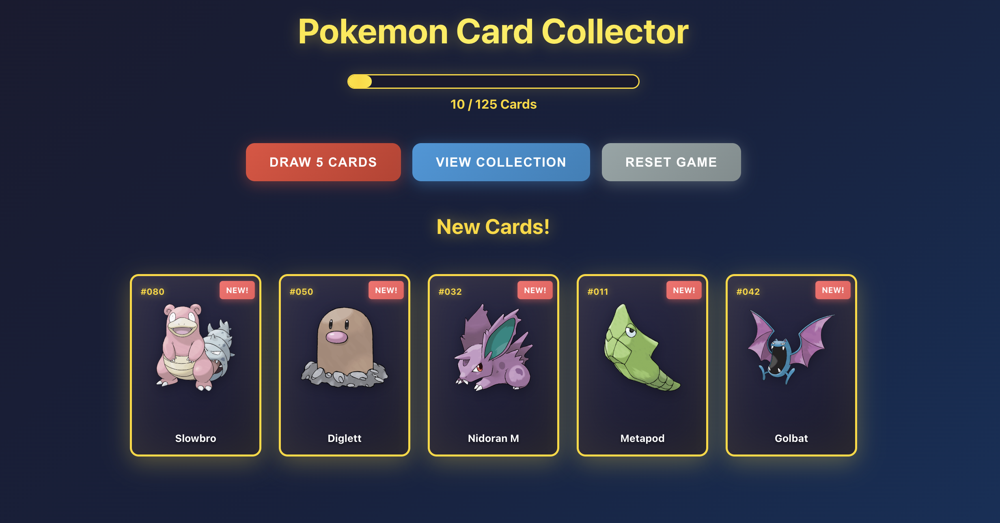
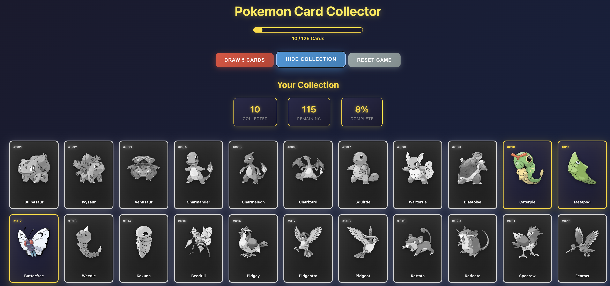

# Prompt

generate a application that collect pokemon cards, I want a button to get the user 5 ramdon cards, the total
of cards is 125, when the user has 125 the game is done, have a second button to let user see all cards, get
images from: https://github.com/HybridShivam/Pokemon/tree/master/assets/images - make the app with react and
typescript - dont use redux and run with bun, also make sure all state is stored in the local store. create
nice annimations.

## Results

Draw Random Cards  
 

Collection of Cards  
