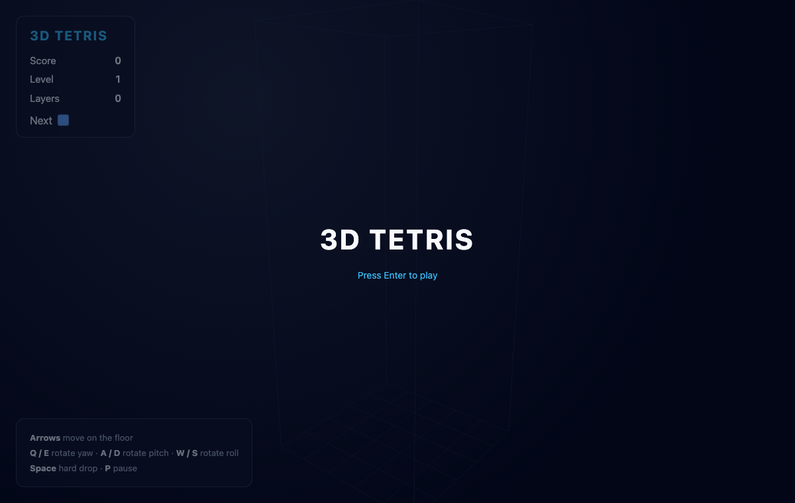
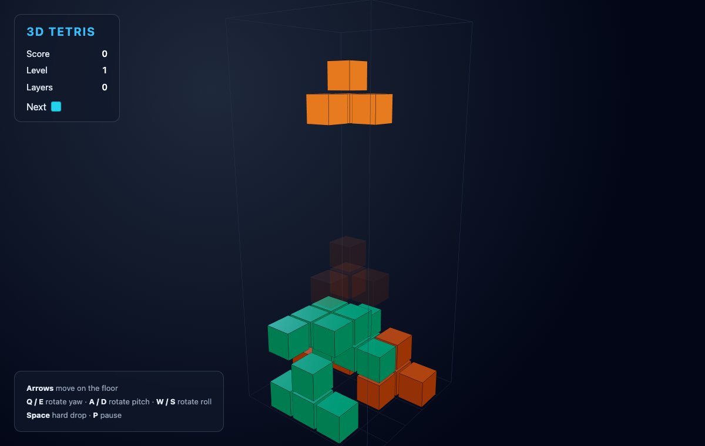
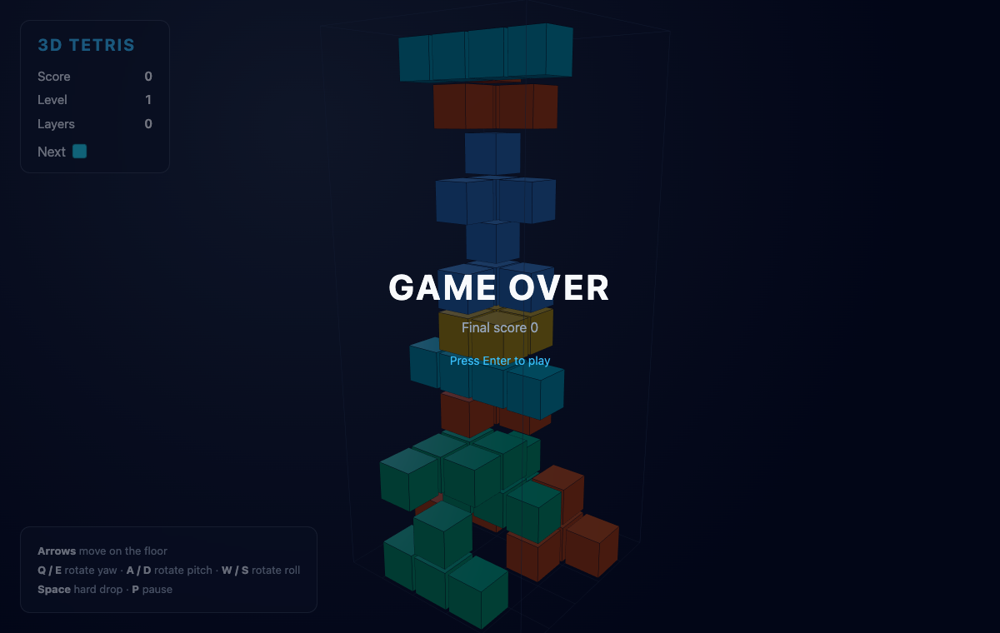

# 3D Tetris

A playable 3D Tetris (Blockout style) in the browser. Pieces are 3D polycubes
that fall down a `5 x 5 x 12` pit. You slide and rotate each piece across all
three axes; when a horizontal layer of the pit is completely filled it clears
and everything above it drops down.

Built with React 19, Bun 1.3 (runtime, package manager and bundler), TypeScript 6,
TanStack Store for state, and Three.js via @react-three/fiber for the WebGL view.

See [design-doc.md](./design-doc.md) for the full design.

## Run

```bash
./start.sh
```

This installs dependencies on first run, starts the Bun server and waits until
it answers, then prints the URL (default `http://localhost:3000`). Set `PORT` to
change it.

```bash
./stop.sh
```

Stops the server using the pid recorded in `server.pid`.

For local development with hot reload:

```bash
bun run dev
```

## Controls

| Key | Action |
| --- | --- |
| Arrow Left / Right | move along x |
| Arrow Up / Down | move along z (depth) |
| `Q` / `E` | rotate around the vertical axis (yaw) |
| `A` / `D` | rotate around the x axis (pitch) |
| `W` / `S` | rotate around the z axis (roll) |
| Space | hard drop |
| `P` | pause / resume |
| Enter | start / restart |

## Screens

### Start

Press Enter to begin. The pit is drawn as a wireframe box with a floor grid; the
HUD on the left tracks score, level and cleared layers and previews the colour of
the next piece.



### Playing

The active piece glows and falls down the pit. A faint projection (the ghost)
shows where it will land, so you can line up a drop before committing. Settled
blocks keep their colour and the camera holds a fixed angled view so the controls
stay consistent.



### Game over

When a freshly spawned piece has no room at the top of the pit the game ends and
shows the final score. Press Enter to play again.



## How it works

- **State** lives in a single TanStack Store (`src/game/store.ts`). The board is a
  flat `number[]` of length `5*5*12`; `0` is empty and any other value is a colour
  index for a settled cell.
- **Pieces** (`src/game/pieces.ts`) are sets of integer cell offsets. Rotation is a
  90 degree turn of every offset around one axis; a rotation or move is applied only
  if every resulting cell stays inside the pit and clear of settled blocks.
- **The loop** (`src/App.tsx`) is one `requestAnimationFrame` accumulator that reads
  the current level for its gravity interval and steps the piece down. On a blocked
  step the piece locks into the board, full layers clear, the score and level update,
  and the next piece spawns.
- **Rendering** (`src/components/`) maps the board and the active piece to Three.js
  boxes inside a centred group, lit by an ambient light and two directional lights.

## Scoring

Layers cleared by a single lock score `[0, 100, 300, 600, 1000]` times the current
level. The level rises every 8 cleared layers and each level shortens the gravity
interval down to a floor of 120 ms.

## Layout

```
index.html              HTML entrypoint
server.ts               Bun.serve dev server
src/main.tsx            React root
src/App.tsx             layout, keyboard, game loop
src/game/types.ts       shared types and pit dimensions
src/game/pieces.ts      shapes and colours
src/game/store.ts       TanStack Store + engine
src/components/Scene.tsx        Canvas, camera, lights
src/components/Pit.tsx          pit frame, settled cells, ghost
src/components/ActivePiece.tsx  the falling piece
src/components/Block.tsx        one cube with edges
src/components/Hud.tsx          score, level, controls overlay
start.sh / stop.sh
```
