<p align="center">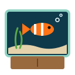</p>

# Aquarium

A 3D web aquarium you build yourself. Pick the rack color and material, stock it with up to 10 fish species, aquascape it with aqua soil, a sand path, a Monte Carlo carpet, red and green bushes, Seiryu dragon stones and hairgrass, drop in sunken wrecks and props, feed the fish, release a small shark that scatters everyone, and turn on the underwater sound. It runs in the browser with three.js, has no build step, and needs no npm packages.

## How it Works

1. `index.html` loads three.js 0.186.1 from the jsdelivr CDN through an import map and starts `web/main.mjs`.
2. The side panel (`ui.mjs`) sends every click to pure reducers in `state.mjs`, which return a new state object.
3. `main.mjs` diffs the new state into the scene: it adds or removes fish, shows decorations, switches the substrate, grows the aquascape plants, sets the grass level and re-textures the rack.
4. Each frame, `swim.mjs` steers every fish: wander toward a random target in its depth band, flee when the shark is close, chase the nearest flake of food.
5. Rack materials are procedural canvas textures (`patterns.mjs`), tinted by the chosen color and reused as bump maps.
6. Wrecks use a weathering shader (`weather.mjs`) that paints rust, algae on the upward faces, grime, and sand silt at the burial line.
7. `sound.mjs` synthesizes everything with WebAudio: water ambience, bubble pops, splashes, munches and the two-note shark theme.
8. Plants are instanced meshes (`plants.mjs`): thousands of carpet tufts, bush leaves and hairgrass blades in a few draw calls. Hairgrass and anemone tentacles sway in the vertex shader.
9. The substrate is one shader (`tank.mjs`) that blends sand and a procedural aqua soil texture, and cuts the sand path from a pure `pathMask` in `patterns.mjs`.
10. The tank setup is saved to `localStorage` and validated on the next load.

## Architecture

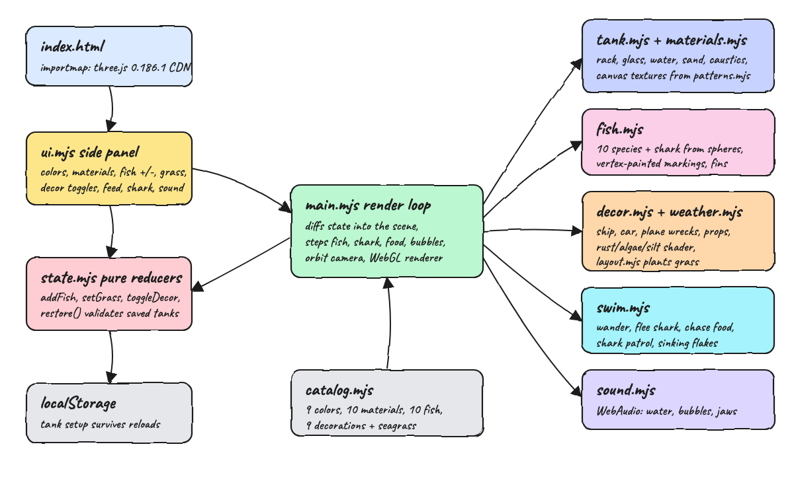

## Features

* **Rack color**: 9 colors (Natural plus 8 tints), so the stand matches any room.
* **Rack material**: 10 materials (wood, steel, bricks, marble, concrete, bamboo, stone, carbon, brass, leather), each a procedural texture with relief.
* **Fish**: 10 species (neon tetra, clownfish, blue tang, goldfish, angelfish, betta, guppy, discus, mandarin, yellow tang), up to 40 fish, each with its own markings, fins, speed and depth band.
* **Seagrass amount**: 8 levels with − / +. Each level plants more hairgrass clumps (18 tapered blades each), back row first so the view stays open, and never inside a decoration or a dragon stone.
* **Substrate**: Sand, Aqua soil (dark granular soil, visible as a layer through the front glass), or Soil + sand path (a winding light sand path lined with pebbles).
* **Aquascape**: a Monte Carlo carpet that covers the floor in billowy green and clears around every decoration and the path, red and green stem-plant bushes along the back glass, and four Seiryu dragon stones with creases and light veins.
* **Decorations**: sunken ship, sunken car, sunken plane, treasure chest, castle, a realistic coral reef (staghorn colonies, a brain coral with grooves, a sea fan, tube sponges, mushroom corals and an anemone with swaying tentacles), rocks, anchor and diver helmet, laid out so they never overlap.
* **Realistic wrecks**: a curved lofted ship hull with broken masts and a torn sail, a rounded 1950s sedan with wheel arches, chrome and glass, and a WWII fighter with elliptical wings, a bubble canopy and a bent prop. All are rusted, covered in algae and half buried in sand.
* **Feed fish**: drops flakes at the surface. They sink slowly, fish race to the nearest one and eat it, and leftovers settle on the sand and fade.
* **Small shark**: patrols the tank. Fish flee from it even when they are eating.
* **Sound**: water ambience, bubble pops, splash, munch and the shark theme, with a volume slider. It is off by default because browsers only allow audio after a click.
* **Living tank**: animated caustics, a rippling water surface, a bubble stream from the air stone, swaying grass and an opening treasure chest.
* **Orbit camera**: drag to orbit and scroll to zoom. The camera flies in when the page loads and fits portrait screens.
* **Mobile layout**: the panel becomes a bottom sheet behind a Controls button.

## Stack

* **three.js 0.186.1**: the WebGL renderer, orbit controls and room environment, loaded from a CDN so there is no bundler.
* **Vanilla ES modules**: plain `.mjs` files with no framework, so the code runs as written.
* **WebAudio**: all sound is synthesized in code, so there are no audio files.
* **Canvas 2D**: generates the rack textures, material thumbnails and caustics at runtime.
* **GLSL `onBeforeCompile`**: extends the standard material with the rust, algae and silt shader, the soil and sand path substrate and the plant sway.
* **BufferGeometryUtils** (ships with three.js): merges coral branches and carpet leaves into single geometries.
* **node:test**: runs the pure logic tests with zero dependencies.
* **python3 http.server**: serves the static files locally.

## Contracts

There is no backend API. The app has two contracts:

* The **saved state** in `localStorage` under the key `aquarium-state`:

```json
{
  "rackColor": "ocean",
  "material": "wood",
  "fish": ["neon", "neon", "clown", "bluetang"],
  "grass": 4,
  "decor": ["ship", "car", "plane"],
  "substrate": "path",
  "scape": ["carpet", "bushes", "stones"],
  "shark": true,
  "sound": false
}
```

* The **catalog** in `web/catalog.mjs`. Every id in the saved state must exist there. `restore()` drops unknown ids, fills in the planted aquascape for saves that predate it, clamps the grass level and never turns sound back on by itself.

## Key Data Structures and Design Decisions

* **State is a plain immutable object**: reducers return a new object, or the same one when nothing changed, so `main.mjs` only re-applies what differs.
* **Fish are a multiset of species ids**: `["neon","neon","clown"]`. Adding or removing a fish is a count diff per species.
* **Swimmer**: `{ pos, vel, target, band, speed, fleeing }`. Steering blends the goal (a target, food, or away from the shark) into the velocity, then clamps to the swim box so fish never leave the water.
* **Decoration spots**: each item has `[x, z, radius]` footprints on the sand. Tests check that footprints stay inside the glass and never overlap, that dragon stones never hit a decoration or the air stone, and that bushes leave the bubble stream free. Grass clumps are placed from a seeded RNG that avoids every footprint. The carpet is a jittered grid that hides the tufts under visible decorations and on the path.
* **Pure logic is separated from rendering**: `catalog`, `state`, `swim`, `patterns` and `layout` import no three.js, so they run under `node --test`.
* **Weathering in the shader**: rust and algae are computed from world position and normal, so they look right regardless of UVs or mesh density. The silt line is set from the real sand height under each object.

## How to Run

```bash
./scripts/setup.sh
./scripts/start-all.sh
./scripts/ui.sh
./scripts/test-all.sh
./scripts/stop-all.sh
```

Open http://localhost:8111. The first load needs internet access to fetch three.js from the CDN.

Tests (37, all pure logic):

```
./scripts/test-all.sh
ℹ tests 37
ℹ pass 37
ℹ fail 0
tests passed
```

## Printscreens

### Default tank
The starting setup: a natural wood rack, eight fish, aqua soil with a sand path, the carpet, red and green bushes, dragon stones, three levels of hairgrass, rocks and the sunken ship. The caustic light moves across the sand and bubbles rise from the air stone in the back corner.

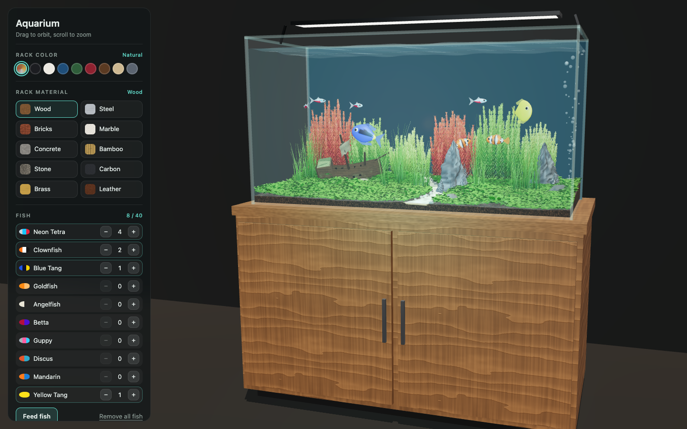

### Everything on, with the shark
An Ocean-tinted wood rack, 16 fish across all 10 species, every decoration and four levels of grass. The shark patrols the middle and nearby fish scatter away from it.

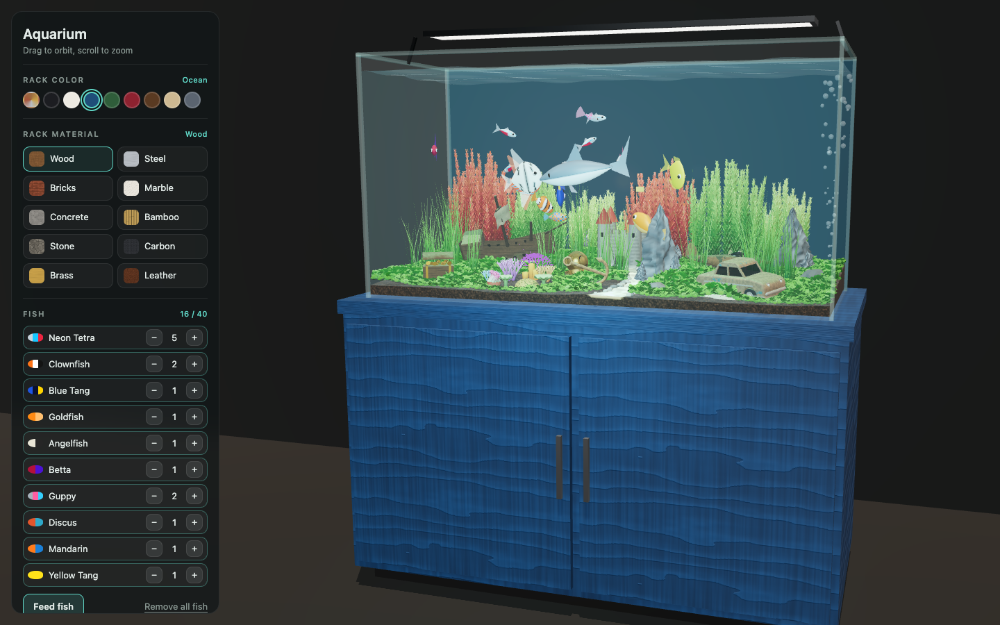

### Bricks rack
A natural brick rack with mortar lines and relief, goldfish, a betta and guppies around the castle, chest and coral, with five levels of grass.

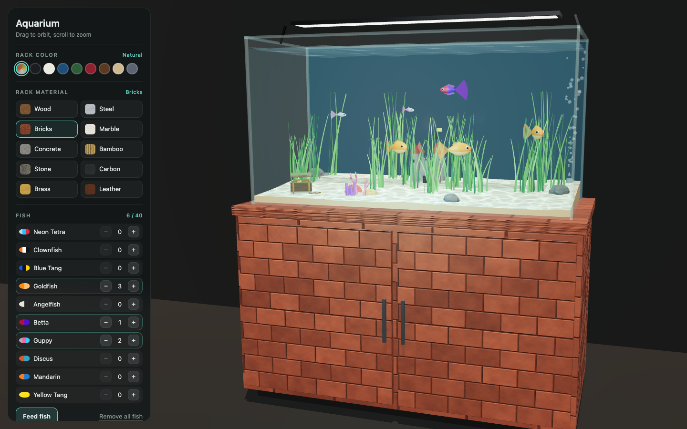

### Steel rack, Midnight color
Brushed steel tinted Midnight, with discus and angelfish over the plane, car, anchor and diver helmet.

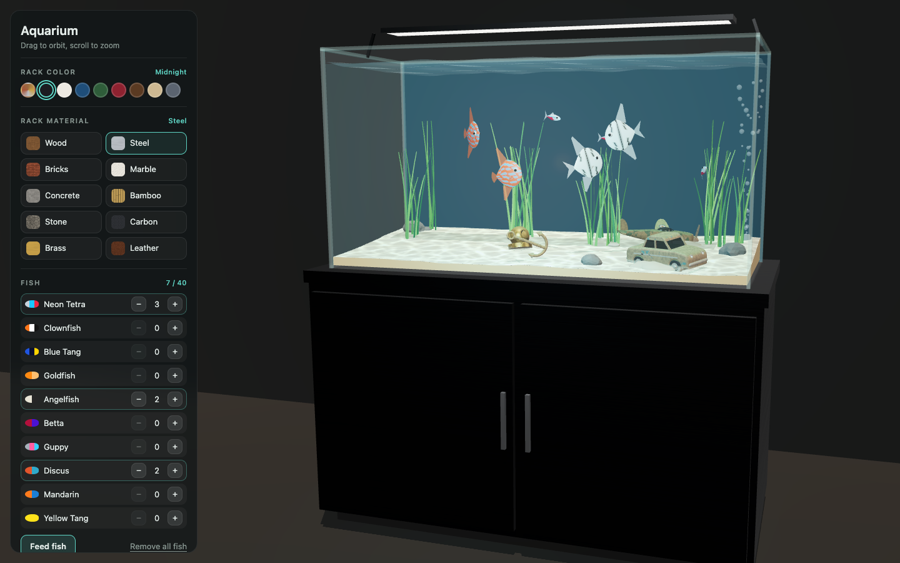

### Marble rack
A natural marble rack with veins, reef fish, the mandarins near the bottom and the shark on patrol.

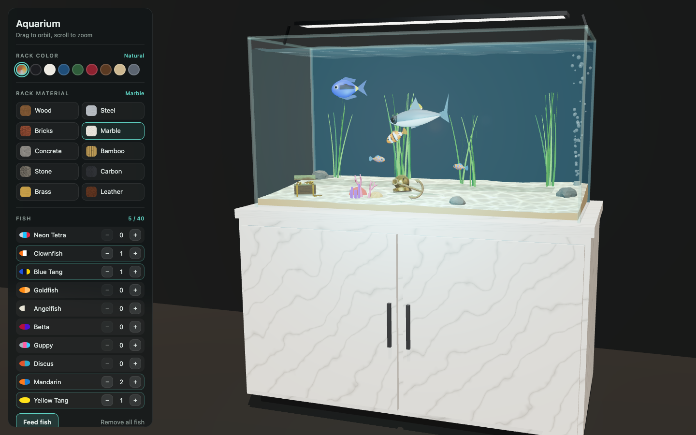

### Wrecks up close: car and plane
The sunken 1950s sedan (rust, algae on the roof and hood, wheels half buried in a sand mound) and the WWII fighter behind it (camouflage-like corrosion, roundel, bubble canopy).

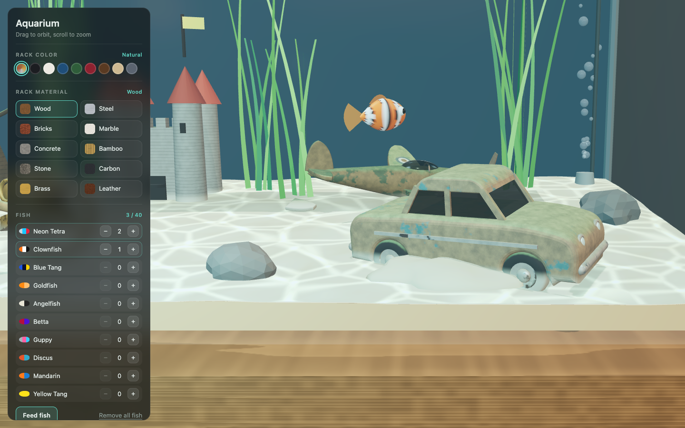

### Wrecks up close: ship and chest
The listing ship with a planked, algae-covered hull, cannon ports, broken masts and a torn sail. In front of it, the treasure chest opens and closes over its gold coins.

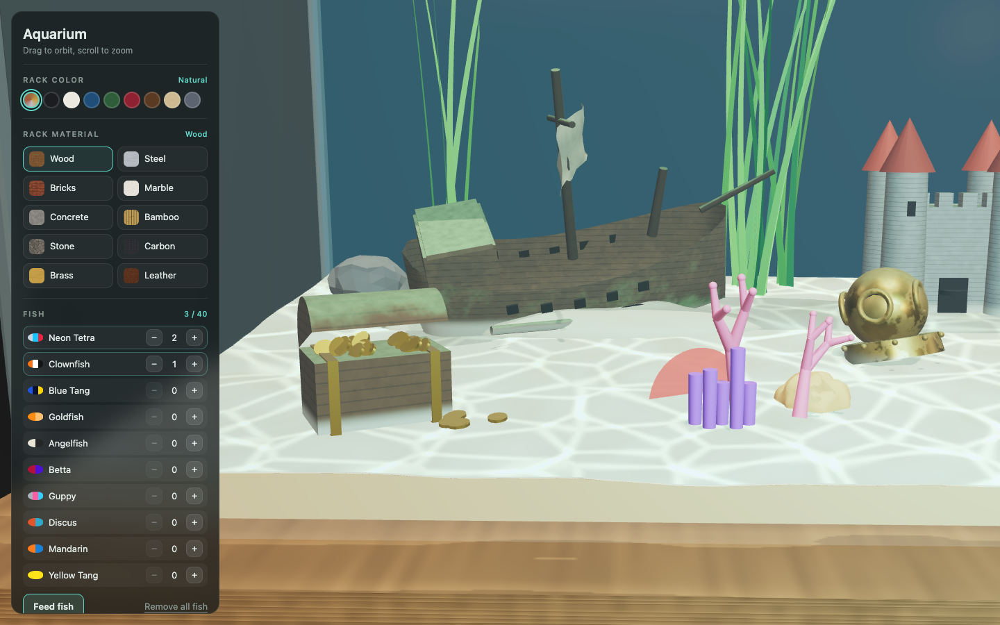

### Feeding
Right after pressing Feed fish: the school converges on the sinking flakes near the surface.

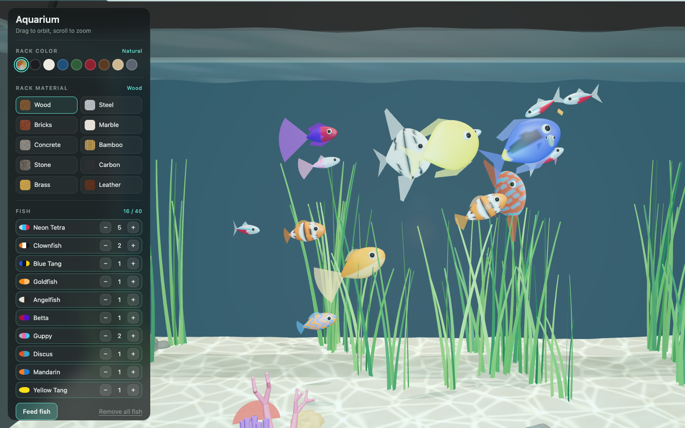

### Aquascape
Aqua soil seen through the front glass, the Monte Carlo carpet, the winding sand path with pebbles, a Seiryu dragon stone and the red and green bushes along the back.

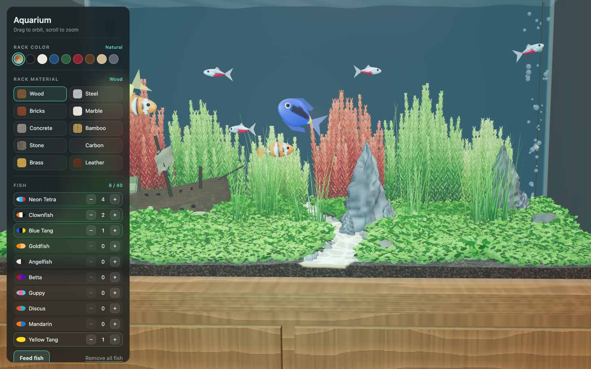

### Coral reef
Staghorn colonies in three colors, a grooved brain coral, a purple sea fan, tube sponges, mushroom corals and an anemone whose tentacles sway, set in a clearing of the carpet.

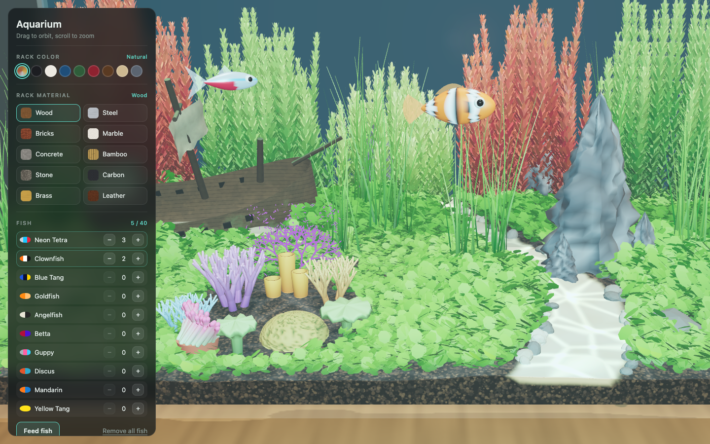

### Aqua soil without the path
A full carpet over dark soil with five levels of hairgrass, dragon stones, the sunken car and a school of neon tetras.

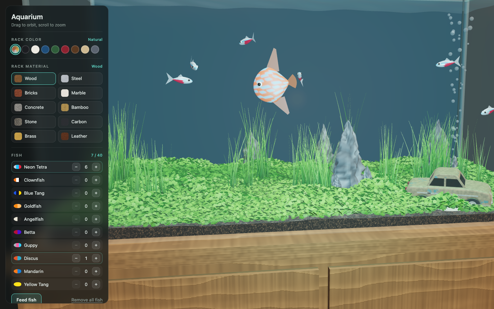

### Sand with bushes
The classic sand substrate with only the bushes on, behind the anchor and the plane.

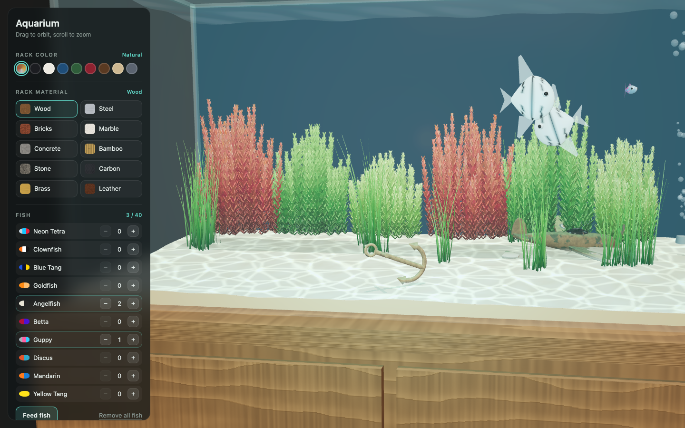

### Aquascape controls
The substrate choice and the Carpet, Bushes and Dragon stones toggles.

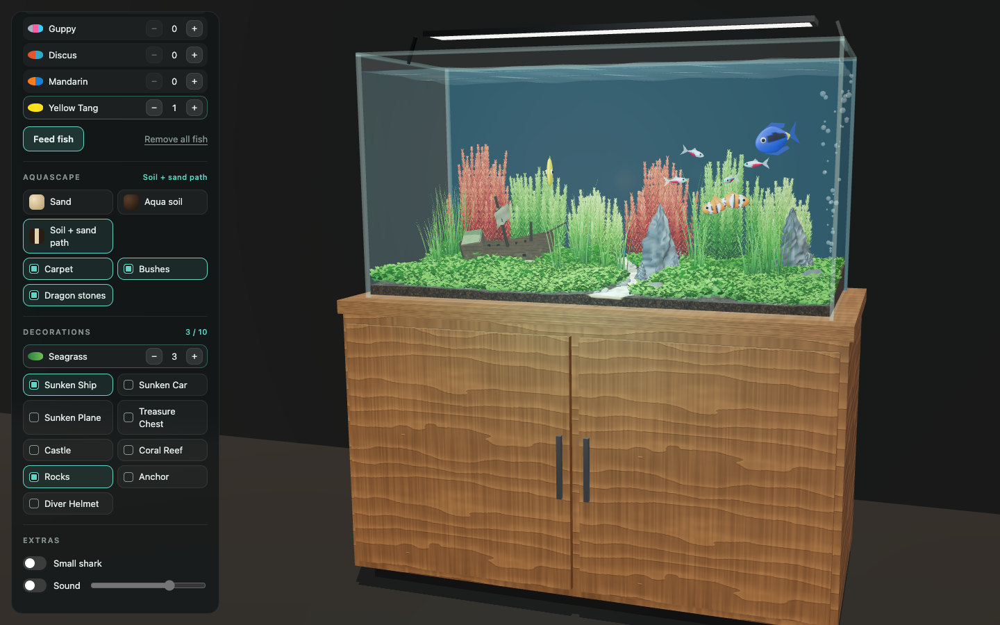

### Mobile
On a phone the camera pulls back to fit the whole tank, and the controls stay behind the Controls button.

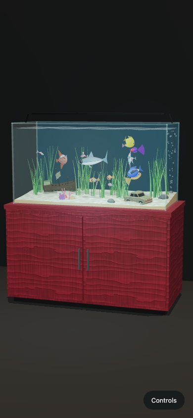

### Mobile controls
The panel opens as a bottom sheet with the same options.

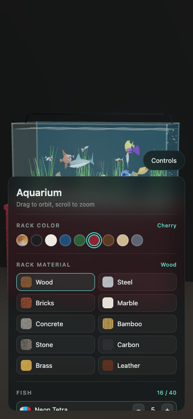

## Scripts

All scripts live in `scripts/` and run from any directory of the repository.

| Script | What it does |
|---|---|
| `./scripts/setup.sh` | Installs dependencies and prepares the app |
| `./scripts/start-all.sh` | Starts every service and prints the full link of each one |
| `./scripts/status.sh` | Shows every service port as UP or DOWN |
| `./scripts/test-all.sh` | Runs every test suite |
| `./scripts/ui.sh` | Opens the UI in the browser |
| `./scripts/stop-all.sh` | Stops every service |

Ports are declared in `scripts/ports.env`.

```bash
./scripts/setup.sh
./scripts/start-all.sh
./scripts/status.sh
./scripts/ui.sh
./scripts/stop-all.sh
```
