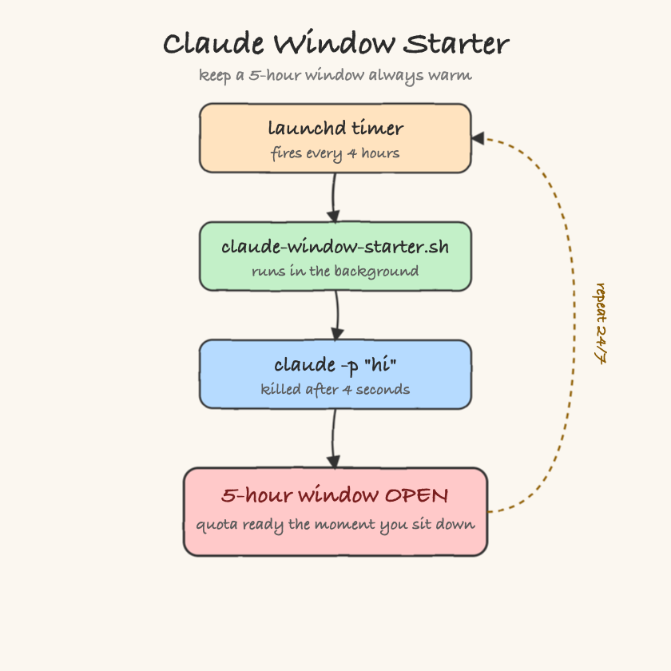

# Claude Window Starter

A tiny background job that keeps your Claude subscription's **5-hour usage window** always warm. Every 4 hours it fires `claude -p "hi"` and kills it after 4 seconds — just long enough for the request to reach the server and start a fresh window, nothing more.



## Why this exists

Your Claude subscription (Pro / Max) meters usage on a **rolling 5-hour window**:

- A window **starts with your first message** and lasts **5 hours**.
- You get a quota inside each window.
- When a window ends, the **next message opens a new one**.

The catch: a window is only ever claimed when you actually send a message. If you only talk to Claude when you sit down to work, every window that passes while you are asleep, in meetings, or between sessions **expires unclaimed**. You are paying for the whole day but only reaching a couple of windows out of it.

**Claude Window Starter** sends one throwaway message every 4 hours, around the clock, so a window is always open. Two wins:

1. **No cold start.** The moment you sit down, there is already an active window with full quota — you never open a session on an empty tank.
2. **You reach windows that would otherwise be wasted.** Nights, weekends, gaps between sessions — each one gets claimed instead of expiring.

## How much more of the plan you actually reach

A day holds `24h / 5h ≈ 4.8` windows. Firing every 4 hours sits **under** the 5-hour window, which guarantees at least one trigger lands inside every rolling 5-hour span — so no claimable window ever slips past untouched.

| Usage pattern | Windows / day | Windows / week |
|---|---|---|
| Only when you start working | ~2 | ~10–14 |
| Claude Window Starter (every 4h, 24/7) | up to ~4.8 | up to ~33 |

Net effect: **up to ~2x more of your plan's allowance is actually reachable** — you stop leaving idle windows on the table. This is bounded by your plan's weekly cap, and warming a window does not manufacture quota you never spend; it removes the cold-start wait and stops windows from expiring unused.

## Files

| File | Purpose |
|---|---|
| `claude-window-starter.sh` | Fires `claude -p "hi"`, kills it after 4s, logs a timestamp |
| `install.sh` | Generates the LaunchAgent plist and loads it |
| `uninstall.sh` | Unloads and removes the LaunchAgent |
| `printscreens/flow.svg` / `flow.png` | The diagram above |

## Install

```bash
./install.sh
```

This writes `~/Library/LaunchAgents/com.claude-window-starter.plist` and loads it. `RunAtLoad` fires one window immediately, then `StartInterval` repeats every 4 hours (14400s), surviving reboots:

```xml
<?xml version="1.0" encoding="UTF-8"?>
<!DOCTYPE plist PUBLIC "-//Apple//DTD PLIST 1.0//EN" "http://www.apple.com/DTDs/PropertyList-1.0.dtd">
<plist version="1.0">
<dict>
    <key>Label</key>
    <string>com.claude-window-starter</string>
    <key>ProgramArguments</key>
    <array>
        <string>/Users/diegopacheco/git/diegopacheco/ai-playground/pocs/claude-window-starter/claude-window-starter.sh</string>
    </array>
    <key>StartInterval</key>
    <integer>14400</integer>
    <key>RunAtLoad</key>
    <true/>
    <key>StandardOutPath</key>
    <string>/Users/diegopacheco/claude-window-starter.log</string>
    <key>StandardErrorPath</key>
    <string>/Users/diegopacheco/claude-window-starter.log</string>
</dict>
</plist>
```

## Verify it is running

```bash
launchctl list | grep claude-window-starter
cat ~/claude-window-starter.log
```

Each fire appends a line like `2026-07-03 10:56:12 window triggered`.

## Uninstall

```bash
./uninstall.sh
```

## Notes

- **4h vs 5h.** 4 hours is a conservative cadence that stays under the 5-hour window, so launchd timing drift or a sleeping Mac never lets a window fully lapse before the next trigger. A ~5h cadence packs windows tighter back-to-back but leaves no margin — 4h trades a little overlap for reliability.
- Each fire costs a trivial slice of usage (one `hi`), traded for never hitting a cold window.
- macOS only — it relies on `launchd`.
