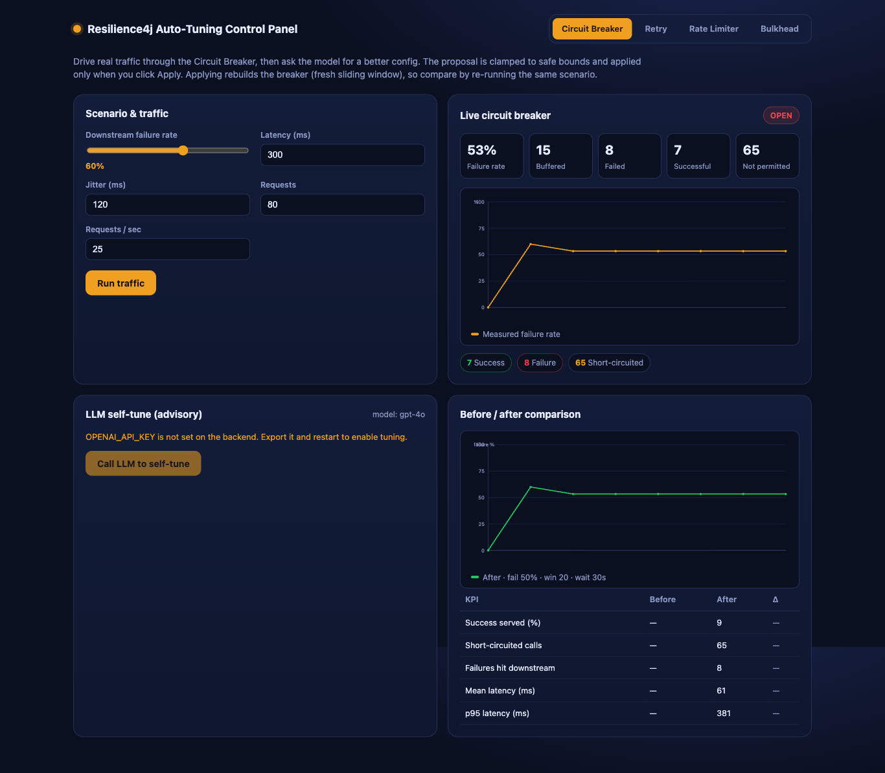
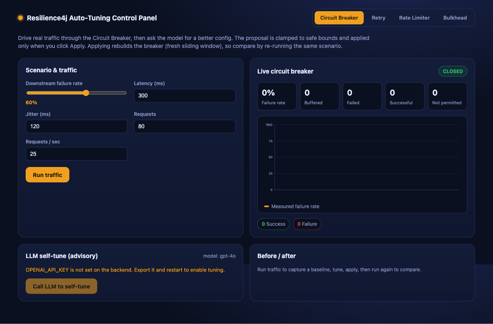
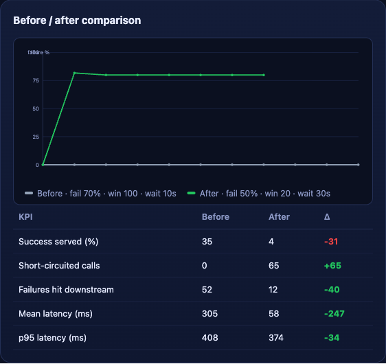
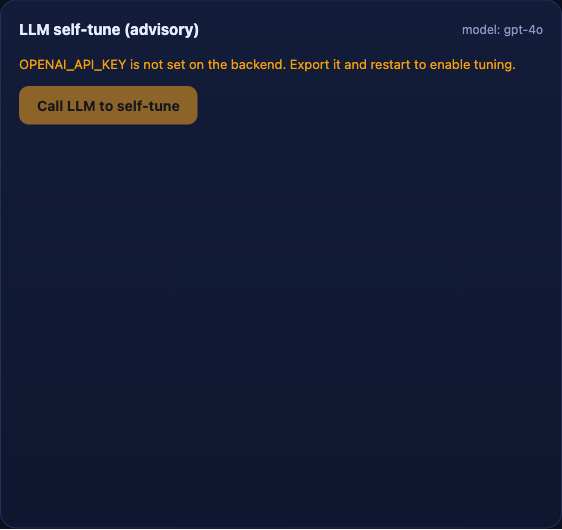

# Closed-Loop Auto-Tuning Agent for Resilience4j

A control panel that drives **real traffic** through four Resilience4j patterns, then asks an
LLM (OpenAI) for a better **Circuit Breaker** configuration based on the metrics that traffic
produced. The model only *advises* — its proposal passes through a deterministic **clamp** (hard
bounds so protection can never be disabled), and a human applies it with one click. The dashboard
then re-runs the same traffic against the new config and shows a **before / after** comparison so
you can judge whether it actually helped.

This is the human-gated, on-demand form of auto-tuning: the loop is closed by a person pressing a
button, not autonomously. See [`design-doc.md`](./design-doc.md) for the full rationale (oscillation,
Goodhart / reward-hacking, incident amplification) that shaped these constraints.

## Screenshots

The whole dashboard while the breaker is OPEN under load — live metrics, the advisory tuning panel,
and the before/after comparison:



Idle dashboard (pattern tabs, scenario & traffic controls, live breaker panel):



The before / after comparison after a config change — the tuned breaker short-circuits a sick
downstream, cutting failures-hit-downstream `52 -> 12` and mean latency `305ms -> 58ms`, while the
KPI table honestly surfaces the trade-off (`success served` drops because it now fast-fails):



The LLM self-tune panel (advisory). With `OPENAI_API_KEY` set it shows the proposed-vs-clamped diff
and the model's rationale; clamped fields are highlighted and an **Apply** button appears:



> Note: these were captured with no `OPENAI_API_KEY` in the environment, so the tuning panel shows
> its advisory (key-required) state, and the before/after above was produced by applying configs
> through the real `/api/config` path. With a key exported, the panel renders the live model
> proposal, diff, and rationale, and Apply uses the clamped values.

## Architecture

```
Browser (React + Vite + TanStack Query/Router)
  pattern tabs | scenario controls | real fetch() traffic runner
  live metrics | Call LLM to self-tune | proposed-vs-clamped diff | Apply
  before/after charts (hand-rolled SVG) + KPI delta
        |  HTTP (Vite proxies /api -> :8080)
        v
Backend (Spring Boot 4 / Java 25)
  PatternController   /api/{cb,retry,ratelimiter,bulkhead}/call -> R4J -> flaky Downstream
  ScenarioController  /api/sim/scenario        set downstream failRate/latency/jitter
  MetricsController   /api/metrics/...          R4J registry snapshots
  ConfigController    GET/POST /api/config/circuitbreaker  (clamp + rebuild breaker)
  TuneController      POST /api/tune/circuitbreaker
        -> TuningService -> OpenAiClient (JDK HttpClient) -> Clamp (hard bounds)
        |  HTTPS
        v
  OpenAI API (OPENAI_API_KEY, model via OPENAI_MODEL, default gpt-4o)
```

### The four patterns

| Tab            | Endpoint                  | What the traffic shows                         |
|----------------|---------------------------|------------------------------------------------|
| Circuit Breaker| `POST /api/cb/call`        | state CLOSED -> OPEN -> calls short-circuited   |
| Retry          | `POST /api/retry/call`     | retried-then-failed / retried-then-succeeded    |
| Rate Limiter   | `POST /api/ratelimiter/call`| excess calls rejected (rate-limited)           |
| Bulkhead       | `POST /api/bulkhead/call`  | calls beyond max concurrency rejected           |

A single flaky `Downstream` sits behind all four; the scenario controls (failure rate, latency,
jitter) tune how it (mis)behaves so traffic actually trips each pattern. Only the **Circuit Breaker**
is tunable by the LLM in this POC.

### Safety: the clamp + the human

Every model proposal is forced inside hard bounds before it can reach the operator, and again on
apply. There is no value the model can return that turns the breaker off.

| Knob                                  | Min | Max  |
|---------------------------------------|-----|------|
| failureRateThreshold (%)              | 40  | 70   |
| slowCallRateThreshold (%)             | 50  | 100  |
| slowCallDurationThresholdMs           | 200 | 5000 |
| slidingWindowSize                     | 10  | 200  |
| minimumNumberOfCalls                  | 5   | 100  |
| waitDurationInOpenStateSeconds        | 5   | 60   |
| permittedNumberOfCallsInHalfOpenState | 2   | 20   |

Applying a config rebuilds the breaker (R4J configs are immutable), which resets the sliding window
by design — that is why before/after is measured by re-running the same scenario against a fresh
window.

## Tech stack

- Backend: Java 25, Spring Boot 4.0.0 (Spring Framework 7), Resilience4j 2.2.0 core modules,
  Jackson 3 (`tools.jackson`), OpenAI via the JDK `java.net.http.HttpClient` (no SDK).
- Frontend: Vite 8, React 19, TypeScript, TanStack Query + TanStack Router. Charts are hand-rolled
  SVG (no charting library).

## Run it

Prerequisites: JDK 25, Node 20+/npm, and (optional) an OpenAI key.

```bash
export OPENAI_API_KEY=sk-...     # optional; without it the tune button is disabled
./start.sh                       # builds the backend jar, starts backend :8080 + Vite :5173
# open http://localhost:5173
./stop.sh                        # stops both, frees the ports
```

`./start.sh` packages the backend, launches it, waits for `/api/tune/status` to answer, installs
frontend deps if needed, starts Vite, and waits for it to serve. Logs land in `.run/`.

Walkthrough:
1. On the **Circuit Breaker** tab, set a scenario (e.g. 60% failure, 300ms latency) and click
   **Run traffic** — real `fetch()` bursts hit `/api/cb/call` and trip the breaker.
2. Click **Call LLM to self-tune**. The backend snapshots the live metrics, calls OpenAI, clamps the
   result, and returns current-vs-proposed-vs-clamped plus a rationale.
3. Review the diff (clamped fields are flagged), click **Apply**.
4. Click **Run traffic** again — the before/after charts and KPI table update.

## API

| Method | Path                          | Purpose                                       |
|--------|-------------------------------|-----------------------------------------------|
| POST   | `/api/cb/call`                 | call through the Circuit Breaker              |
| POST   | `/api/retry/call`              | call through Retry                            |
| POST   | `/api/ratelimiter/call`        | call through Rate Limiter                     |
| POST   | `/api/bulkhead/call`           | call through Bulkhead                         |
| POST   | `/api/cb/reset`                | reset the breaker (fresh window)              |
| GET/POST | `/api/sim/scenario`          | get / set downstream failRate, latency, jitter|
| GET    | `/api/metrics/circuitbreaker`  | live breaker metrics snapshot                 |
| GET    | `/api/metrics/{retry,ratelimiter,bulkhead}` | per-pattern R4J metrics          |
| GET/POST | `/api/config/circuitbreaker` | get / apply (clamped) breaker config         |
| GET    | `/api/tune/status`             | `{ configured, model }`                       |
| POST   | `/api/tune/circuitbreaker`     | LLM proposal -> clamp -> `{current,proposed,clamped,clamps,rationale}` |

## Tests

`./test.sh` runs the backend suite. The safety property (the clamp can never disable protection) is
the centerpiece; endpoint integration tests drive each pattern and assert the expected R4J effect
(using the JDK `HttpClient`, since Spring Boot 4 drops `TestRestTemplate`).

```
Tests run: 3, Failures: 0, Errors: 0, Skipped: 0 -- com.diegopacheco.autotune.config.ClampTest
Tests run: 1, Failures: 0, Errors: 0, Skipped: 0 -- com.diegopacheco.autotune.tune.TuningServiceTest
Tests run: 4, Failures: 0, Errors: 0, Skipped: 0 -- com.diegopacheco.autotune.PatternEndpointIT
BUILD SUCCESS  (8 tests, 0 failures)
```

## Honest limitations

- Applying config resets the breaker's sliding window (documented, part of the before/after method).
- The clamp prevents catastrophe, not sub-optimality — the human reading the rationale is the real check.
- "Better" is scenario-dependent; the dashboard surfaces the trade-off, it does not declare a winner.
- No autonomy on purpose. A fully autonomous loop would additionally need cooldown/hysteresis,
  timescale separation, shadow -> canary promotion, freeze-on-incident, and a control group — all
  explicitly out of scope here.
