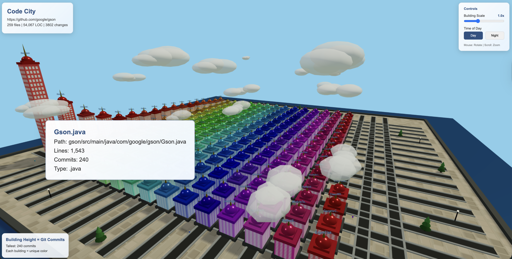

# Code City Viz

By Diego Pacheco

## How it works?

It clones a github project and analize size and number of commits on the file and the buid a 3D city where:
- Each building is a file
- The height of the building is the number of lines of code / commits
- People are entering and exiting buildings as code is being modified more often
- Clouds are for fun

## How to use it?

```
./run.sh https://github.com/google/gson
```

## Result

Using: https://github.com/google/gson

