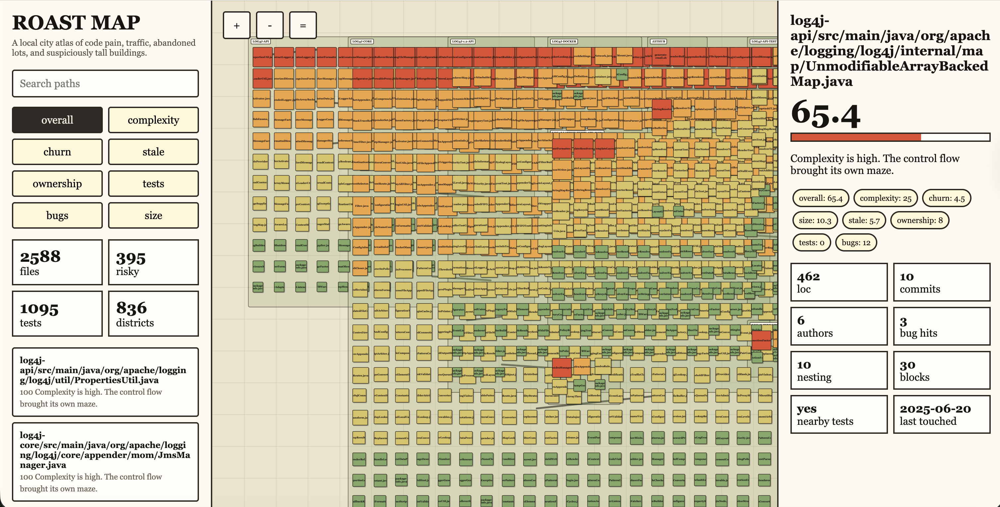

# codebase-roast-map

## roast-map-result

Generated Log4j result:

[Open the rendered roast map](file:///Users/diegopacheco/git/misc/logging-log4j2/.roast-map/index.html)



Generated files:

- [HTML map](file:///Users/diegopacheco/git/misc/logging-log4j2/.roast-map/index.html)
- [Markdown summary](file:///Users/diegopacheco/git/misc/logging-log4j2/.roast-map/summary.md)
- [Raw data](file:///Users/diegopacheco/git/misc/logging-log4j2/.roast-map/data.json)

The Log4j scan rendered `2588` files and found `395` risky files. The hottest blocks include files with high complexity, heavy churn, many authors, bug-heavy history, stale areas, and weak nearby test signals.

The HTML map is the main result. Open it in a browser to pan, zoom, search files, toggle risk layers, and click a block to see the evidence behind the roast score.

Builds a visual pain map of a repository.

It scans local source and git history to find complex files, churn hotspots, stale areas, risky ownership, weak tests, large files, and paths with bug-heavy history.

Read the design doc: [DESIGN.md](DESIGN.md)

## What It Does

`codebase-roast-map` produces two outputs:

- A terminal roast report with ranked code pain
- A local static map UI at `.roast-map/index.html`

The map treats a repo like a city:

- Folders are districts
- Files are blocks
- Hotter colors mean higher risk
- Bigger blocks mean more pain
- Search and layers help isolate specific risks
- Clicking a file shows why it scored high

## Signals

The scanner uses local data only:

- Git churn
- Bug-related commit subjects
- Contributor count
- Last touched date
- Line count
- Nesting depth
- Function-like block count
- Suspicious markers
- Missing nearby tests

No network access is required.

## Install

Run:

```bash
./install.sh
```

Choose:

- `1` for Codex
- `2` for Claude Code
- `3` for both

## Codex Usage

Codex CLI does not support custom slash commands.

Use the skill picker:

```text
/skills
```

Then choose:

```text
codebase-roast-map
```

Or mention the skill directly:

```text
$codebase-roast-map roast this repo
```

For the visual map:

```text
$codebase-roast-map open the roast map
```

## Claude Code Usage

Claude Code installs slash commands:

```text
/roast
/roast-map
```

`/roast` prints the terminal report.

`/roast-map` generates and opens the local UI.

## Direct Script Usage

You can also run the scanner directly:

```bash
node skill/scripts/roast-map.mjs report .
```

```bash
node skill/scripts/roast-map.mjs map .
```

## Output

Map mode writes:

- `.roast-map/index.html`
- `.roast-map/data.json`
- `.roast-map/summary.md`

These files are disposable and can be regenerated any time.

## Uninstall

Run:

```bash
./uninstall.sh
```

Choose the same target you installed.
