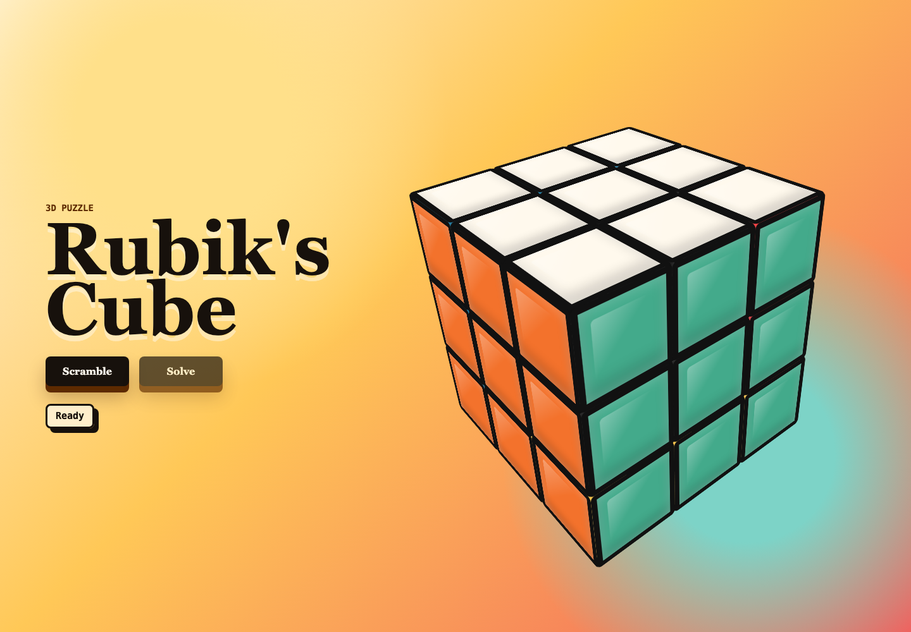

# Rubik's Cube

A colorful browser Rubik's Cube with 3D-looking cubies, visible layer rotations, and Scramble and Solve controls.

## Printscreen



## Render Flow

`index.html` displays the page shell, the controls, the status text, and the empty `#cube` element.

`app.js` creates the cube data, calls `render()`, and fills `#cube` with 27 cubies. Each cubie gets six face elements, and each visible face receives its current sticker color.

`styles.css` presents those elements as a 3D cube with CSS transforms, perspective, sticker borders, and responsive sizing.

When Scramble or Solve runs, `app.js` rotates one layer, updates the cube state, and calls `render()` again so the displayed cubies match the latest state.

## Run

```bash
./start.sh
```

Open `http://127.0.0.1:8097`.

Use a different port with `PORT=8081 ./start.sh`.

## Stop

```bash
./stop.sh
```

## Files

`index.html` contains the page structure.

`styles.css` contains the 3D cube presentation and responsive layout.

`app.js` contains the cube state, scramble sequence, solve sequence, and turn animation.
