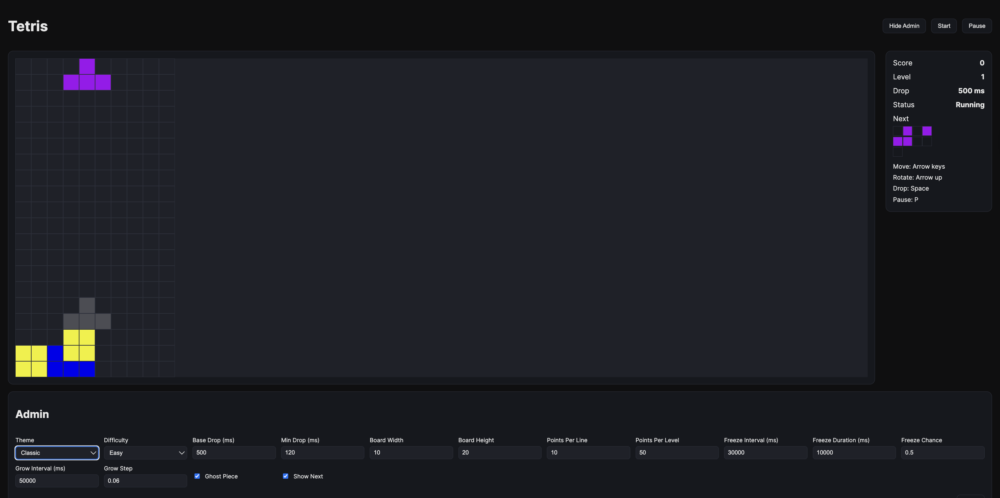

# Codex App - Tetris Game



# Codex App (Mac) Experience

1. Was easy to install (dmg file).
2. UI experience of the terminal interface.
3. Killer feature is that you can have multiple sessions open in tabs.
4. The app is responsive and fast.
5. It run smooth and vary fast.
6. However the code was very monolithic and hard to read. The could structure could be much better.
7. There is a bug with "space" which freezes the piece rather than send it all the way down.

## Prompt

```
build a tetris game, it should have a web interface written in reac 19, and you must have a run.sh to run the app. the game must have an admin interface where the user can configure themes, timeouts, dificulty and more... 
the app must be a classic tetril but each good move give you 10 points with 50 points you goto next level every 30s there is 50% change the ui free for 10s, every 50s the ui gets bigger. make sure you write this in a design doc in a mrdownformat and save this prompt on the readme.md. 
```

### Run

```bash
./run.sh
```

### Result

```
``` 
