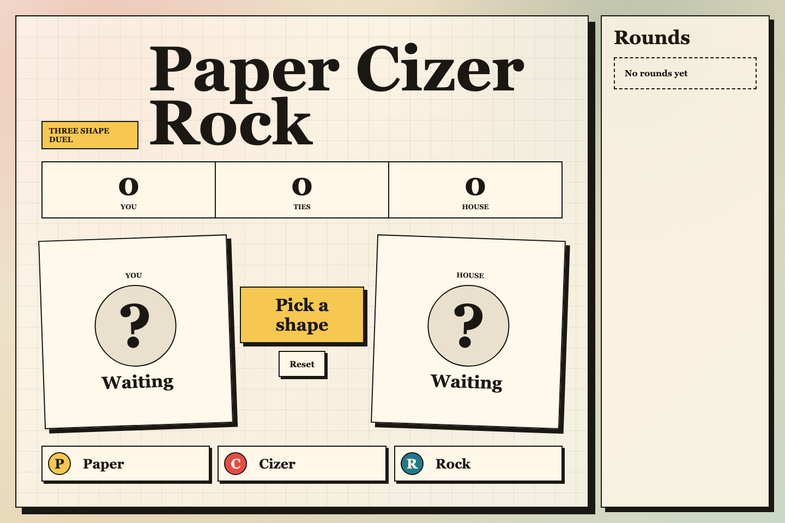
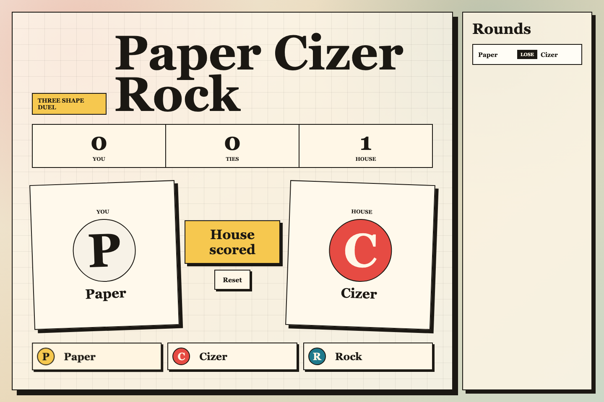

# Paper Cizer Rock

A React web game for quick Paper, Cizer, Rock rounds against the house.

## Prompt

build a web paper cizer rock game, with react, have a run.sh and also take print screens of the game and refer on the readme.

## Run

```bash
./run.sh
```

Open the local URL printed by Vite.

## Screens





## Experience Notes

* It was able to one-shot it
* The UI is interesting, different, not expected by a game IMHO.
* The solution used react (different them opus 4.7)
* It used vite and bun (good choises)
* However was a monolithic app with all in one file.
* No typescript