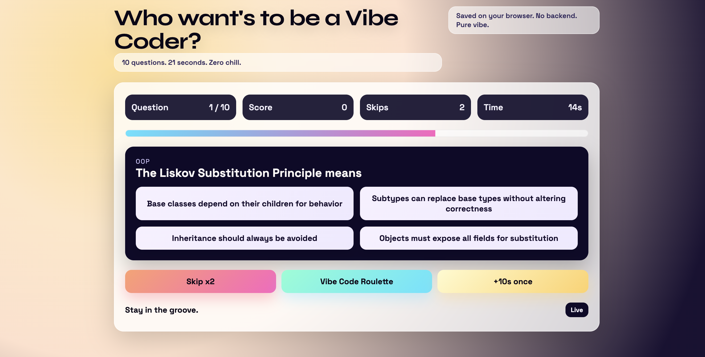

# Prompt

```
build a game called "Who want's to be a Vibe Coder?" as a satire of "who wants to be a milionare". Dont use
comments never ever, build this with react, dont use backend or redux, save it all on the browser local store. Make sure every question has 4 options, 3 wrong 1 right, every time the question is right - render a congratulations annimations with confetti, ask 10 questions give 21s for each question for the user to anwser, to help the user there is 3 options(buttones). The user can: A: skip (the user can skip 2 times and get new questions - but he needs anwseer 10 questions no matter what). B: Vibe code them a ramdon rolete
happens and user might win or losse (3) win 10 more seconds just 1 time. The questions must be about Distributed Systems, Design Patterns, OOP, FP, Data Srtructures, Algorithims, Cloud Computing on AWS, DevOps, Data Engineering, Frontend Engineering and about weired langs like Haskell, Rust, Zig, Nim, Clojure, Emojicode and TypeScript.
```

## Model / Tool

```
Tool: codex-cli
Model: gpt-5.1
```

## Run 

```
./run.sh
```

## Result

