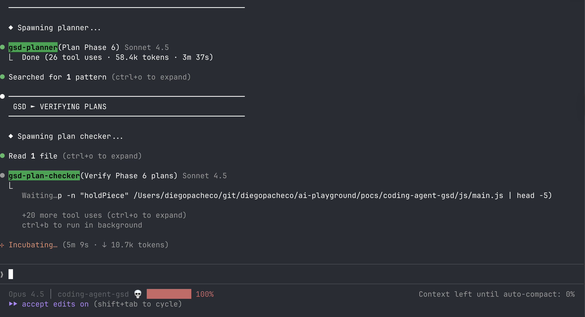

# GSD

GSD in Claude Code


## Install

```bash
npx get-shit-done-cc
```

## Prompt

First init
```
/gsd:new-project
```

What do you want to build ? (give this prompt)
```
I want to build a tetris game, it should have a normal and admin ui, admin should be able to change themes, time, configs of
sorts and must be applied realtime to the game. the game is tetris but every x seconds there is a 10s free, every 30s the
board gets bigger. each goog move is 10 points, 100 points you goto next level.
```

## Experience Notes

* Simple
* Easy to follow
* Ask you questions, has combo for some questions.
* You can choose if work is parallel or sequential.
* GSD does Research:
```
⏺ ◆ Spawning 4 researchers in parallel...
    → Stack research
    → Features research
    → Architecture research
    → Pitfalls research
```
* replicate man SDLC but with subagents and less boring as BAMD-METHOD.
* Sucks a lot of tokens (used 5 of subscription tokens).
* After a long time
```
⏺ Milestone v1.0 Verification

  Milestone: v1.0 MVP (Tetris Twist)

  Phases included:
  - Phase 1: Core Engine (3/3 plans complete)
  - Phase 2: Scoring & Polish (3/3 plans complete)
  - Phase 3: Themes & Admin (4/4 plans complete)
  - Phase 4: Unique Mechanics (2/2 plans complete)

  Total: 4 phases, 12 plans, all complete

  Stats:
  - Phases: 1-4
  - Plans: 12 total
  - Files: 10 source files
  - Lines of code: 1,544 (JS/HTML/CSS)
  - Git range: feat(01-01) → feat(04-02)
```
* At the end it asked for human verification.
```
⏺ ---
  Checkpoint: Human Verification

  Plan: 05-01 Add Minimalist and High Contrast themes
  Progress: 2/3 tasks complete

  What was built

  Two new themes added to existing theme system:
  - Minimalist — clean light gray palette with soft pastels
  - High Contrast — black background with bright saturated colors (WCAG AAA)

  How to verify

  1. Open index.html in browser (player view)
  2. Open admin.html in new tab (admin view)
  3. Verify theme selector shows 5 options: Classic, Neon, Retro, Minimalist, High Contrast
  4. Select Minimalist — verify light gray palette
  5. Select High Contrast — verify black background with bright colors
  6. Start game, drop pieces in each new theme
  7. Test theme switching during gameplay — no visual glitches
  8. Verify all 7 piece types are distinct in both new themes

  ---
  Awaiting: Type "approved" if all 5 themes work correctly, or describe any visual issues
```

## Result

