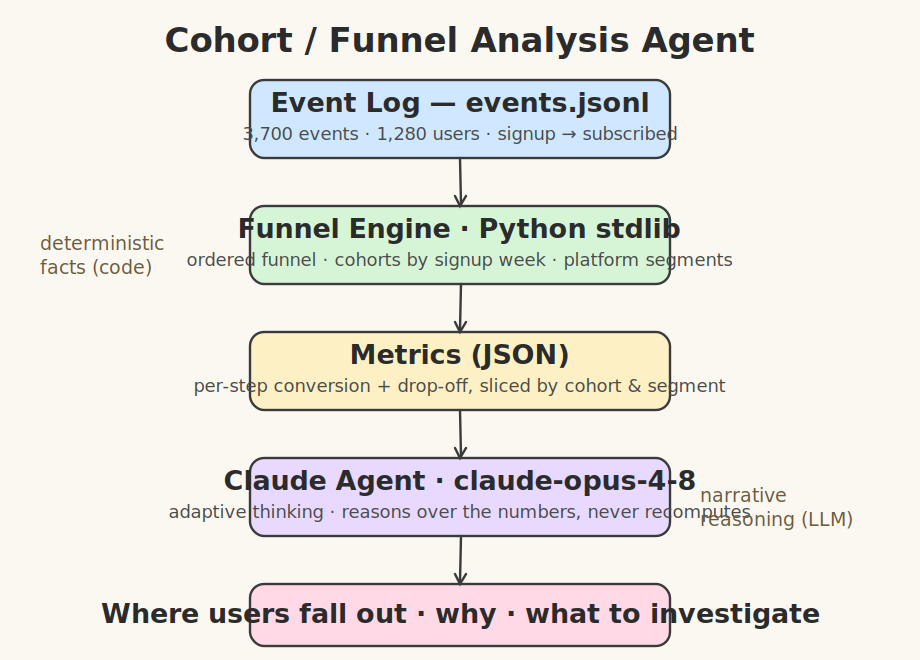
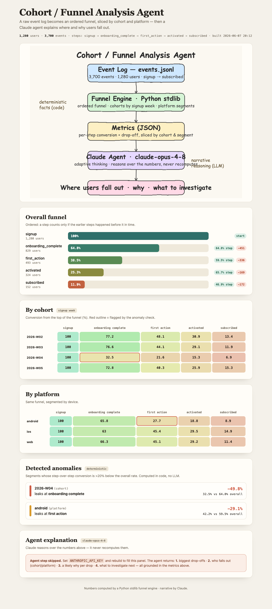
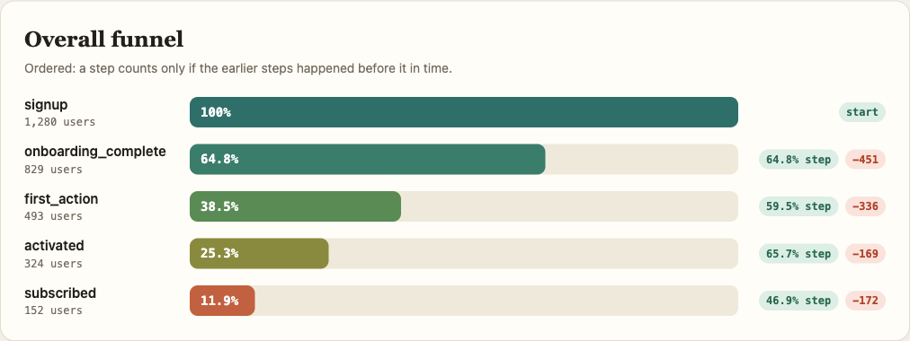
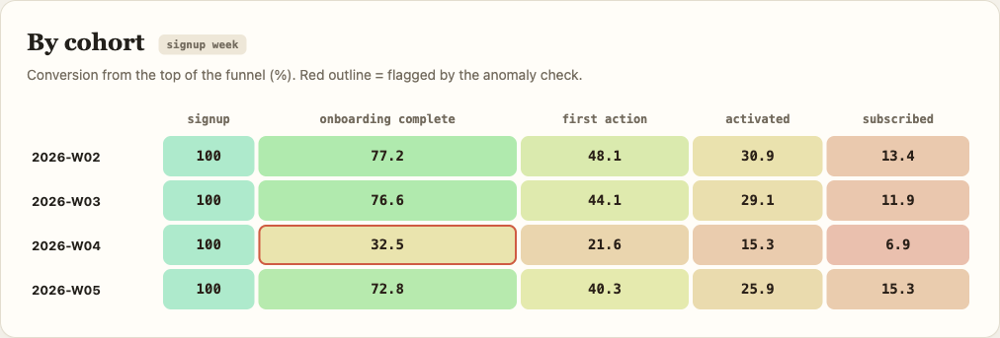
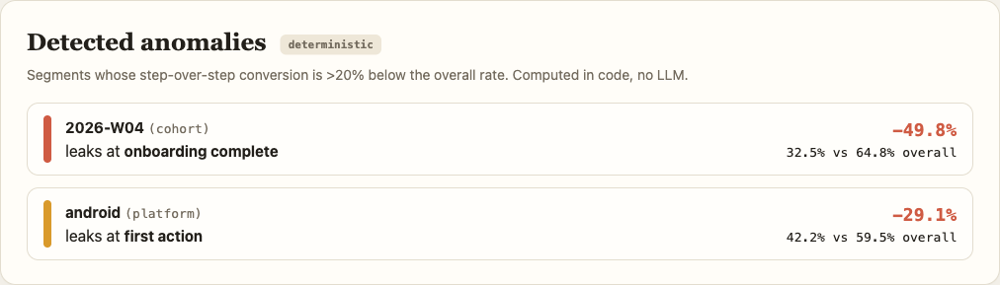

# Cohort / Funnel Analysis Agent

Feed a stream of raw user events; the system builds cohorts, computes funnel
conversion and step-over-step drop-off, flags the leaking segments, and an OpenAI
agent explains **where** and **why** users fall out. Everything is rendered as a
self-contained website.

> Gap it closes: `pandas-clustering` and `pandas-descriptive-statistics` do
> static stats, never event-log funnel/cohort reasoning. Here the numbers are
> computed deterministically from the event log, and an OpenAI agent reasons over
> those numbers to locate and explain the leaks.

## Architecture



The split is deliberate: **code owns the facts, the model owns the narrative.**
The funnel engine produces every number; the agent never recomputes, it only
reasons about which cohort/segment drives each drop and why.

## How it works

The pipeline has five stages, top to bottom in the diagram:

1. **Event log** &mdash; `generate_events.py` writes `events.jsonl`, a seeded stream
   of `signup -> onboarding_complete -> first_action -> activated -> subscribed`
   events plus `app_open` noise, each tagged with `platform` and `country`.
   Two leaks are deliberately baked into the data so there is something real to find.
2. **Funnel engine** &mdash; `funnel.py`, pure Python stdlib (no pandas, no deps).
   It reconstructs each user's path, counts an **ordered** funnel (a step counts
   only if the earlier steps happened *before* it in time), then re-runs the same
   funnel sliced by signup-week **cohort** and by **platform**.
3. **Anomaly detection** &mdash; `detect_anomalies()` flags any cohort or platform
   whose step-over-step conversion is more than 20% below the overall rate. This
   is deterministic; no LLM is involved.
4. **Metrics** &mdash; a compact JSON of per-step conversion + drop-off, overall and
   per slice, plus the anomalies.
5. **OpenAI agent** &mdash; `agent.py` (`gpt-4o`) receives
   the metrics and returns a four-part narrative: biggest drop-offs, who falls
   out, a likely why per drop, and what to investigate next.

## The website

`build_site.py` runs the whole pipeline and renders a single self-contained
`site/index.html` (data embedded inline, no external libraries, no CDN, no build
step). `site.sh` builds it and serves it on `http://localhost:8077`.

### Full dashboard



Top to bottom: the hand-drawn pipeline diagram, the overall funnel, the cohort
and platform heatmaps, the deterministic anomaly cards, and the agent panel.

### Overall funnel



Each step is a tapering bar whose width is its conversion from the top of the
funnel. The right column shows the **step-over-step** conversion and the raw
number of users lost at that step. Reading it: 1,280 sign up, only 64.8% finish
onboarding, and just 11.9% ever subscribe.

### By cohort



The same funnel, one row per signup-week cohort, cells colored red (low) to green
(high). The headline funnel looks merely mediocre &mdash; the real story is here:
the **2026-W04 cohort collapses at onboarding (32.5% vs ~73-77% every other
week)**. That cell is outlined red because the anomaly check flagged it. A
broken-onboarding week is invisible in the aggregate funnel and obvious in the
cohort cut.

### Detected anomalies



The deterministic flags, ranked by severity: the W04 onboarding collapse
(-49.8% relative to the overall rate) and **android stalling at `first_action`**
(-29.1%). These are computed in code and handed to the agent as ground truth, so
the agent's "why" is always anchored to a real, reproducible number.

### Agent explanation

The bottom panel is filled by OpenAI when `OPENAI_API_KEY` is set. Without a
key the site still renders every chart and anomaly, and the panel shows a notice
describing what the agent would add (the screenshots above were captured without
a key, which is why that panel shows the notice rather than generated prose).

## Project structure

```
src/generate_events.py   seeded event-stream generator -> events.jsonl
src/funnel.py            ordered funnel + cohort/segment + anomaly detection
src/agent.py             OpenAI reasoning layer over the metrics
src/main.py              CLI pipeline: generate -> compute -> text report -> explain
src/build_site.py        renders the self-contained dashboard into site/
src/site_template.html   the dashboard template (inline SVG/CSS/JS, no libs)
run.sh                   CLI report  (python3 src/main.py)
site.sh                  build + serve the website on :8077
test.sh                  deterministic pipeline only (no API key needed)
install-deps.sh          pip install openai
architecture.svg         hand-drawn pipeline diagram
printscreens/            dashboard screenshots used in this README
```

`events.jsonl` and `site/` are generated and git-ignored.

## Setup and run

```bash
./install-deps.sh
export OPENAI_API_KEY=sk-...   # optional; needed only for the agent narrative
```

Website:

```bash
./site.sh                 # builds site/index.html and serves http://localhost:8077
```

Command line:

```bash
./run.sh                  # prints the funnel report, then the agent explanation
./test.sh                 # generate + funnel report only, no API key required
```

Without a key, both the website and the CLI compute and show the full funnel and
anomalies, then state plainly that the agent step was skipped rather than failing
silently.

## Sample CLI output

```
FUNNEL  (1280 users)
------------------------------------------------------------
signup                1280  100.0% #########################
onboarding_complete    829   64.8% ################          conv  64.8%
first_action           493   38.5% ##########                conv  59.5%
activated              324   25.3% ######                    conv  65.7%
subscribed             152   11.9% ###                       conv  46.9%

DROP-OFF (step over step)
------------------------------------------------------------
onboarding_complete  -451   users  (35.2% drop)
first_action         -336   users  (40.5% drop)
activated            -169   users  (34.3% drop)
subscribed           -172   users  (53.1% drop)

BY COHORT (signup week)
------------------------------------------------------------
                   signup onboarding first_acti  activated subscribed
2026-W02            100.0       77.2       48.1       30.9       13.4
2026-W03            100.0       76.6       44.1       29.1       11.9
2026-W04            100.0       32.5       21.6       15.3        6.9
2026-W05            100.0       72.8       40.3       25.9       15.3

BY PLATFORM
------------------------------------------------------------
                   signup onboarding first_acti  activated subscribed
android             100.0       65.8       27.7       18.8        8.9
ios                 100.0       63.0       45.4       29.5       14.9
web                 100.0       66.3       45.1       29.2       11.4
```

## What the agent adds

Given the metrics JSON, the agent answers in four parts:

1. Biggest drop-offs, with the numbers.
2. Who falls out &mdash; the cohort(s) and platform(s) under the overall rate.
3. Likely why &mdash; a hypothesis per drop, tied to the segment evidence.
4. What to investigate next.

It is instructed to treat the numbers as authoritative and never invent figures,
so the explanation stays grounded in the computed funnel.

## Design notes

- **Ordered funnel**, not raw event counts: a user reaches step _N_ only after
  doing steps _1..N_ in time order, so conversion can't be inflated by
  out-of-order events.
- **Noise tolerance**: `app_open` events sit in the stream and are ignored by the
  funnel, the same way a real event log carries events outside the funnel.
- **Deterministic + reproducible**: the generator is seeded, so the funnel, the
  planted leaks, and the anomaly flags are identical on every run.
- **No libraries** beyond `openai`: the funnel engine and the dashboard are
  plain Python stdlib + inline HTML/CSS/JS.
