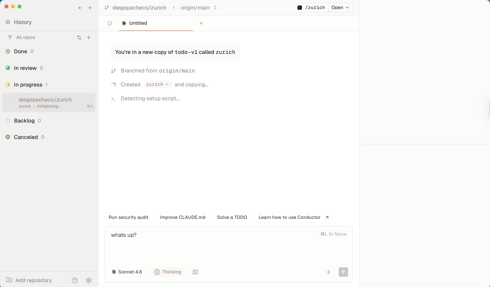

# Conductor

https://www.conductor.build/

## Experience Notes

* When I try to open the workspace got an error:
```
Preparing worktree (new branch 'diegopacheco/zurich')
fatal: '/Users/diegopacheco/conductor/workspaces/todo-v1/zurich' already exists
```
* It's kind of anoying because required to be a git initialized repo, but I gave that to him and was still bothering me.
* It said on the ui: `creating zurich and copying...` but did not move stay there a long time.


## Result

Conductor UI <br/>
