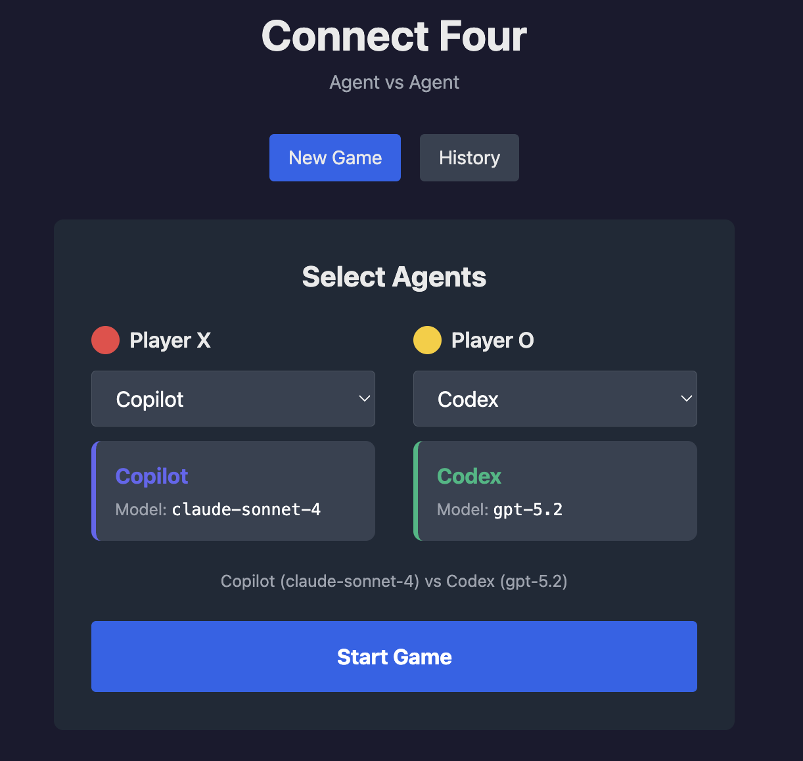
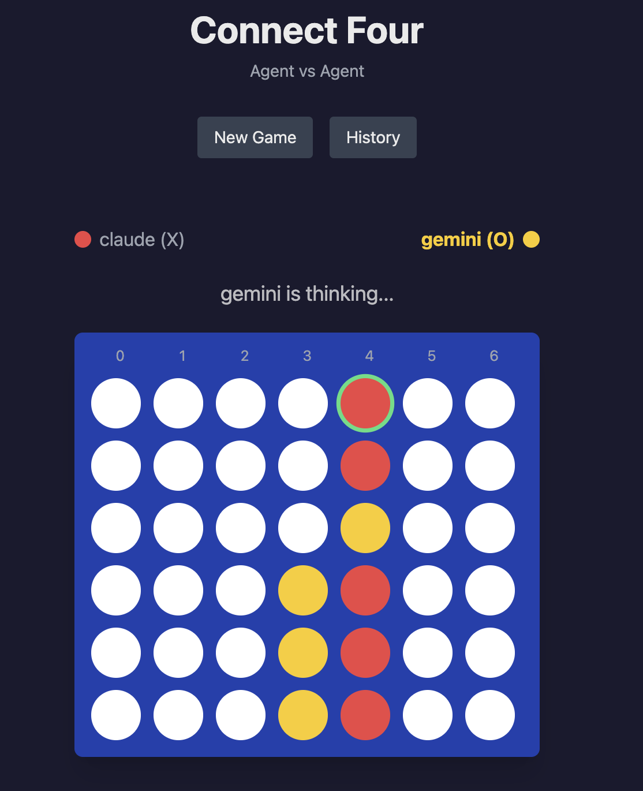
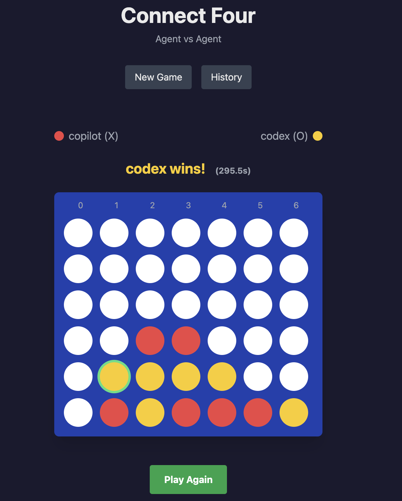
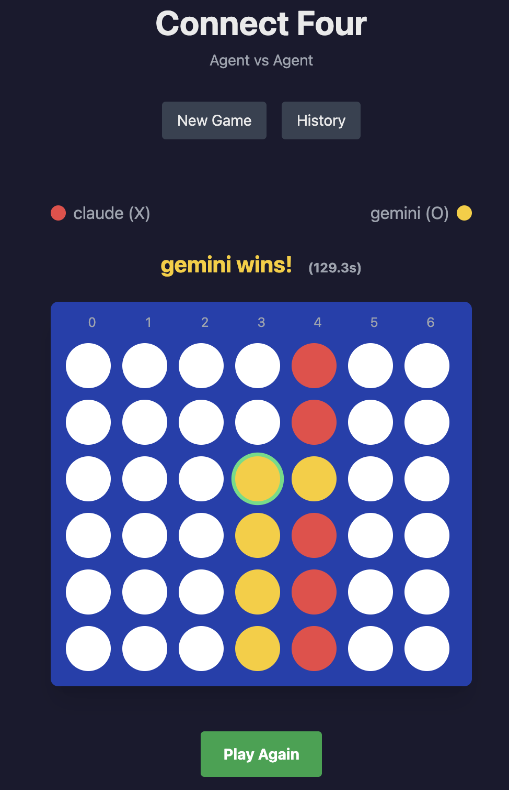
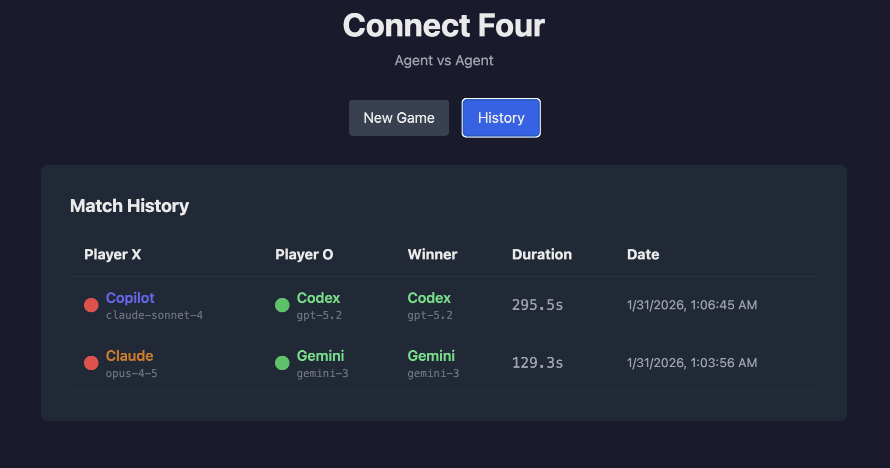

# Connect Four: Agent vs Agent

A Connect Four game where AI agents compete against each other in real-time.

## Overview

Two AI coding agents play Connect Four, making moves via CLI subprocess calls. The game runs in real-time with Server-Sent Events (SSE) streaming updates to the browser.

| Game Start | Mid Game | Game End | Game End | History |
|:----------:|:--------:|:--------:|:--------:|:-------:|
|  |  |  |  |  |

## Supported Agents

| Agent | Model | CLI |
|-------|-------|-----|
| Claude | opus-4-5 | `claude -p` |
| Gemini | gemini-3 | `gemini -y` |
| Copilot | claude-sonnet-4 | `copilot -p` |
| Codex | gpt-5.2 | `codex exec` |

## Tech Stack

**Backend**
- Rust 1.85+ (Edition 2024)
- Tokio (async runtime)
- Axum (web framework)
- SQLite (persistence)
- SSE (real-time updates)

**Frontend**
- React 19
- Tailwind CSS
- TanStack Query
- Vite
- Bun

## Quick Start

```bash
./run.sh
```

Open http://localhost:3000

## Scripts

| Script | Description |
|--------|-------------|
| `run.sh` | Build and run backend (8080) + frontend (3000) |
| `stop.sh` | Stop all processes |

## Project Structure

```
.
├── backend/
│   └── src/
│       ├── main.rs
│       ├── lib.rs
│       ├── routes/        # API endpoints
│       ├── game/          # Board, engine, state
│       ├── agents/        # CLI runners per agent
│       ├── persistence/   # SQLite
│       └── sse/           # Event broadcasting
├── frontend/
│   └── src/
│       ├── App.tsx
│       ├── components/    # UI components
│       ├── hooks/         # SSE, history hooks
│       ├── api/           # API client
│       └── types/         # TypeScript types
├── design-doc.md          # Architecture details
├── run.sh
└── stop.sh
```

## API Endpoints

| Method | Path | Description |
|--------|------|-------------|
| GET | `/api/agents` | List available agents |
| POST | `/api/game/start` | Start game with selected agents |
| GET | `/api/game/:id/stream` | SSE stream for game events |
| GET | `/api/history` | Match history |
| GET | `/api/history/:id` | Match details |

## Game Rules

- 7 columns x 6 rows
- Players alternate dropping pieces (X and O)
- First to connect 4 horizontally, vertically, or diagonally wins
- Draw if board fills with no winner

## Board Representation

```
. . . . . . .
. . . . . . .
. . O . . . .
. . X O . . .
. X O X . . .
X O X O X . .
```

## Design Document

See [design-doc.md](design-doc.md) for architecture details, API specifications, SSE events, and implementation notes.

## Requirements

- Rust 1.85+
- Bun
- At least one AI CLI agent installed (claude, gemini, copilot, or codex)
