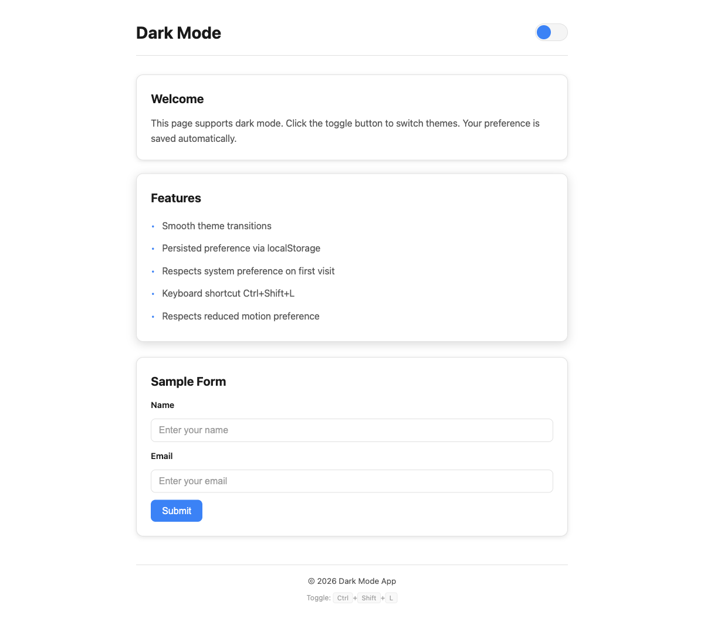
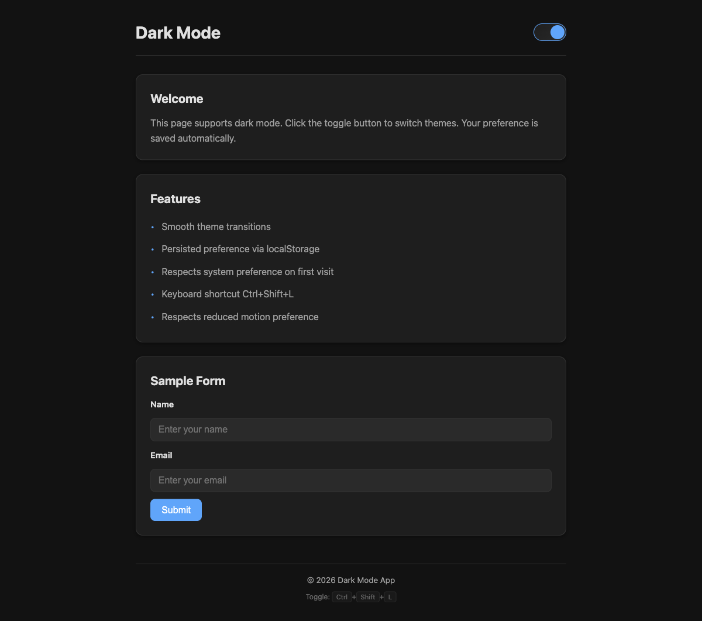

# Dark Mode

Web page with dark/light theme toggle.

## Features

* CSS custom properties for theming
* Animated slider toggle
* Persisted preference via localStorage
* Respects system preference on first visit
* Keyboard shortcut: Ctrl+Shift+L
* Respects prefers-reduced-motion
* Responsive layout

## Screenshots

Light mode
<br>


Dark mode
<br>


## How to Run

```bash
./run.sh
```
