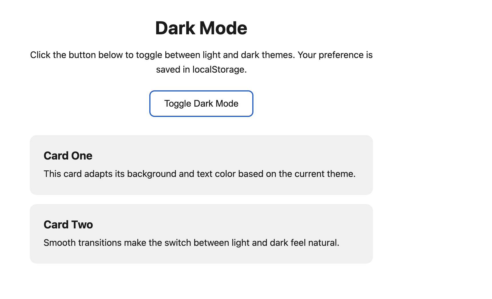
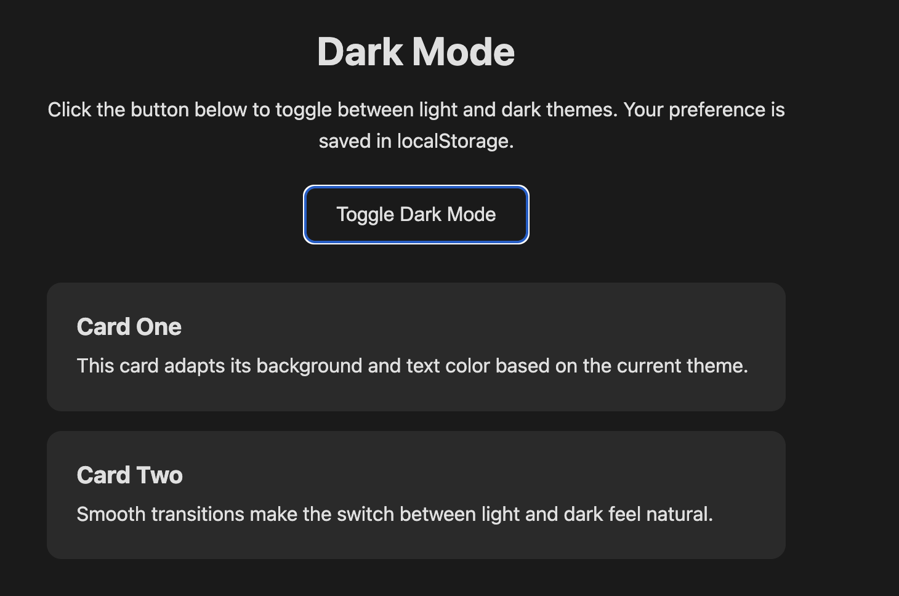

# Cook

https://rjcorwin.github.io/cook/

## install

```
npm install -g @let-it-cook/cli
mkdir -p .claude/skills && \
    cp -r $(npm root -g)/@let-it-cook/cli/skill .claude/skills/cook
```

## Experience Notes

* Was easy top install
* to generate a dark pattern: "cook "Implement dark mode" review" used 3% of my claude subscription.
* Was fast
* But gives not much observability of whats going on
* Did not asked me any questions.
* The result was not impressed and maninly because did not ask any questions IMHO.

## Results

Light mode - default theme with white background and light gray cards.
<br>


Dark mode - toggled theme with dark background and dark gray cards, preference saved in localStorage.
<br>

