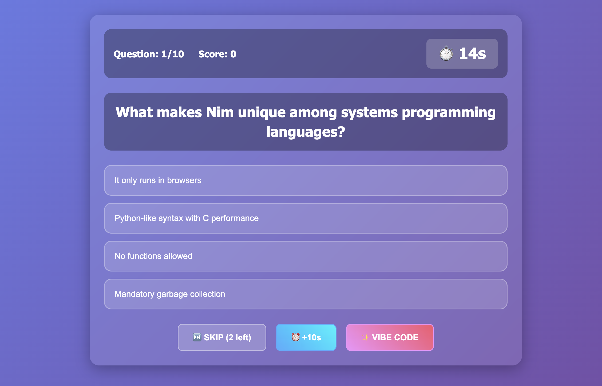

# Prompt

```
build a game called "Who want's to be a Vibe Coder?" as a satire of "who wants to be a milionare". Dont use
comments never ever, build this with react, dont use backend or redux, save it all on the browser local store. Make sure every question has 4 options, 3 wrong 1 right, every time the question is right - render a congratulations annimations with confetti, ask 10 questions give 21s for each question for the user to anwser, to help the user there is 3 options(buttones). The user can: A: skip (the user can skip 2 times and get new questions - but he needs anwseer 10 questions no matter what). B: Vibe code them a ramdon rolete
happens and user might win or losse (3) win 10 more seconds just 1 time. The questions must be about Distributed Systems, Design Patterns, OOP, FP, Data Srtructures, Algorithims, Cloud Computing on AWS, DevOps, Data Engineering, Frontend Engineering and about weired langs like Haskell, Rust, Zig, Nim, Clojure, Emojicode and TypeScript.
```

## Model / Tool

```
Tool: copilot-cli
Model: sonnet-4.5
```

## Run 

```
./run.sh
```

## Result




# 💻 Who Wants to be a Vibe Coder?

A satirical programming trivia game inspired by "Who Wants to be a Millionaire" - built with React!

## 🎮 Game Features

- **10 Questions**: Answer all 10 questions about programming topics
- **21 Second Timer**: Each question has a 21-second countdown
- **Confetti Celebrations**: Correct answers trigger awesome confetti animations
- **Local Storage**: Your progress is automatically saved in the browser
- **Three Lifelines**:
  - **Skip (2x)**: Skip a question and get a new one (but you still need 10 answers!)
  - **Vibe Code (1x)**: 1/3 chance to win +10 seconds, 2/3 chance to get nothing

## 📚 Question Topics

Questions cover:
- Distributed Systems (CAP theorem, eventual consistency)
- Design Patterns (Singleton, Builder, etc.)
- Object-Oriented Programming
- Functional Programming (monads, pure functions, higher-order functions)
- Data Structures (stacks, queues, hash tables, graphs)
- Algorithms (binary search, quicksort, time complexity)
- Cloud Computing (AWS S3, Lambda, CloudFormation)
- DevOps (CI/CD, Docker, Kubernetes, Infrastructure as Code)
- Data Engineering (ETL, data lakes, data warehouses, Apache Spark)
- Frontend Engineering (React, Virtual DOM, Shadow DOM, tree shaking)
- Weird Languages (Haskell, Rust, Zig, Nim, Clojure, Emojicode, TypeScript)

## 🚀 Getting Started

### Prerequisites
- Node.js (v14 or higher)
- npm

### Installation & Running

```bash
cd vibe-coder-game
npm install
npm start
```

The game will open at `http://localhost:3000`

### Building for Production

```bash
npm run build
```

## 🎯 How to Play

1. Click **"START VIBING 🚀"** to begin
2. Read each question carefully
3. Click one of the four answer options
4. Watch the timer! You have 21 seconds per question
5. Use your lifelines strategically:
   - **Skip**: Get a new question (2 uses max)
   - **Vibe Code**: 33% chance for +10 seconds (1 use only)
6. Get all 10 questions right to achieve perfection!

## 🎨 Tech Stack

- **React 19** - UI framework
- **canvas-confetti** - Celebration animations
- **Local Storage API** - Game state persistence
- **CSS3** - Animations and styling (gradients, transforms, keyframes)

## 🏆 Scoring

- Perfect (10/10): "🔥 PERFECT! You're a true Vibe Coder!"
- Great (7-9): "💪 Great job! You've got the vibes!"
- Good (5-6): "👍 Not bad! Keep vibing!"
- Needs Work (<5): "📚 Time to hit the docs! Keep learning!"

## 🎭 Game States

- **Start Screen**: Introduction and rules
- **Playing**: Active gameplay with timer and questions
- **Finished**: Final score and play again option

## 💾 Data Persistence

Game progress is automatically saved to browser localStorage including:
- Current score
- Questions answered
- Remaining skips and vibe code uses
- Current question pool
- Game state

## 🎪 Special Features

- **Responsive Design**: Works on desktop and mobile
- **Smooth Animations**: CSS keyframes for all interactions
- **Timer Warning**: Timer turns red and pulses at 5 seconds
- **Answer Feedback**: Instant visual feedback on correct/incorrect answers
- **Confetti Burst**: Dual-sided confetti cannon on correct answers

## 📝 No Backend Required

Everything runs in the browser - no server, no database, no Redux. Pure React with hooks and local storage!

---

Built with vibes and zero comments in the code 😎
