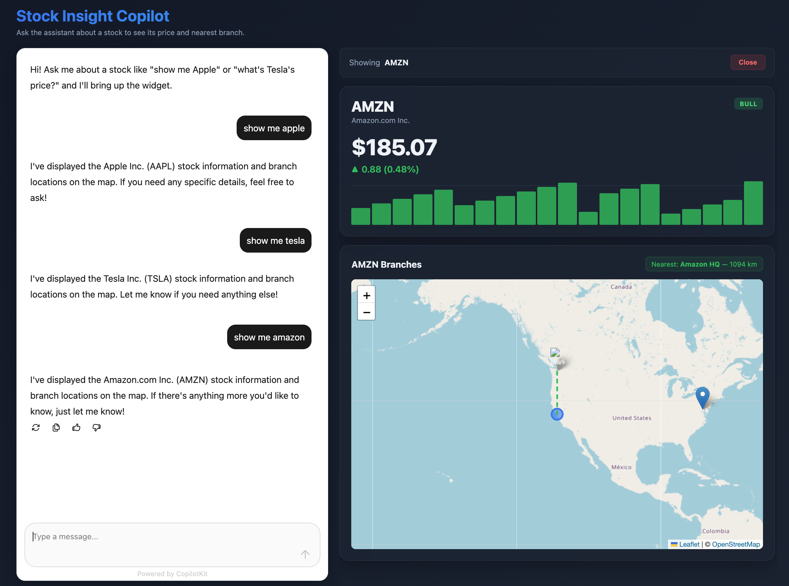

# CopilotKit Fun

Upstream project: https://github.com/copilotkit/copilotkit

A small POC that wires a React frontend to a Node/Express backend using [CopilotKit](https://github.com/copilotkit/copilotkit) and OpenAI. The assistant helps users explore stock prices and locate the nearest company branches on a Leaflet map.



## Stack

- Frontend: React 18, Vite, `@copilotkit/react-core`, `@copilotkit/react-ui`, React Leaflet
- Backend: Node 20+, Express, `@copilotkit/runtime`, OpenAI (`gpt-4o-mini`)

## Layout

```
backend/    Express server, CopilotKit runtime, stock + branch data
frontend/   Vite + React app with the CopilotKit chat panel and map
run.sh      Installs deps and starts both servers
stop.sh     Kills processes on ports 3000 and 4000
```

## Endpoints

- `GET /api/stocks` — list of available stocks
- `GET /api/stocks/:symbol` — single stock quote
- `GET /api/branches/:symbol` — branch locations for a stock
- `POST /api/copilotkit` — CopilotKit runtime endpoint

## Run

```bash
export OPENAI_API_KEY=sk-...
./run.sh
```

Then open http://localhost:3000.

## Stop

```bash
./stop.sh
```
