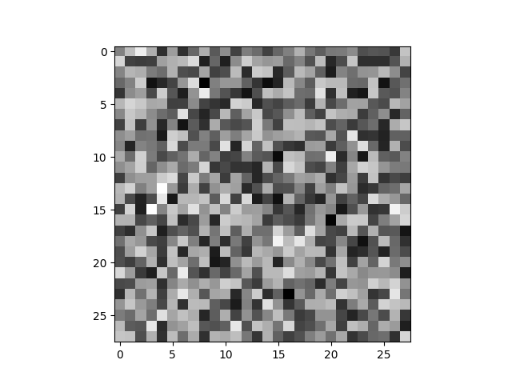

### Result
* GAN
* using CPU
* mostely shapes



Result:
```
32/32 [==============================] - 0s 2ms/step
Epoch 1, Discriminator Loss: 0.8701873421669006, Generator Loss: 0.7536244988441467
Epoch 2, Discriminator Loss: 0.7866532802581787, Generator Loss: 0.5110658407211304
Epoch 3, Discriminator Loss: 0.795529842376709, Generator Loss: 0.4358506500720978
Epoch 4, Discriminator Loss: 0.7879922986030579, Generator Loss: 0.4131787419319153
Epoch 5, Discriminator Loss: 0.7722048908472061, Generator Loss: 0.40563929080963135
Epoch 6, Discriminator Loss: 0.752498209476471, Generator Loss: 0.40025991201400757
Epoch 7, Discriminator Loss: 0.737003356218338, Generator Loss: 0.393036425113678
Epoch 8, Discriminator Loss: 0.722800225019455, Generator Loss: 0.38314521312713623
Epoch 9, Discriminator Loss: 0.7120707035064697, Generator Loss: 0.37075871229171753
Epoch 10, Discriminator Loss: 0.7055555731058121, Generator Loss: 0.35681822896003723
Epoch 11, Discriminator Loss: 0.699524000287056, Generator Loss: 0.3430621922016144
Epoch 12, Discriminator Loss: 0.6932380199432373, Generator Loss: 0.32983770966529846
Epoch 13, Discriminator Loss: 0.6869253814220428, Generator Loss: 0.3168046176433563
Epoch 14, Discriminator Loss: 0.6810318827629089, Generator Loss: 0.3037201464176178
Epoch 15, Discriminator Loss: 0.6755858063697815, Generator Loss: 0.290468692779541
Epoch 16, Discriminator Loss: 0.6706700474023819, Generator Loss: 0.27706342935562134
Epoch 17, Discriminator Loss: 0.6658516675233841, Generator Loss: 0.2636989653110504
Epoch 18, Discriminator Loss: 0.6610062420368195, Generator Loss: 0.25061196088790894
Epoch 19, Discriminator Loss: 0.6562145203351974, Generator Loss: 0.23804433643817902
Epoch 20, Discriminator Loss: 0.6513365060091019, Generator Loss: 0.22620797157287598
Epoch 21, Discriminator Loss: 0.6464625149965286, Generator Loss: 0.21516962349414825
Epoch 22, Discriminator Loss: 0.6417105793952942, Generator Loss: 0.2048143744468689
Epoch 23, Discriminator Loss: 0.6372264474630356, Generator Loss: 0.1950099766254425
Epoch 24, Discriminator Loss: 0.6330899298191071, Generator Loss: 0.18569983541965485
Epoch 25, Discriminator Loss: 0.6292276978492737, Generator Loss: 0.1769319474697113
Epoch 26, Discriminator Loss: 0.625547856092453, Generator Loss: 0.16871203482151031
Epoch 27, Discriminator Loss: 0.6220566183328629, Generator Loss: 0.16096118092536926
Epoch 28, Discriminator Loss: 0.6187974661588669, Generator Loss: 0.15364444255828857
Epoch 29, Discriminator Loss: 0.6157042980194092, Generator Loss: 0.14673106372356415
Epoch 30, Discriminator Loss: 0.612754300236702, Generator Loss: 0.14022283256053925
Epoch 31, Discriminator Loss: 0.6098739057779312, Generator Loss: 0.13411037623882294
Epoch 32, Discriminator Loss: 0.607064425945282, Generator Loss: 0.1283307522535324
Epoch 33, Discriminator Loss: 0.6043828874826431, Generator Loss: 0.1228577271103859
Epoch 34, Discriminator Loss: 0.6018072962760925, Generator Loss: 0.11766908317804337
Epoch 35, Discriminator Loss: 0.5992808192968369, Generator Loss: 0.11275092512369156
Epoch 36, Discriminator Loss: 0.5968993902206421, Generator Loss: 0.10807672888040543
Epoch 37, Discriminator Loss: 0.5945944935083389, Generator Loss: 0.10364285856485367
Epoch 38, Discriminator Loss: 0.5924008041620255, Generator Loss: 0.09942089766263962
Epoch 39, Discriminator Loss: 0.5903303772211075, Generator Loss: 0.09536842256784439
Epoch 40, Discriminator Loss: 0.5883942395448685, Generator Loss: 0.09149742126464844
Epoch 41, Discriminator Loss: 0.5865087062120438, Generator Loss: 0.08782937377691269
Epoch 42, Discriminator Loss: 0.5846494734287262, Generator Loss: 0.08435798436403275
Epoch 43, Discriminator Loss: 0.582797572016716, Generator Loss: 0.08107951283454895
Epoch 44, Discriminator Loss: 0.5809614509344101, Generator Loss: 0.07797761261463165
Epoch 45, Discriminator Loss: 0.5791289359331131, Generator Loss: 0.07504850625991821
Epoch 46, Discriminator Loss: 0.5772500187158585, Generator Loss: 0.07227633893489838
Epoch 47, Discriminator Loss: 0.5753931999206543, Generator Loss: 0.06961562484502792
Epoch 48, Discriminator Loss: 0.5736423283815384, Generator Loss: 0.06705670058727264
Epoch 49, Discriminator Loss: 0.5718671977519989, Generator Loss: 0.06463838368654251
Epoch 50, Discriminator Loss: 0.5700476318597794, Generator Loss: 0.062340378761291504
Epoch 51, Discriminator Loss: 0.5682499706745148, Generator Loss: 0.060155272483825684
Epoch 52, Discriminator Loss: 0.5664182901382446, Generator Loss: 0.05808023363351822
Epoch 53, Discriminator Loss: 0.5646043568849564, Generator Loss: 0.05609722062945366
Epoch 54, Discriminator Loss: 0.5627747476100922, Generator Loss: 0.054207783192396164
Epoch 55, Discriminator Loss: 0.5609268993139267, Generator Loss: 0.05240216851234436
Epoch 56, Discriminator Loss: 0.5590836852788925, Generator Loss: 0.05067649856209755
Epoch 57, Discriminator Loss: 0.5572073012590408, Generator Loss: 0.049025602638721466
Epoch 58, Discriminator Loss: 0.5553220361471176, Generator Loss: 0.04744527488946915
Epoch 59, Discriminator Loss: 0.553416520357132, Generator Loss: 0.0459308996796608
Epoch 60, Discriminator Loss: 0.5514741986989975, Generator Loss: 0.04448602721095085
Epoch 61, Discriminator Loss: 0.5495106875896454, Generator Loss: 0.0431075356900692
Epoch 62, Discriminator Loss: 0.5474997311830521, Generator Loss: 0.041788630187511444
Epoch 63, Discriminator Loss: 0.5454563200473785, Generator Loss: 0.04051792994141579
Epoch 64, Discriminator Loss: 0.5434016436338425, Generator Loss: 0.03929828479886055
Epoch 65, Discriminator Loss: 0.5412968248128891, Generator Loss: 0.03813336417078972
Epoch 66, Discriminator Loss: 0.5391593426465988, Generator Loss: 0.03701627999544144
Epoch 67, Discriminator Loss: 0.5370110124349594, Generator Loss: 0.035938672721385956
Epoch 68, Discriminator Loss: 0.5348639786243439, Generator Loss: 0.03490764647722244
Epoch 69, Discriminator Loss: 0.5327238440513611, Generator Loss: 0.033911578357219696
Epoch 70, Discriminator Loss: 0.5306505113840103, Generator Loss: 0.032944969832897186
Epoch 71, Discriminator Loss: 0.5286365300416946, Generator Loss: 0.03200241178274155
Epoch 72, Discriminator Loss: 0.5267225354909897, Generator Loss: 0.03108975663781166
Epoch 73, Discriminator Loss: 0.5248749107122421, Generator Loss: 0.03021128475666046
Epoch 74, Discriminator Loss: 0.5230960696935654, Generator Loss: 0.029365545138716698
Epoch 75, Discriminator Loss: 0.5213614106178284, Generator Loss: 0.02855408750474453
Epoch 76, Discriminator Loss: 0.51970274746418, Generator Loss: 0.02777092158794403
Epoch 77, Discriminator Loss: 0.5180908143520355, Generator Loss: 0.0270135086029768
Epoch 78, Discriminator Loss: 0.5165055692195892, Generator Loss: 0.026281392201781273
Epoch 79, Discriminator Loss: 0.5149379223585129, Generator Loss: 0.02557768113911152
Epoch 80, Discriminator Loss: 0.5134060233831406, Generator Loss: 0.024899525567889214
Epoch 81, Discriminator Loss: 0.5118948668241501, Generator Loss: 0.024242226034402847
Epoch 82, Discriminator Loss: 0.5104108303785324, Generator Loss: 0.023605700582265854
Epoch 83, Discriminator Loss: 0.50892473757267, Generator Loss: 0.022991685196757317
Epoch 84, Discriminator Loss: 0.5074455738067627, Generator Loss: 0.022398285567760468
Epoch 85, Discriminator Loss: 0.5059802234172821, Generator Loss: 0.02182442881166935
Epoch 86, Discriminator Loss: 0.5045140534639359, Generator Loss: 0.021273620426654816
Epoch 87, Discriminator Loss: 0.503053605556488, Generator Loss: 0.020739097148180008
Epoch 88, Discriminator Loss: 0.5016276389360428, Generator Loss: 0.020221423357725143
Epoch 89, Discriminator Loss: 0.5002046674489975, Generator Loss: 0.019722282886505127
Epoch 90, Discriminator Loss: 0.49881140887737274, Generator Loss: 0.01923886500298977
Epoch 91, Discriminator Loss: 0.49745337665081024, Generator Loss: 0.01876826398074627
Epoch 92, Discriminator Loss: 0.4961203783750534, Generator Loss: 0.01831391267478466
Epoch 93, Discriminator Loss: 0.49477753043174744, Generator Loss: 0.01787508837878704
Epoch 94, Discriminator Loss: 0.49346180260181427, Generator Loss: 0.017447030171751976
Epoch 95, Discriminator Loss: 0.49215544760227203, Generator Loss: 0.017032567411661148
Epoch 96, Discriminator Loss: 0.4908275902271271, Generator Loss: 0.016634410247206688
Epoch 97, Discriminator Loss: 0.4895167648792267, Generator Loss: 0.016248011961579323
Epoch 98, Discriminator Loss: 0.4882112145423889, Generator Loss: 0.01587369292974472
Epoch 99, Discriminator Loss: 0.48689886927604675, Generator Loss: 0.015511104837059975
Epoch 100, Discriminator Loss: 0.48560190200805664, Generator Loss: 0.015156802721321583
Epoch 101, Discriminator Loss: 0.4842963367700577, Generator Loss: 0.014815044589340687
Epoch 102, Discriminator Loss: 0.4829678237438202, Generator Loss: 0.014485799707472324
Epoch 103, Discriminator Loss: 0.48164328932762146, Generator Loss: 0.014166340231895447
Epoch 104, Discriminator Loss: 0.4803241491317749, Generator Loss: 0.01385491993278265
Epoch 105, Discriminator Loss: 0.4789990335702896, Generator Loss: 0.013552864082157612
Epoch 106, Discriminator Loss: 0.47765523195266724, Generator Loss: 0.01325985323637724
Epoch 107, Discriminator Loss: 0.4763093590736389, Generator Loss: 0.012977060861885548
Epoch 108, Discriminator Loss: 0.4749591499567032, Generator Loss: 0.012701381929218769
Epoch 109, Discriminator Loss: 0.47361060976982117, Generator Loss: 0.012432633899152279
Epoch 110, Discriminator Loss: 0.47225695848464966, Generator Loss: 0.012171453796327114
Epoch 111, Discriminator Loss: 0.47089093923568726, Generator Loss: 0.01191833708435297
Epoch 112, Discriminator Loss: 0.46950356662273407, Generator Loss: 0.011673334054648876
Epoch 113, Discriminator Loss: 0.4681164175271988, Generator Loss: 0.01143511850386858
Epoch 114, Discriminator Loss: 0.4667222648859024, Generator Loss: 0.011202949099242687
Epoch 115, Discriminator Loss: 0.46530476212501526, Generator Loss: 0.010978291742503643
Epoch 116, Discriminator Loss: 0.4638940840959549, Generator Loss: 0.010759511031210423
Epoch 117, Discriminator Loss: 0.46246451139450073, Generator Loss: 0.010546981357038021
Epoch 118, Discriminator Loss: 0.461000457406044, Generator Loss: 0.010341420769691467
Epoch 119, Discriminator Loss: 0.45953328907489777, Generator Loss: 0.010140844620764256
Epoch 120, Discriminator Loss: 0.45804595947265625, Generator Loss: 0.009946168400347233
Epoch 121, Discriminator Loss: 0.4565277695655823, Generator Loss: 0.009757036343216896
Epoch 122, Discriminator Loss: 0.45499221980571747, Generator Loss: 0.009572104550898075
Epoch 123, Discriminator Loss: 0.4534417986869812, Generator Loss: 0.009392392821609974
Epoch 124, Discriminator Loss: 0.45188914239406586, Generator Loss: 0.009215940721333027
Epoch 125, Discriminator Loss: 0.4503401666879654, Generator Loss: 0.009043673053383827
Epoch 126, Discriminator Loss: 0.4487946927547455, Generator Loss: 0.008876229636371136
Epoch 127, Discriminator Loss: 0.447268083691597, Generator Loss: 0.00871345680207014
Epoch 128, Discriminator Loss: 0.4457700103521347, Generator Loss: 0.00855273101478815
Epoch 129, Discriminator Loss: 0.4443212151527405, Generator Loss: 0.008394867181777954
Epoch 130, Discriminator Loss: 0.44289885461330414, Generator Loss: 0.008241151459515095
Epoch 131, Discriminator Loss: 0.4414967894554138, Generator Loss: 0.008090783841907978
Epoch 132, Discriminator Loss: 0.4401380717754364, Generator Loss: 0.007942943833768368
Epoch 133, Discriminator Loss: 0.4388013780117035, Generator Loss: 0.0077985660172998905
Epoch 134, Discriminator Loss: 0.43747378885746, Generator Loss: 0.007657974027097225
Epoch 135, Discriminator Loss: 0.43615417182445526, Generator Loss: 0.007520816754549742
Epoch 136, Discriminator Loss: 0.43483538925647736, Generator Loss: 0.007386733777821064
Epoch 137, Discriminator Loss: 0.43352939188480377, Generator Loss: 0.007255911361426115
Epoch 138, Discriminator Loss: 0.4322158098220825, Generator Loss: 0.007128266151994467
Epoch 139, Discriminator Loss: 0.4308961182832718, Generator Loss: 0.007003464736044407
Epoch 140, Discriminator Loss: 0.42957812547683716, Generator Loss: 0.006881590932607651
Epoch 141, Discriminator Loss: 0.4282575994729996, Generator Loss: 0.006761948578059673
Epoch 142, Discriminator Loss: 0.4269590973854065, Generator Loss: 0.006643972359597683
Epoch 143, Discriminator Loss: 0.4256869852542877, Generator Loss: 0.006528230383992195
Epoch 144, Discriminator Loss: 0.424421027302742, Generator Loss: 0.0064154681749641895
Epoch 145, Discriminator Loss: 0.42317263782024384, Generator Loss: 0.006305897608399391
Epoch 146, Discriminator Loss: 0.42193976044654846, Generator Loss: 0.006197992246598005
Epoch 147, Discriminator Loss: 0.42071954905986786, Generator Loss: 0.006092290859669447
Epoch 148, Discriminator Loss: 0.41950228810310364, Generator Loss: 0.00598869239911437
Epoch 149, Discriminator Loss: 0.418293759226799, Generator Loss: 0.005887284409254789
Epoch 150, Discriminator Loss: 0.4170920103788376, Generator Loss: 0.005788378417491913
Epoch 151, Discriminator Loss: 0.4158918559551239, Generator Loss: 0.00569111667573452
Epoch 152, Discriminator Loss: 0.4146947115659714, Generator Loss: 0.005595349241048098
Epoch 153, Discriminator Loss: 0.4135013669729233, Generator Loss: 0.005502489395439625
Epoch 154, Discriminator Loss: 0.41228844225406647, Generator Loss: 0.005412091035395861
Epoch 155, Discriminator Loss: 0.4110921025276184, Generator Loss: 0.005323378369212151
Epoch 156, Discriminator Loss: 0.40989989042282104, Generator Loss: 0.005236153956502676
Epoch 157, Discriminator Loss: 0.40869949758052826, Generator Loss: 0.005150670185685158
Epoch 158, Discriminator Loss: 0.4074981212615967, Generator Loss: 0.005066967103630304
Epoch 159, Discriminator Loss: 0.40629561245441437, Generator Loss: 0.004985055420547724
Epoch 160, Discriminator Loss: 0.40509580075740814, Generator Loss: 0.004905259236693382
Epoch 161, Discriminator Loss: 0.403889536857605, Generator Loss: 0.004827724304050207
Epoch 162, Discriminator Loss: 0.4026813209056854, Generator Loss: 0.004751966334879398
Epoch 163, Discriminator Loss: 0.40149107575416565, Generator Loss: 0.004677266348153353
Epoch 164, Discriminator Loss: 0.4003095477819443, Generator Loss: 0.0046035838313400745
Epoch 165, Discriminator Loss: 0.39913251996040344, Generator Loss: 0.0045311301946640015
Epoch 166, Discriminator Loss: 0.39797647297382355, Generator Loss: 0.004459628835320473
Epoch 167, Discriminator Loss: 0.39681942760944366, Generator Loss: 0.0043898820877075195
Epoch 168, Discriminator Loss: 0.3956797271966934, Generator Loss: 0.0043210964649915695
Epoch 169, Discriminator Loss: 0.39456339180469513, Generator Loss: 0.004253343679010868
Epoch 170, Discriminator Loss: 0.3934512734413147, Generator Loss: 0.004186692647635937
Epoch 171, Discriminator Loss: 0.39233969151973724, Generator Loss: 0.0041224355809390545
Epoch 172, Discriminator Loss: 0.39122653007507324, Generator Loss: 0.004059221595525742
Epoch 173, Discriminator Loss: 0.390127956867218, Generator Loss: 0.003997460473328829
Epoch 174, Discriminator Loss: 0.3890283703804016, Generator Loss: 0.0039364611729979515
Epoch 175, Discriminator Loss: 0.38793857395648956, Generator Loss: 0.003876475850120187
Epoch 176, Discriminator Loss: 0.38684651255607605, Generator Loss: 0.0038179364055395126
Epoch 177, Discriminator Loss: 0.3857611119747162, Generator Loss: 0.003759919200092554
Epoch 178, Discriminator Loss: 0.38467684388160706, Generator Loss: 0.0037031478714197874
Epoch 179, Discriminator Loss: 0.38358382880687714, Generator Loss: 0.003647908102720976
Epoch 180, Discriminator Loss: 0.38249528408050537, Generator Loss: 0.003593728644773364
Epoch 181, Discriminator Loss: 0.3814151883125305, Generator Loss: 0.003540369914844632
Epoch 182, Discriminator Loss: 0.38033080101013184, Generator Loss: 0.0034880791790783405
Epoch 183, Discriminator Loss: 0.3792465031147003, Generator Loss: 0.0034369821660220623
Epoch 184, Discriminator Loss: 0.378159835934639, Generator Loss: 0.0033868688624352217
Epoch 185, Discriminator Loss: 0.377085417509079, Generator Loss: 0.0033373080659657717
Epoch 186, Discriminator Loss: 0.37600868940353394, Generator Loss: 0.003288853680714965
Epoch 187, Discriminator Loss: 0.3749261796474457, Generator Loss: 0.003241827478632331
Epoch 188, Discriminator Loss: 0.37384389340877533, Generator Loss: 0.003195430850610137
Epoch 189, Discriminator Loss: 0.37277014553546906, Generator Loss: 0.003149627009406686
Epoch 190, Discriminator Loss: 0.37169238924980164, Generator Loss: 0.003104554256424308
Epoch 191, Discriminator Loss: 0.370608389377594, Generator Loss: 0.003060602582991123
Epoch 192, Discriminator Loss: 0.36951903998851776, Generator Loss: 0.0030177831649780273
Epoch 193, Discriminator Loss: 0.368445485830307, Generator Loss: 0.0029753909911960363
Epoch 194, Discriminator Loss: 0.3673717677593231, Generator Loss: 0.002933925250545144
Epoch 195, Discriminator Loss: 0.3662988245487213, Generator Loss: 0.0028930543921887875
Epoch 196, Discriminator Loss: 0.36524173617362976, Generator Loss: 0.0028525523375719786
Epoch 197, Discriminator Loss: 0.36417584121227264, Generator Loss: 0.002812992548570037
Epoch 198, Discriminator Loss: 0.3631139248609543, Generator Loss: 0.0027740993537008762
Epoch 199, Discriminator Loss: 0.3620580583810806, Generator Loss: 0.0027356643695384264
Epoch 200, Discriminator Loss: 0.3610122799873352, Generator Loss: 0.0026979141402989626
Epoch 201, Discriminator Loss: 0.3599690645933151, Generator Loss: 0.002660961588844657
Epoch 202, Discriminator Loss: 0.3589174896478653, Generator Loss: 0.0026248665526509285
Epoch 203, Discriminator Loss: 0.3578834682703018, Generator Loss: 0.0025890327524393797
Epoch 204, Discriminator Loss: 0.3568456470966339, Generator Loss: 0.002553886966779828
Epoch 205, Discriminator Loss: 0.3558018356561661, Generator Loss: 0.002519535133615136
Epoch 206, Discriminator Loss: 0.3547656536102295, Generator Loss: 0.0024856743402779102
Epoch 207, Discriminator Loss: 0.35373514890670776, Generator Loss: 0.0024521618615835905
Epoch 208, Discriminator Loss: 0.35270267724990845, Generator Loss: 0.0024194426368921995
Epoch 209, Discriminator Loss: 0.35167714953422546, Generator Loss: 0.002387117827311158
Epoch 210, Discriminator Loss: 0.35064467787742615, Generator Loss: 0.0023554067593067884
Epoch 211, Discriminator Loss: 0.3496178388595581, Generator Loss: 0.0023238561116158962
Epoch 212, Discriminator Loss: 0.34859655797481537, Generator Loss: 0.0022928700782358646
Epoch 213, Discriminator Loss: 0.34756213426589966, Generator Loss: 0.002262649592012167
Epoch 214, Discriminator Loss: 0.3465391546487808, Generator Loss: 0.0022328768391162157
Epoch 215, Discriminator Loss: 0.345515176653862, Generator Loss: 0.0022035674192011356
Epoch 216, Discriminator Loss: 0.34447912871837616, Generator Loss: 0.0021750302985310555
Epoch 217, Discriminator Loss: 0.343448743224144, Generator Loss: 0.002146950224414468
Epoch 218, Discriminator Loss: 0.3424203395843506, Generator Loss: 0.002119410550221801
Epoch 219, Discriminator Loss: 0.3413919061422348, Generator Loss: 0.0020921463146805763
Epoch 220, Discriminator Loss: 0.3403659760951996, Generator Loss: 0.002065064152702689
Epoch 221, Discriminator Loss: 0.3393377363681793, Generator Loss: 0.0020385331008583307
Epoch 222, Discriminator Loss: 0.33830951154232025, Generator Loss: 0.0020124283619225025
Epoch 223, Discriminator Loss: 0.3372674435377121, Generator Loss: 0.001986957620829344
Epoch 224, Discriminator Loss: 0.3362352252006531, Generator Loss: 0.0019619851373136044
Epoch 225, Discriminator Loss: 0.3351997584104538, Generator Loss: 0.0019375064875930548
Epoch 226, Discriminator Loss: 0.3341490775346756, Generator Loss: 0.0019134858157485723
Epoch 227, Discriminator Loss: 0.33310675621032715, Generator Loss: 0.0018896465189754963
Epoch 228, Discriminator Loss: 0.33205509185791016, Generator Loss: 0.0018660998903214931
Epoch 229, Discriminator Loss: 0.33099304139614105, Generator Loss: 0.0018430020427331328
Epoch 230, Discriminator Loss: 0.32992541790008545, Generator Loss: 0.001820356585085392
Epoch 231, Discriminator Loss: 0.32884374260902405, Generator Loss: 0.0017980656120926142
Epoch 232, Discriminator Loss: 0.3277553766965866, Generator Loss: 0.0017761907074600458
Epoch 233, Discriminator Loss: 0.32665006816387177, Generator Loss: 0.0017549003241583705
Epoch 234, Discriminator Loss: 0.3255477547645569, Generator Loss: 0.0017338013276457787
Epoch 235, Discriminator Loss: 0.32443973422050476, Generator Loss: 0.001712881145067513
Epoch 236, Discriminator Loss: 0.3233208507299423, Generator Loss: 0.0016924645751714706
Epoch 237, Discriminator Loss: 0.32220302522182465, Generator Loss: 0.0016725027235224843
Epoch 238, Discriminator Loss: 0.32110176980495453, Generator Loss: 0.001652714447118342
Epoch 239, Discriminator Loss: 0.32001908123493195, Generator Loss: 0.0016332694794982672
Epoch 240, Discriminator Loss: 0.31896650791168213, Generator Loss: 0.0016139446524903178
Epoch 241, Discriminator Loss: 0.3179502487182617, Generator Loss: 0.001594655797816813
Epoch 242, Discriminator Loss: 0.3169509321451187, Generator Loss: 0.0015753291081637144
Epoch 243, Discriminator Loss: 0.31598271429538727, Generator Loss: 0.0015560800675302744
Epoch 244, Discriminator Loss: 0.3150309920310974, Generator Loss: 0.0015370547771453857
Epoch 245, Discriminator Loss: 0.3140852004289627, Generator Loss: 0.0015183958457782865
Epoch 246, Discriminator Loss: 0.3131439536809921, Generator Loss: 0.0015001915162429214
Epoch 247, Discriminator Loss: 0.31220996379852295, Generator Loss: 0.001482203253544867
Epoch 248, Discriminator Loss: 0.31128327548503876, Generator Loss: 0.0014644840266555548
Epoch 249, Discriminator Loss: 0.3103530704975128, Generator Loss: 0.001447074580937624
Epoch 250, Discriminator Loss: 0.30943813920021057, Generator Loss: 0.0014297976158559322
Epoch 251, Discriminator Loss: 0.30851510167121887, Generator Loss: 0.001412749057635665
Epoch 252, Discriminator Loss: 0.3075942099094391, Generator Loss: 0.0013959750067442656
Epoch 253, Discriminator Loss: 0.3066711127758026, Generator Loss: 0.0013794255210086703
Epoch 254, Discriminator Loss: 0.30575136840343475, Generator Loss: 0.0013631214387714863
Epoch 255, Discriminator Loss: 0.30483631789684296, Generator Loss: 0.0013470530975610018
Epoch 256, Discriminator Loss: 0.3039174824953079, Generator Loss: 0.0013312556548044086
Epoch 257, Discriminator Loss: 0.3030060678720474, Generator Loss: 0.0013155798660591245
Epoch 258, Discriminator Loss: 0.30208854377269745, Generator Loss: 0.0013002145569771528
Epoch 259, Discriminator Loss: 0.3011769950389862, Generator Loss: 0.0012849717168137431
Epoch 260, Discriminator Loss: 0.30026690661907196, Generator Loss: 0.0012699959333986044
Epoch 261, Discriminator Loss: 0.29936014115810394, Generator Loss: 0.0012552080443128943
Epoch 262, Discriminator Loss: 0.2984677404165268, Generator Loss: 0.0012405397137627006
Epoch 263, Discriminator Loss: 0.2975805550813675, Generator Loss: 0.0012260139919817448
Epoch 264, Discriminator Loss: 0.2966964542865753, Generator Loss: 0.0012116284342482686
Epoch 265, Discriminator Loss: 0.29581715166568756, Generator Loss: 0.001197504228912294
Epoch 266, Discriminator Loss: 0.2949398010969162, Generator Loss: 0.0011837355559691787
Epoch 267, Discriminator Loss: 0.2940767705440521, Generator Loss: 0.0011700958712026477
Epoch 268, Discriminator Loss: 0.29322394728660583, Generator Loss: 0.001156444544903934
Epoch 269, Discriminator Loss: 0.2923707813024521, Generator Loss: 0.0011431260500103235
Epoch 270, Discriminator Loss: 0.29151612520217896, Generator Loss: 0.001130125019699335
Epoch 271, Discriminator Loss: 0.29066693782806396, Generator Loss: 0.001117160078138113
Epoch 272, Discriminator Loss: 0.2898251712322235, Generator Loss: 0.0011042688274756074
Epoch 273, Discriminator Loss: 0.28899067640304565, Generator Loss: 0.0010915728053078055
Epoch 274, Discriminator Loss: 0.2881508469581604, Generator Loss: 0.0010790645610541105
Epoch 275, Discriminator Loss: 0.2873212546110153, Generator Loss: 0.001066654804162681
Epoch 276, Discriminator Loss: 0.28648921847343445, Generator Loss: 0.001054453430697322
Epoch 277, Discriminator Loss: 0.285667285323143, Generator Loss: 0.0010423384374007583
Epoch 278, Discriminator Loss: 0.2848435491323471, Generator Loss: 0.0010304342722520232
Epoch 279, Discriminator Loss: 0.28402139246463776, Generator Loss: 0.001018681563436985
Epoch 280, Discriminator Loss: 0.28320349752902985, Generator Loss: 0.001007070648483932
Epoch 281, Discriminator Loss: 0.2823900580406189, Generator Loss: 0.0009957051370292902
Epoch 282, Discriminator Loss: 0.2815697640180588, Generator Loss: 0.000984555808827281
Epoch 283, Discriminator Loss: 0.2807598412036896, Generator Loss: 0.0009734383784234524
Epoch 284, Discriminator Loss: 0.2799577862024307, Generator Loss: 0.0009624364320188761
Epoch 285, Discriminator Loss: 0.27914711833000183, Generator Loss: 0.0009515826241113245
Epoch 286, Discriminator Loss: 0.27834178507328033, Generator Loss: 0.0009408827754668891
Epoch 287, Discriminator Loss: 0.2775377631187439, Generator Loss: 0.0009305169223807752
Epoch 288, Discriminator Loss: 0.2767334133386612, Generator Loss: 0.0009202564251609147
Epoch 289, Discriminator Loss: 0.27593789994716644, Generator Loss: 0.0009100614115595818
Epoch 290, Discriminator Loss: 0.27514417469501495, Generator Loss: 0.0009000362479127944
Epoch 291, Discriminator Loss: 0.27435238659381866, Generator Loss: 0.0008900512475520372
Epoch 292, Discriminator Loss: 0.27355799078941345, Generator Loss: 0.0008802256779745221
Epoch 293, Discriminator Loss: 0.2727696895599365, Generator Loss: 0.0008704678039066494
Epoch 294, Discriminator Loss: 0.2719838172197342, Generator Loss: 0.0008608878706581891
Epoch 295, Discriminator Loss: 0.2711900472640991, Generator Loss: 0.0008514890796504915
Epoch 296, Discriminator Loss: 0.2704080194234848, Generator Loss: 0.000842213281430304
Epoch 297, Discriminator Loss: 0.26962627470493317, Generator Loss: 0.0008330813725478947
Epoch 298, Discriminator Loss: 0.26884831488132477, Generator Loss: 0.0008240427705459297
Epoch 299, Discriminator Loss: 0.26806698739528656, Generator Loss: 0.0008151522488333285
Epoch 300, Discriminator Loss: 0.26728780567646027, Generator Loss: 0.0008063705754466355
Training complete
Model saved
1/1 [==============================] - 0s 23ms/step
```