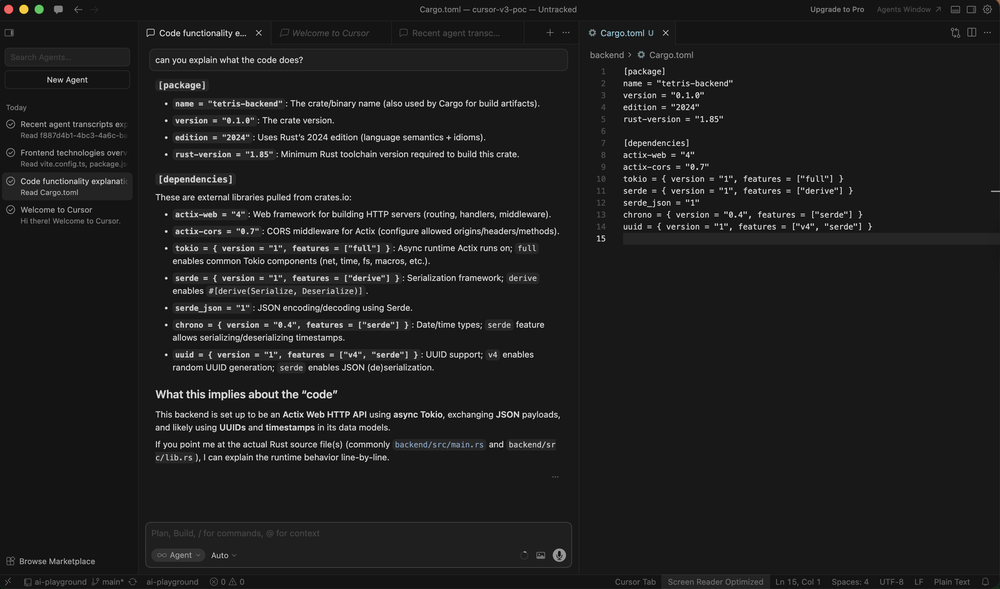

# Tetris Game

Built with [Cursor v3](https://forum.cursor.com/t/cursor-3-new-cursor-interface/156506) - the new Cursor interface featuring agent view, design tool, and browser-integrated AI assistance.

Full-stack Tetris game built with React 19 + Vite + TanStack Router on the frontend and Rust + Actix + Tokio on the backend.

This POC was built using **Cursor v3** to explore AI-assisted code generation for a full-stack application with complex game logic, real-time rendering, and REST API integration. The goal was to evaluate how well Cursor v3 handles multi-language projects (TypeScript + Rust) with interconnected frontend/backend components.

See the [design-doc.md](design-doc.md) for full architectural details.

## Cursor v3 in Action

The screenshot below shows Cursor v3's AI agent explaining the Rust backend `Cargo.toml` manifest. The agent breaks down each dependency (actix-web, tokio, serde, chrono, uuid) and infers that the project is an Actix Web HTTP API using async Tokio, exchanging JSON payloads with UUIDs and timestamps. This is the standard chat/agent view in Cursor v3, where you prompt the AI and it responds with structured analysis of your codebase.



## Agent View

The screenshot below shows Cursor v3's **Agent View** - a split-pane layout where the AI agent's explanation appears on the left while the actual source code is visible on the right. Here you can see the agent analyzing the `Cargo.toml` alongside the Rust backend's `main.rs` data model structs (`ScoreEntry`, `GameConfig`, etc.). The agent view makes it easy to cross-reference the AI's analysis with the real code, showing the file tree, open editors, and the agent conversation side by side.


## Browser View

The screenshot below shows the Tetris game running in the browser alongside Cursor v3's agent panel. The user asked "is my app running?" and the agent confirmed both services are live - Frontend (Vite) on `http://localhost:5173` and Backend on `http://localhost:8080` - detecting the active terminal processes and open ports. On the right side you can see the actual Tetris game rendered in the browser with the classic theme, showing the game board with falling pieces, the score/level/lines panel, next piece preview, and keyboard controls.


## Design Tool

The screenshot below shows Cursor v3's **Design Tool** in action. The user asked to rename the title from "TETRIS" to "web tewtris" and Cursor v3 walked through the full refactoring process: it located the header text in `frontend/src/App.tsx`, identified the HTML document title in `frontend/index.html`, showed the exact code diffs with highlighted changes in both files, and ran the linter to confirm no TypeScript issues. On the right side you can see the live browser preview reflecting the updated title with the neon-styled "web tewtris" heading rendered in the app's main menu. This demonstrates how Cursor v3's design tool lets you make UI changes conversationally while seeing the result in real time.


## Features

- 10 progressive difficulty levels with increasing speed
- 5 visual themes: Classic, Neon, Pastel, Dark, Ocean
- Configuration menu for difficulty, themes, and timer settings
- High score leaderboard with backend persistence
- Hard drop and soft drop controls
- Next piece preview
- Optional countdown timer mode

## Tech Stack

**Frontend**

- React 19
- TypeScript
- Vite 8
- Bun
- TanStack Router
- HTML5 Canvas

**Backend**

- Rust 1.94+ (edition 2024)
- Actix-web 4
- Tokio
- Serde

## Prerequisites

- [Bun](https://bun.sh/) installed
- [Rust](https://rustup.rs/) 1.85+ installed

## Running

```bash
./run.sh
```

Frontend runs on [http://localhost:5173](http://localhost:5173) and backend on [http://localhost:8080](http://localhost:8080).

## Stopping

```bash
./stop.sh
```

## Controls


| Key         | Action     |
| ----------- | ---------- |
| Arrow Left  | Move left  |
| Arrow Right | Move right |
| Arrow Down  | Soft drop  |
| Arrow Up    | Rotate     |
| Space       | Hard drop  |


## API


| Method | Endpoint    | Description        |
| ------ | ----------- | ------------------ |
| GET    | /health     | Health check       |
| GET    | /api/scores | Get leaderboard    |
| POST   | /api/scores | Submit score       |
| GET    | /api/config | Get game config    |
| PUT    | /api/config | Update game config |


## Project Structure

```
├── backend/              Rust Actix backend
│   ├── Cargo.toml
│   └── src/main.rs
├── frontend/             React Vite frontend
│   ├── package.json
│   ├── src/
│   │   ├── main.tsx      Entry point
│   │   ├── App.tsx       Router and main views
│   │   ├── useGame.ts    Game engine hook
│   │   ├── GameBoard.tsx Canvas board renderer
│   │   ├── NextPiece.tsx Next piece preview
│   │   ├── ConfigMenu.tsx Settings panel
│   │   ├── Leaderboard.tsx Score table
│   │   ├── api.ts        Backend API client
│   │   └── types.ts      Shared types and constants
│   └── index.html
├── design-doc.md         Architecture and design details
├── run.sh                Start both services
├── stop.sh               Stop both services
└── README.md
```

