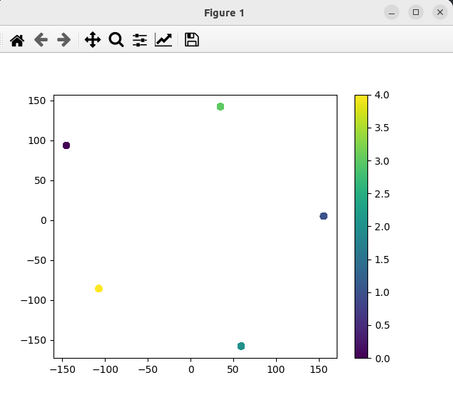

### Result

* Product recomendation system using Word2Vec
* The model is trained on the product names
* The product history events is generated synthetically
* The model is used to recommend products based on the product history events
* The model is saved and loaded from disk

```
❯ ./run.sh
iPhone 15   - recommendation: MacBook Pro
Apple Watch - recommendation: AirPods Pro
```
if you run - data will be clustered using t-sne
```
/bin/python src/clustering.py
```
