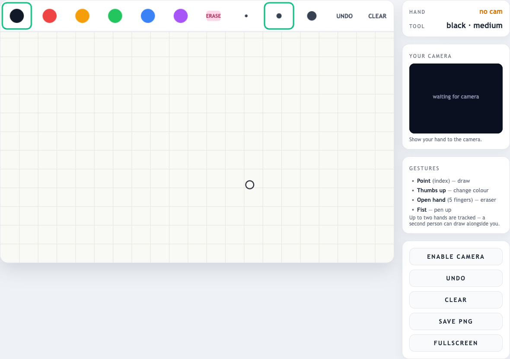
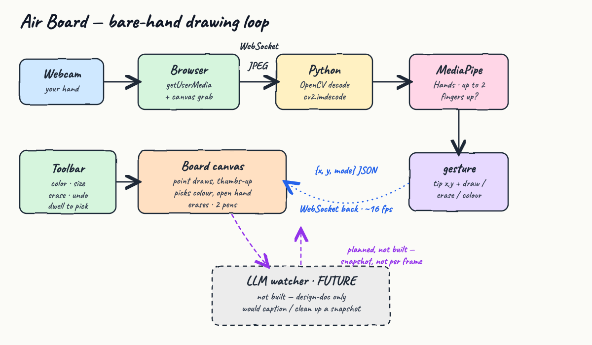

# Air Board

A browser **whiteboard you draw on with your bare hands** — no pen, no mouse. Your webcam is the
input device: **point** to draw, **thumbs up** to change colour, **open your hand** to erase. It
tracks **up to two people at once**, so a friend can draw on the same board next to you.

The webcam lives in the browser, and **Python + OpenCV + MediaPipe Hands** is the perception brain:
live frames become a fingertip + a gesture, in a fast loop. This is the "vision-reactive" idea made
concrete — perception turned into a continuous action (ink on a canvas) — and the sibling of
[`open-can-enduro-game`](../open-can-enduro-game) (hand → steering) and
[`jurassic-runner-game`](../jurassic-runner-game) (body → jump/duck).

## What it looks like

The board, its toolbar, and your live camera square on the right. Point one finger to draw, thumbs up
to change colour, open your hand to erase, make a fist to lift the pen.



*(Captured with the camera disabled, so the square reads "waiting for camera" and no face is shown.
On your machine it shows your sharp live feed with a dot on each fingertip.)*

## How perception drives the pen



1. The browser grabs the webcam with `getUserMedia` and draws each frame to a hidden canvas.
2. That frame is JPEG-encoded and pushed to Python over a **WebSocket**.
3. Python decodes it with **OpenCV** (`cv2.imdecode`) and runs **MediaPipe HandLandmarker** with
   `num_hands=2` (21 landmarks per hand).
4. For each hand it derives a tiny packet — the index-fingertip `x,y` and a gesture `mode` — and
   sends back `{ "hands": [...] }`.
5. The board canvas matches each hand to a pen, lays down strokes, and renders at 60 fps.

Drawing is **pure computer vision** — fast enough to follow your finger every frame. There is no LLM
on the per-frame path (it would add hundreds of milliseconds and make the pen lag). An LLM fits this
design only as a slow, async *watcher* on the finished image — see
[`design-doc.md`](design-doc.md) section 7.

## Gestures

| Gesture | What it does |
| --- | --- |
| **Point** (index finger) | Draw — ink follows your fingertip |
| **Thumbs up** | Change colour (cycles to the next swatch, once per gesture) |
| **Open hand** (5 fingers) | Eraser — rub out under your hand |
| **Fist** | Pen up (rest) |

Pen vs eraser is decided **live by your hand** — point to draw, open your hand to erase, point again
to keep drawing. The colour and brush size are shared by everyone on the board; either person can
cycle the colour with a thumbs-up.

**Two people:** raise a hand each. The board tracks both, tints the two cursors `#1` / `#2`, and
keeps each person's strokes attached to their own pen.

**Mouse / keyboard fallback** (no camera, or for testing): drag to draw, click a toolbar cell to
pick a tool. `z` undo, `c` clear, `e` toggle eraser, `x` cycle colour, `f` full-screen.

## Toolbar

A strip across the top of the board: **6 colours**, an **eraser**, **3 brush sizes**, **undo**, and
**clear**. Click a cell with the mouse to pick it. Bare hands change colour with a thumbs-up and
switch to the eraser with an open hand; the side panel has `UNDO`, `CLEAR`, `SAVE PNG`, `FULLSCREEN`,
and an `ENABLE CAMERA` button, with keyboard shortcuts for undo / clear / eraser / colour.

## Run it

You need a machine with a webcam and a Chromium-based browser or Safari. `localhost` counts as a
secure context, so the browser will grant camera access.

```bash
./start.sh
```

First run creates a virtualenv, installs the dependencies, downloads the MediaPipe hand model
(~7.8 MB), and starts the server. `start.sh` also stops any previous instance first, so you can
re-run it freely. Then open:

```
http://localhost:8000
```

Stop it:

```bash
./stop.sh
```

## Tests

`test.sh` boots the server and drives the full pipeline end to end — it confirms the page is served
and feeds a real frame through OpenCV + MediaPipe Hands over the WebSocket:

```
http page ok
GL version: 2.1 (2.1 Metal - 90.5), renderer: Apple M4 Max
INFO: Created TensorFlow Lite XNNPACK delegate for CPU.
websocket pipeline ok -> {'hands': []}
ALL TESTS PASSED
```

(`'hands': []` is correct: the test sends a blank frame with no hand in it.)

```bash
./test.sh
```

## Stack

| Piece | Choice |
| --- | --- |
| Hand tracking | MediaPipe `HandLandmarker` (float16, `num_hands=2`) |
| Frame decode | OpenCV (`opencv-python`) |
| Transport | `websockets` |
| Static server | Python stdlib `http.server` |
| Board | plain HTML canvas + vanilla JS, light theme |
| Python | 3.9 |

No drawing library, no frontend framework, no build step.

## Files

```
server.py            WebSocket hand-tracking (2 hands) + static file server
web/index.html       layout (board + camera square + side panel)
web/style.css        light theme
web/board.js         canvas board, camera capture, gesture → cursor/draw, 2 pens, toolbar, ink layer
test_client.py       sends one frame through the pipeline
requirements.txt     mediapipe, opencv-python, websockets, numpy
start.sh stop.sh test.sh
diagram.html         source of the hand-drawn architecture image
design-doc.md        design document
```

## Notes

- The webcam never leaves your machine: frames go browser → local Python over `ws://localhost`.
- Because the browser owns the camera, the Python side never opens a camera device — no OS camera
  permission prompt for the server.
- The hand model and the virtualenv are git-ignored; `start.sh` recreates them.
- The README screenshots were captured with the camera disabled, so no real face appears.
